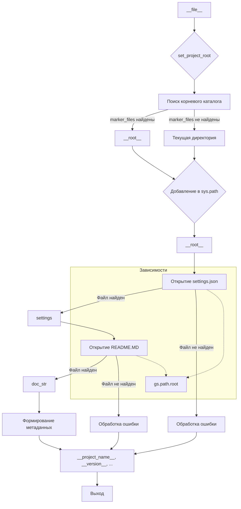

# <input code>

```python
## \file hypotez/src/suppliers/chat_gpt/header.py
# -*- coding: utf-8 -*-\n#! venv/Scripts/python.exe\n#! venv/bin/python/python3.12\n\n"""
.. module: src.suppliers.chat_gpt 
	:platform: Windows, Unix
	:synopsis:

"""
MODE = 'dev'

import sys
import json
from packaging.version import Version

from pathlib import Path
def set_project_root(marker_files=('pyproject.toml', 'requirements.txt', '.git')) -> Path:
    """
    Finds the root directory of the project starting from the current file's directory,
    searching upwards and stopping at the first directory containing any of the marker files.

    Args:
        marker_files (tuple): Filenames or directory names to identify the project root.
    
    Returns:
        Path: Path to the root directory if found, otherwise the directory where the script is located.
    """
    __root__:Path
    current_path:Path = Path(__file__).resolve().parent
    __root__ = current_path
    for parent in [current_path] + list(current_path.parents):
        if any((parent / marker).exists() for marker in marker_files):
            __root__ = parent
            break
    if __root__ not in sys.path:
        sys.path.insert(0, str(__root__))
    return __root__


# Get the root directory of the project
__root__ = set_project_root()
"""__root__ (Path): Path to the root directory of the project"""

from src import gs

settings:dict = None
try:
    with open(gs.path.root / 'src' / 'settings.json', 'r') as settings_file:
        settings = json.load(settings_file)
except (FileNotFoundError, json.JSONDecodeError):
    ...

doc_str:str = None
try:
    with open(gs.path.root / 'src' / 'README.MD', 'r') as settings_file:
        doc_str = settings_file.read()
except (FileNotFoundError, json.JSONDecodeError):
    ...


__project_name__ = settings.get("project_name", 'hypotez') if settings  else 'hypotez'
__version__: str = settings.get("version", '')  if settings  else ''
__doc__: str = doc_str if doc_str else ''
__details__: str = ''
__author__: str = settings.get("author", '')  if settings else ''
__copyright__: str = settings.get("copyrihgnt", '')  if settings else ''
__cofee__: str = settings.get("cofee", "Treat the developer to a cup of coffee for boosting enthusiasm in development: https://boosty.to/hypo69")  if settings else "Treat the developer to a cup of coffee for boosting enthusiasm in development: https://boosty.to/hypo69"
```

# <algorithm>

**Алгоритм работы кода:**

1. **`set_project_root`:**
    - Получает текущий путь файла (`__file__`).
    - Итерируется по родительским директориям, начиная с текущего пути.
    - Проверяет существование файлов из `marker_files` в каждом родительском каталоге.
    - Если файл найден, возвращает путь к родительскому каталогу.
    - Если файл не найден в родительском каталоге, продолжает проверку на следующем уровне.
    - Если корневой каталог не найден, возвращает текущую директорию.
    - Добавляет найденный путь к `sys.path`, чтобы модули из корневого каталога были доступны.

2. **Получение настроек:**
    - Находит корневой каталог проекта (`__root__`).
    - Попытка открыть `settings.json` в корневом каталоге проекта.
    - Загрузка данных из файла в переменную `settings`.
    - Обработка исключений `FileNotFoundError` и `json.JSONDecodeError` (если файл не найден или поврежден).

3. **Получение документации:**
    - Попытка открыть `README.MD` в корневом каталоге проекта.
    - Чтение данных из файла в переменную `doc_str`.
    - Обработка исключений `FileNotFoundError` и `json.JSONDecodeError` (если файл не найден или поврежден).

4. **Формирование метаданных:**
    - Извлекает значения из `settings` (или устанавливает значения по умолчанию):
        - `__project_name__`, `__version__`, `__doc__`, `__author__`, `__copyright__`, `__cofee__`.

**Пример:** Если `__file__` находится в `/home/user/project/hypotez/src/suppliers/chat_gpt/header.py`, то код найдёт директорию `/home/user/project`, и добавит её в `sys.path`.


# <mermaid>



**Объяснение диаграммы:**

* `A` — текущий файл.
* `B` — вызов функции `set_project_root`.
* `C` — процесс поиска корневого каталога.
* `D` — найденный корневой каталог.
* `E` — текущий каталог, если корневой не найден.
* `F` — добавление найденного пути в `sys.path`.
* `G` — переменная `__root__`.
* `H` — попытка открыть `settings.json`.
* `I` — переменная `settings`, содержащая данные из файла.
* `J` — блок обработки `FileNotFoundError`.
* `K` — попытка открыть `README.MD`.
* `L` — переменная `doc_str`.
* `M` — блок обработки `FileNotFoundError`.
* `N` — формирование метаданных.
* `O` — переменные `__project_name__`, `__version__`, и т.д.
* `P` — завершение выполнения.

**Подключаемые зависимости:**

- `gs.path.root` — предполагается, что это объект, предоставляющий доступ к корневому каталогу проекта, определённый в модуле `gs`.

# <explanation>

**Импорты:**

- `sys`: для доступа к системным переменным, в частности `sys.path`.
- `json`: для работы с JSON-файлами (загрузка и сохранение).
- `packaging.version`: для работы с версиями пакетов.
- `pathlib`: для работы с путями к файлам.
- `src.gs`:  импорт из модуля `gs` в пакете `src`. Вероятно, `gs` содержит вспомогательные функции или классы для работы с файлами, путями и другими ресурсами, связанными с проектом.

**Классы:**

- Нет явных определений классов.

**Функции:**

- `set_project_root(marker_files)`: находит корневой каталог проекта, начиная от текущего файла.  Аргумент `marker_files` предоставляет список файлов или каталогов, которые используются для определения корня проекта. Возвращает объект `Path`.

**Переменные:**

- `MODE`: строковая переменная, вероятно, определяет режим работы (например, `dev`, `prod`).
- `__root__`: переменная, хранящая объект `Path` к корневому каталогу проекта.
- `settings`: словарь, содержащий настройки проекта, загруженные из `settings.json`.
- `doc_str`: строковая переменная, содержащая содержимое `README.MD` (если файл существует).
- `__project_name__`, `__version__`, `__doc__`, `__author__`, `__copyright__`, `__cofee__`: переменные, содержащие метаданные проекта, полученные из файла `settings.json` или заданные по умолчанию.

**Возможные ошибки или улучшения:**

- Отсутствие обработки ошибок: хотя `try...except` блоки есть, они не очень подробны. Например, не указано, что происходит, если `settings.json` не имеет нужных ключей. Возможно, стоило бы использовать `try...except` для каждого пункта.
- Непонятный модуль `gs`: Необходимо понимание структуры `gs`, чтобы понять, как именно `gs.path.root` работает и откуда он берется.
- Повторение кода: код для загрузки `settings.json` и `README.MD` очень похож, что можно оптимизировать через функцию.
- `__cofee__`: Нестандартное название переменной.


**Цепочка взаимосвязей:**

Файл `header.py` (в пакете `chat_gpt`) получает информацию о проекте (корневой каталог, настройки, документация) для использования в коде чат-ботов.  Эта информация, вероятно, загружается из файла `settings.json` и `README.MD` в корневом каталоге проекта.  Модуль `gs` вероятно,  предоставляет общие функции для поиска и работы с файлами проекта.