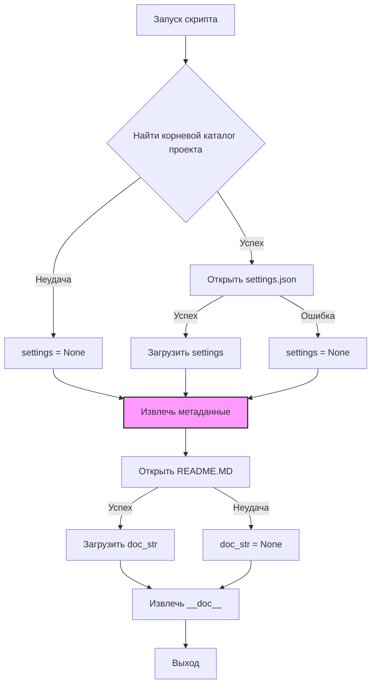

```MD
# <input code>

```python
## \file hypotez/src/suppliers/chat_gpt/scenarios/header.py
# -*- coding: utf-8 -*-\
#! venv/Scripts/python.exe
#! venv/bin/python/python3.12

"""
.. module: src.suppliers.chat_gpt.scenarios 
	:platform: Windows, Unix
	:synopsis:

"""
MODE = 'dev'

"""
	:platform: Windows, Unix
	:synopsis:

"""


"""
	:platform: Windows, Unix
	:synopsis:

"""


"""
  :platform: Windows, Unix

"""
"""
  :platform: Windows, Unix
  :platform: Windows, Unix
  :synopsis:
"""MODE = 'dev'
  
""" module: src.suppliers.etzmaleh """

import sys
import json
from packaging.version import Version

from pathlib import Path
def set_project_root(marker_files=('pyproject.toml', 'requirements.txt', '.git')) -> Path:
    """
    Finds the root directory of the project starting from the current file's directory,
    searching upwards and stopping at the first directory containing any of the marker files.

    Args:
        marker_files (tuple): Filenames or directory names to identify the project root.
    
    Returns:
        Path: Path to the root directory if found, otherwise the directory where the script is located.
    """
    __root__:Path
    current_path:Path = Path(__file__).resolve().parent
    __root__ = current_path
    for parent in [current_path] + list(current_path.parents):
        if any((parent / marker).exists() for marker in marker_files):
            __root__ = parent
            break
    if __root__ not in sys.path:
        sys.path.insert(0, str(__root__))
    return __root__


# Get the root directory of the project
__root__ = set_project_root()
"""__root__ (Path): Path to the root directory of the project"""

from src import gs

settings:dict = None
try:
    with open(gs.path.root / 'src' /  'settings.json', 'r') as settings_file:
        settings = json.load(settings_file)
except (FileNotFoundError, json.JSONDecodeError):
    ...

doc_str:str = None
try:
    with open(gs.path.root / 'src' /  'README.MD', 'r') as settings_file:
        doc_str = settings_file.read()
except (FileNotFoundError, json.JSONDecodeError):
    ...


__project_name__ = settings.get("project_name", 'hypotez') if settings  else 'hypotez'
__version__: str = settings.get("version", '')  if settings  else ''
__doc__: str = doc_str if doc_str else ''
__details__: str = ''
__author__: str = settings.get("author", '')  if settings  else ''
__copyright__: str = settings.get("copyrihgnt", '')  if settings  else ''
__cofee__: str = settings.get("cofee", "Treat the developer to a cup of coffee for boosting enthusiasm in development: https://boosty.to/hypo69")  if settings  else "Treat the developer to a cup of coffee for boosting enthusiasm in development: https://boosty.to/hypo69"
```

# <algorithm>

**Блок-схема алгоритма:**

1. **Инициализация:**
   - Определяется корневая папка проекта с помощью функции `set_project_root`. (Пример: `marker_files` содержит `pyproject.toml`, функция ищет родительские каталоги, пока не найдет директорию с этим файлом. Если `pyproject.toml` не найдено, то используется текущий каталог.)
   - Добавление найденного корневого каталога в `sys.path`.

2. **Чтение настроек:**
   - Попытка открыть файл `settings.json` в корневом каталоге проекта.
   - Если файл найден и содержит корректный JSON, то его содержимое загружается в переменную `settings`. В противном случае переменная `settings` остается `None`.

3. **Чтение документации:**
   - Попытка открыть файл `README.MD` в корневом каталоге проекта.
   - Если файл найден, то его содержимое загружается в переменную `doc_str`. В противном случае переменная `doc_str` остается `None`.

4. **Извлечение метаданных:**
   - Используя `settings.get()`, извлекаются значения из словаря `settings` для `project_name`, `version`, `author`, `copyright`, `cofee`. Если `settings` равен `None`, то используется значение по умолчанию.
   -  Значение переменной `doc_str` присваивается переменной `__doc__`.


# <mermaid>



**Зависимости:**

- `sys`: Модуль для работы со средой выполнения Python.
- `json`: Модуль для работы с JSON-данными.
- `packaging.version`: Модуль для работы с версиями.
- `pathlib`: Модуль для работы с путями к файлам.
- `gs`:  Используется модуль `gs` из пакета `src`, возможно для получения пути к корневой папке проекта.  (Подключаемая зависимость)


# <explanation>

**Импорты:**

- `sys`:  Нужен для доступа к системным переменным, в частности `sys.path`, чтобы добавить корневую папку проекта в список доступных папок для импорта модулей.
- `json`:  Используется для парсинга и сериализации JSON.
- `packaging.version`:  Используется для работы с версиями пакетов.
- `pathlib`:  Используется для работы с путями к файлам и каталогам в удобном и безопасном стиле.
- `gs`:  Модуль из пакета `src`, вероятно, содержащий полезные функции для работы с проектом, в том числе получение пути к корневому каталогу. Связь с пакетом `src` прямая.

**Функции:**

- `set_project_root(marker_files)`:  Находит корневой каталог проекта. Ищет вверх по дереву каталогов, пока не обнаружит один из файлов, указанных в `marker_files`. Это важная функция для обеспечения того, что код работает независимо от того, где он запущен (внутри проекта или из другой папки).

**Классы:**

- Нет определённых классов.

**Переменные:**

- `__root__`:  Содержит путь к корневому каталогу проекта.
- `settings`:  Словарь с настройками проекта, загруженный из `settings.json`.
- `doc_str`:  Содержит текст документации (например, из `README.MD`).
- `__project_name__`, `__version__`, `__doc__`, `__details__`, `__author__`, `__copyright__`, `__cofee__`:  Метаданные проекта, полученные из `settings.json` или имеющие значения по умолчанию.


**Возможные ошибки/улучшения:**

- **Обработка ошибок:** Обработка `FileNotFoundError` и `json.JSONDecodeError` при чтении `settings.json` и `README.MD` очень важна, чтобы предотвратить аварийный выход программы.
- **Использование `gs`:**  Неясно, как именно используется модуль `gs`. Было бы полезно узнать, что он делает.
- **Унификация путей:**  Можно улучшить код, используя `Path` для всех манипуляций с путями (вместо использования `str`).

**Взаимосвязи с другими частями проекта:**

- Функция `set_project_root()` необходима для получения корневого каталога, который используется для доступа к другим файлам (например, `settings.json` и `README.MD`).
-  Использование модуля `gs` предполагает наличие зависимостей внутри пакета `src` и его подмодулей.


Этот код организован так, чтобы быть гибким и независимым от конкретного расположения файлов проекта.  Важно тщательно изучить модуль `gs`, чтобы понять, как он используется.