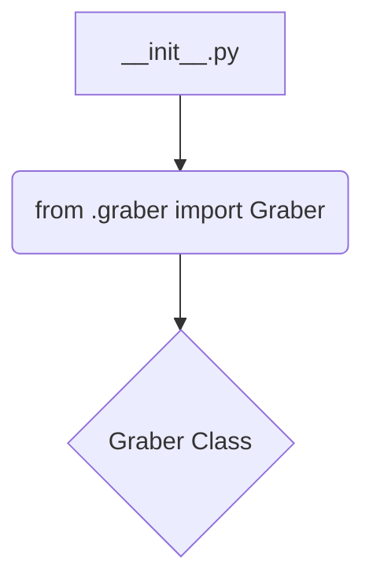
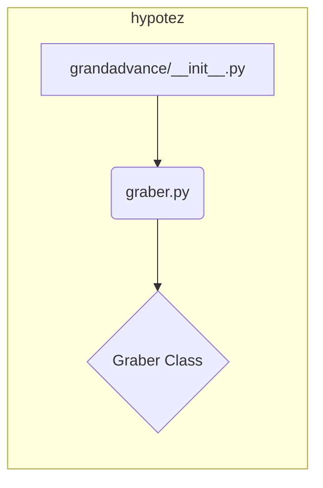

```MD
1. **<input code>**

```python
## \file hypotez/src/suppliers/grandadvance/__init__.py
# -*- coding: utf-8 -*-
#! venv/Scripts/python.exe
#! venv/bin/python/python3.12

"""
.. module: src.suppliers.grandadvance 
	:platform: Windows, Unix
	:synopsis:

"""
MODE = 'dev'

from .graber import Graber
```

2. **<algorithm>**

Этот код является инициализационным модулем для пакета `grandadvance` в рамках проекта `hypotez`.  Он не содержит собственных вычислительных алгоритмов, а лишь импортирует класс `Graber` из модуля `graber.py` внутри того же пакета.  Блок-схема представляет собой простую импортирующую операцию:



Пример: Предположим, что `graber.py` содержит определение класса `Graber`.  Этот импорт позволяет использовать `Graber` в других частях пакета `grandadvance` без необходимости повторного определения.


3. **<mermaid>**



**Объяснение зависимостей:**

Диаграмма показывает, что `grandadvance/__init__.py` зависит от `graber.py` внутри того же пакета `grandadvance` в рамках проекта `hypotez`.  Зависимость выражается в импорте класса `Graber`.


4. **<explanation>**

* **Импорты:**
    * `from .graber import Graber`: Импортирует класс `Graber` из модуля `graber.py`, который находится в том же каталоге, что и текущий файл (`__init__.py`).  Символ `.` перед `graber` указывает на относительный импорт, что делает код более модульным и легко масштабируемым.  Это важная практика для организации кода в Python проектах.

* **Классы:**
    * `Graber`: Этот класс определяется в модуле `graber.py` и, скорее всего, отвечает за взаимодействие с внешним источником данных (например, API) и извлечение данных.   Информация о классе `Graber` не предоставлена в данном `__init__.py` файле, и нам необходимо обратиться к `graber.py` для получения подробностей.

* **Функции:**
    * Нет функций в этом файле.

* **Переменные:**
    * `MODE = 'dev'`:  Переменная, скорее всего, хранит режим работы приложения (например, 'dev', 'prod').  Она определена на уровне модуля и доступна для использования в любом месте этого пакета.

* **Возможные ошибки или области для улучшений:**
    * Нет явных ошибок, но полезно было бы добавить документацию к переменной `MODE`, описывающую, что она делает и какие значения может принимать.


**Цепочка взаимосвязей с другими частями проекта:**

Этот `__init__.py`  файл является частью пакета `grandadvance`, который, предположительно, отвечает за взаимодействие с определенным поставщиком данных (GrandAdvance в данном случае).  Другие части проекта, такие как обработка данных, хранение результатов и т.д., могут использовать класс `Graber` из этого пакета для получения данных.  Взаимосвязь будет зависеть от того, как проект организован архитектурно.  Без дополнительных данных сложно представить более глубокую цепочку.