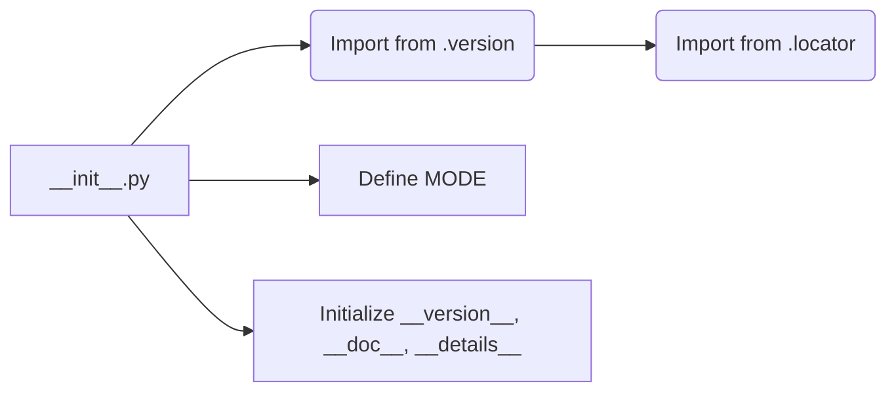
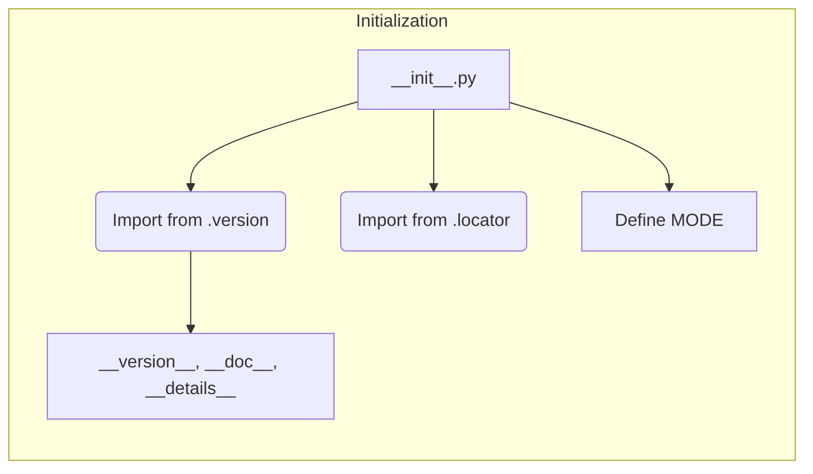

```MD
# Анализ кода hypotez/src/suppliers/hb/locators/__init__.py

1. **<input code>**:

```python
## \file hypotez/src/suppliers/hb/locators/__init__.py
# -*- coding: utf-8 -*-
#! venv/Scripts/python.exe
#! venv/bin/python/python3.12

"""
.. module: src.suppliers.hb.locators 
	:platform: Windows, Unix
	:synopsis:

"""
MODE = 'dev'

"""
	:platform: Windows, Unix
	:synopsis:

"""


"""
	:platform: Windows, Unix
	:synopsis:

"""


"""
  :platform: Windows, Unix

"""
"""
  :platform: Windows, Unix
  :platform: Windows, Unix
  :synopsis:
"""MODE = 'dev'
  
""" module: src.suppliers.hb.locators """


""" Изменения в локаторах. Применять с осторожносастью  """
...

from packaging.version import Version
from .version import __version__, __doc__, __details__  

from .locator import 
```

2. **<algorithm>**:

Код представляет собой модуль инициализации для пакета `locators`.  Поскольку основная часть кода пропущена (…), алгоритм не может быть полностью визуализирован.  Однако, он, очевидно, выполняет следующие действия:

* **Импортирует** необходимые модули из подпапки `version` и `locator`.
* **Определяет** константу `MODE`, вероятно, для выбора режима работы (в данном случае `'dev'`).
* **Инициализирует** переменные `__version__`, `__doc__`, `__details__` (возможно, из пакета `version`).



3. **<mermaid>**:



4. **<explanation>**:

* **Импорты**:
    * `from packaging.version import Version`: Импортирует класс `Version` из пакета `packaging`.  Этот пакет используется для работы с версиями программного обеспечения.   Этот импорт используется для работы с версиями, но в данном фрагменте кода не используется напрямую.
    * `from .version import __version__, __doc__, __details__`:  Импортирует переменные `__version__`, `__doc__`, `__details__` из модуля `version.py` внутри пакета `locators`.  Это, вероятно, метаданные о версии, документация и дополнительные детали пакета.
    * `from .locator import`:  Импортирует все из модуля `locator.py`.  Это основной модуль, содержащий логику работы с локаторами.  Эта часть кода закомментирована `...` и не может быть проанализирована.

* **Классы**:
    * В предоставленном фрагменте кода нет классов.  Они, скорее всего, будут объявлены в файле `locator.py`.

* **Функции**:
    * Нет функций.  Логика, скорее всего, заключена в классах из файла `locator.py`.

* **Переменные**:
    * `MODE = 'dev'`:  Переменная, вероятно, задаёт режим работы. `dev`  может означать режим разработки.


**Возможные ошибки или области для улучшений**:

* Недостаток информации:  Недостаточно кода для детального анализа.
* Неявная зависимость: Код слишком фрагментарный, чтобы оценить полноту реализации и возможные зависимости от других частей проекта.
* Недокументированные значения: Значения переменных (особенно `MODE`) не описываются в комментариях.

**Цепочка взаимосвязей**:

Модуль `locators/__init__.py` импортирует модуль `version.py` и `locator.py`.  Модуль `locator.py` (по всей вероятности) содержит классы и функции, которые реализуют логику работы с локаторами.  Связь с другими частями проекта неясна без дополнительных фрагментов кода.  Модуль `locators` может использоваться другими частями проекта для поиска и работы с локаторами.

**Вывод**:

Фрагмент кода представляет собой заготовку или начальный модуль для пакета `locators`, который предоставляет функциональность работы с локаторами. Для более полного понимания требуется код из модулей `version.py` и `locator.py`.