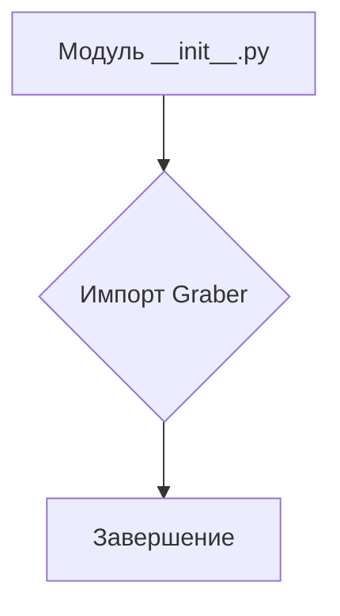
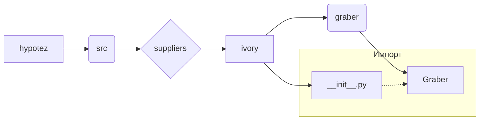

# <input code>

```python
## \file hypotez/src/suppliers/ivory/__init__.py
# -*- coding: utf-8 -*-
#! venv/Scripts/python.exe
#! venv/bin/python/python3.12

"""
.. module: src.suppliers.ivory 
	:platform: Windows, Unix
	:synopsis:

"""
MODE = 'dev'

from .graber import Graber
```

# <algorithm>

Этот код представляет собой инициализирующий модуль для пакета `ivory` внутри проекта `hypotez`.  Он определяет переменную `MODE` со значением 'dev', что, вероятно, указывает на режим разработки.  Основной функциональность импортирует класс `Graber` из модуля `.graber`.  В этом случае, нет вызова каких-либо функций или инициализации каких-либо объектов.

**Блок-схема:**



**Пример:**

При импорте модуля `hypotez.src.suppliers.ivory` из другого модуля, Python будет выполнять код в этом `__init__.py` файле.  В итоге, переменная `MODE` будет доступна и класс `Graber` станет доступным для использования.


# <mermaid>



# <explanation>

**Импорты:**

- `from .graber import Graber`: Этот импорт необходим для использования класса `Graber` из модуля `graber`, который находится в той же директории, что и текущий файл `__init__.py`.  Символ `.` указывает на относительный путь.  Это указывает на то, что `graber.py` находится внутри директории `ivory`.  Подобная иерархия структуры папок используется для организации кода.

**Классы:**

- `Graber`: Это класс, который, скорее всего, определен в файле `graber.py`.  В `__init__.py` он просто импортируется, чтобы быть доступным для использования в других частях проекта.  Без кода самого `graber.py` сложно сказать точнее, какие методы и атрибуты имеет класс `Graber`.

**Функции:**

- Нет явных функций. Файл `__init__.py` содержит только импорты.

**Переменные:**

- `MODE = 'dev'`:  Переменная, хранящая строковое значение, указывающее на режим работы приложения (скорее всего, для настроек).  Она будет доступна в модуле `ivory` для дальнейшего использования.

**Возможные ошибки или улучшения:**

- Нет ошибок в данном коде, но для лучшей практики можно добавить документацию (документинт строка) к переменной `MODE`. Это поможет понять ее назначение.

**Взаимосвязи с другими частями проекта:**

Этот `__init__.py` модуль определяет интерфейс для других частей проекта, предоставляя доступ к классу `Graber`.  Возможно, существуют другие модули, которые импортируют класс `Graber` для выполнения определенных задач, например, для обработки данных из различных источников.  Связь между этим модулем и остальными модулями будет зависеть от того, как используется класс `Graber` в других частях кода.  Важно понимать, что без доступа к коду `graber.py` трудно определить его точную роль и взаимодействие с другими частями проекта.