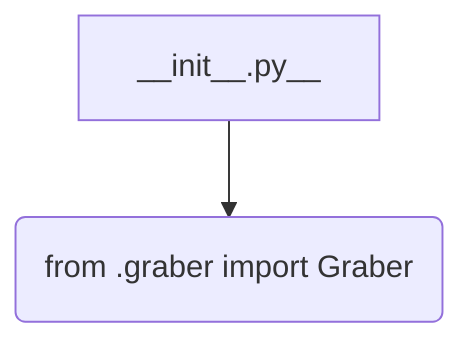
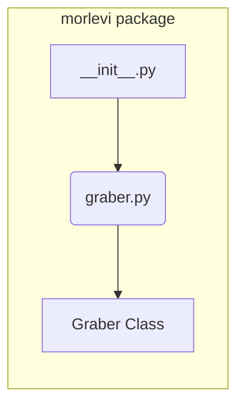

```MD
1. **<input code>**

```python
## \file hypotez/src/suppliers/morlevi/__init__.py
# -*- coding: utf-8 -*-
#! venv/Scripts/python.exe
#! venv/bin/python/python3.12

"""
.. module: src.suppliers.morlevi 
	:platform: Windows, Unix
	:synopsis:

"""
MODE = 'dev'

from .graber import Graber
```

2. **<algorithm>**

Этот код является инициализационным модулем для пакета `morlevi` в рамках проекта `hypotez`.  Он не содержит логики обработки данных, а лишь импортирует другой модуль.

Блок-схема:



Пример: При выполнении кода из файла `__init__.py` происходит импорт класса `Graber` из модуля `graber.py` внутри того же пакета.  Данные не передаются.

3. **<mermaid>**



Описание диаграммы:

* **morlevi package:** Представляет пакет `morlevi` внутри `hypotez/src/suppliers`.
* **__init__.py:** Модуль инициализации пакета.
* **graber.py:** Модуль, содержащий класс `Graber`.
* **Graber Class:** Класс `Graber` из модуля `graber.py`.  
    
Связи:  Файл `__init__.py` импортирует модуль `graber.py`.

4. **<explanation>**

* **Импорты:**
    `from .graber import Graber`: Этот импорт подключает класс `Graber` из файла `graber.py` внутри пакета `morlevi`. Символ `.` указывает на то, что импортируемый модуль находится в том же пакете. Это стандартный способ организации импорта внутри пакета Python.

* **Классы:**
    В данном файле нет определений собственных классов, только импорт уже определенного класса `Graber`.  Этот класс, вероятно, отвечает за получение данных из источника (например, веб-скрейпинг).

* **Функции:**
    Файл `__init__.py` не содержит функций.  Любые функции, использующие класс `Graber`, будут определены в `graber.py`.

* **Переменные:**
    `MODE = 'dev'`: Это константа, определяющая режим работы. В данном случае, вероятно, `dev` (разработка).  В разных режимах (например, `prod` - производство) может меняться поведение приложения.

* **Возможные ошибки/улучшения:**
    * Отсутствует документация: Не хватает подробного описания того, что делает класс `Graber`, какие данные он собирает и как работает.
    * Отсутствуют проверки: Нет механизма проверки того, что файл `graber.py` существует и содержит класс `Graber`.
    * Недостаточная ясность: Непонятно, что именно делает этот модуль в контексте проекта `hypotez`. Необходимо описание его назначения в общем архитектурном контексте.

**Цепочка взаимосвязей с другими частями проекта:**

Файл `__init__.py` в пакете `morlevi` служит посредником для доступа к классу `Graber`.  Далее, класс `Graber` скорее всего будет использоваться другими частями проекта (например, функциями или классами в `hypotez/src/services`), которые нуждаются в данных, получаемых от источника.  Эти части проекта могут взаимодействовать с `Graber` через вызовы его методов.

В целом, код выглядит как часть хорошо организованной структуры, но без доступа к остальному коду проекта сложно дать полную оценку его функциональности и места в общей системе.