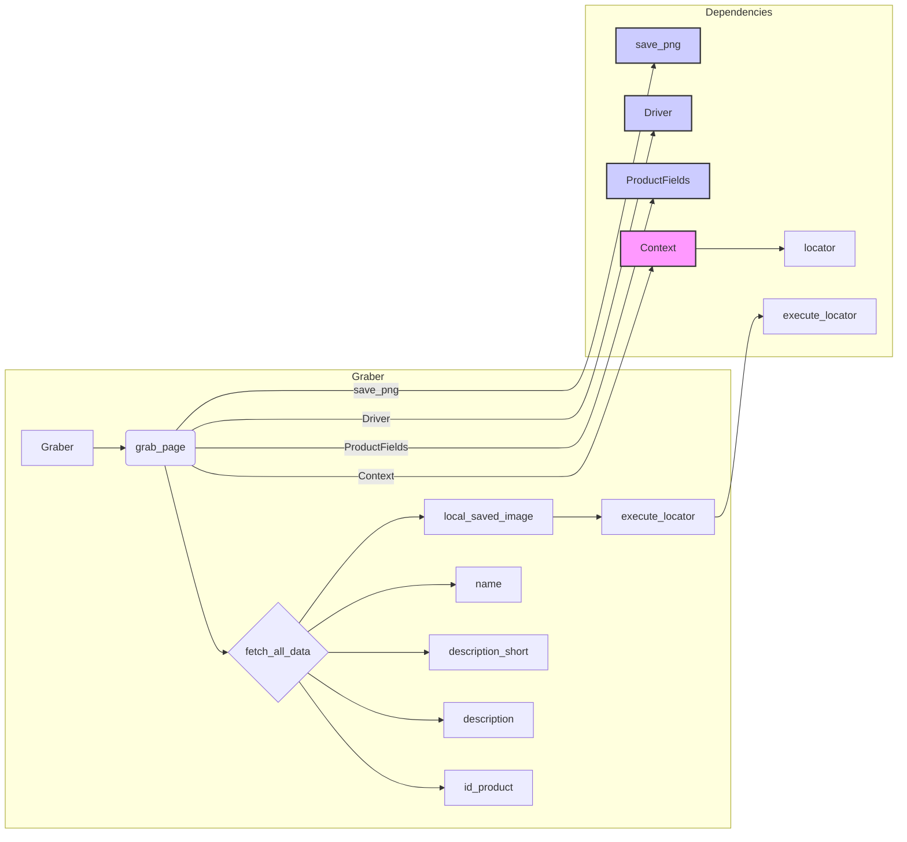

# <input code>

```python
## \file hypotez/src/suppliers/morlevi/graber.py
# -*- coding: utf-8 -*-
#! venv/Scripts/python.exe
#! venv/bin/python/python3.12

"""
.. module: src.suppliers.morlevi 
	:platform: Windows, Unix
	:synopsis: Класс собирает значение полей на странице  товара `morlevi.co.il`. 
    Для каждого поля страницы товара сделана функция обработки поля в родительском классе.
    Если нужна нестандертная обработка, функция перегружается в этом классе.
    ------------------
    Перед отправкой запроса к вебдрайверу можно совершить предварительные действия через декоратор. 
    Декоратор по умолчанию находится в родительском классе. Для того, чтобы декоратор сработал надо передать значение 
    в `Context.locator`, Если надо реализовать свой декоратор - раскоментируйте строки с декоратором и переопределите его поведение


"""
MODE = 'dev'

import asyncio
from pathlib import Path
from types import SimpleNamespace
from typing import Any, Callable, Optional
from dataclasses import dataclass, field
from functools import wraps
from pydantic import BaseModel
from types import SimpleNamespace
from typing import Any, Callable
from functools import wraps
from types import SimpleNamespace
from typing import Any, Callable

import header
from src import gs
from src.suppliers import Graber as Grbr, Context, close_pop_up
from src.product import ProductFields
from src.webdriver import Driver
from src.utils.jjson import j_loads_ns
from src.utils.image import save_png, save_png_from_url
from src.logger import logger
from src.logger.exceptions import ExecuteLocatorException

from dataclasses import dataclass, field


# # Определение декоратора для закрытия всплывающих окон
# # В каждом отдельном поставщике (`Supplier`) декоратор может использоваться в индивидуальных целях
# # Общее название декоратора `@close_pop_up` можно изменить 


# def close_pop_up(value: Any = None) -> Callable:
#     """Создает декоратор для закрытия всплывающих окон перед выполнением основной логики функции.

#     Args:
#         value (Any): Дополнительное значение для декоратора.

#     Returns:
#         Callable: Декоратор, оборачивающий функцию.
#     """
#     def decorator(func: Callable) -> Callable:
#         @wraps(func)
#         async def wrapper(*args, **kwargs):
#             try:
#                 await Context.driver.execute_locator(Context.locator.close_pop_up)  # Await async pop-up close   
#             except ExecuteLocatorException as ex:
#                 logger.debug(f'Ошибка выполнения локатора: ',ex)
#             return await func(*args, **kwargs)  # Await the main function
#         return wrapper
#     return decorator


class Graber(Grbr):
    """Класс для операций захвата Morlevi."""
    supplier_prefix: str

    def __init__(self, driver: Driver):
        """Инициализация класса сбора полей товара."""
        self.supplier_prefix = 'morlevi'
        super().__init__(supplier_prefix=self.supplier_prefix, driver=driver)
        Context.locator_for_decorator = self.locator.close_pop_up

    async def grab_page(self, driver: Driver) -> ProductFields:
        """Asynchronous function to grab product fields.

        Args:
            driver (Driver): The driver instance to use for grabbing.

        Returns:
            ProductFields: The grabbed product fields.
        """
        d = self.d = driver  

        # Logic for extracting data
        async def fetch_all_data(**kwards):
            # Call function to fetch specific data
            # await fetch_specific_data(**kwards)

            # Uncomment the following lines to fetch specific data

            await self.id_product(kwards.get("id_product", ''))
            # ... (many more await calls)
            await self.description(kwards.get("description", ''))
            await self.description_short(kwards.get("description_short", ''))
            await self.name(kwards.get("name", ''))
            await self.local_saved_image(kwards.get("local_saved_image", ''))

        # Call the function to fetch all data
        await fetch_all_data()
        return self.fields


    @close_pop_up()
    async def local_saved_image(self, value: Any = None):
        """Fetch and save image locally.
        Функция получает изображение как скриншот сохраняет через файл в `tmp` и сохраняет путь к локальному файлу в поле `local_saved_image` объекта `ProductFields`
        Args:
        value (Any): это значение можно передать в словаре kwargs через ключ {local_saved_image = `value`} при определении класса.
        Если `value` был передан, его значение подставляется в поле `ProductFields.local_saved_image`.
        .. note:
            путь к изображению ведет в директорию  `tmp`
        .. todo:
            - Как передать значение из `**kwards` функции `grab_product_page(**kwards)`
            - Как передать путь кроме жестко указанного   
        """
       
        if not value:
            try:
                if not self.fields.id_product:
                    await self.id_product() # < ~~~~~~~~~~~~~~~~~~~~~~~~~~~~~~~~~~~~~~~~~  BUG! Как передать значение из `**kwards` функции `grab_product_page(**kwards)`
                raw = await self.d.execute_locator(self.l.default_image_url) # <- получаю скриншот как `bytes` 
                img_tmp_path = await save_png(raw[0] if isinstance(raw, list) else raw , Path( gs.path.tmp / f'{self.fields.id_product}.png'))
                if img_tmp_path:
                    self.fields.local_saved_image = img_tmp_path
                    return True
                else:
                    logger.debug(f"Ошибка сохранения изображения")
                    return
            except Exception as ex:
                logger.error(f'Ошибка сохранения изображения в поле `local_saved_image`', ex)
                return
```

# <algorithm>

```mermaid
graph TD
    A[Получение входных данных (driver, kwargs)] --> B{Инициализация Graber};
    B --> C[Вызов fetch_all_data];
    C --> D[Вызов self.id_product];
    C --> E[Вызов self.description];
    C --> F[Вызов self.description_short];
    C --> G[Вызов self.name];
    C --> H[Вызов self.local_saved_image];
    H --> I[Проверка value];
    I -- value есть --> J[Использование переданного value];
    I -- value нет --> K[Получение id_product];
    K --> L[Получение скриншота (default_image_url)];
    L --> M[Сохранение изображения в tmp];
    M --> N[Сохранение пути к изображению в self.fields.local_saved_image];
    N --> O[Возврат ProductFields];
    
    subgraph fetch_all_data
        C -- fetch_all_data --> D
        C -- fetch_all_data --> E
        C -- fetch_all_data --> F
        C -- fetch_all_data --> G
        C -- fetch_all_data --> H
    end
```

**Примеры:**

* **Входные данные (A):** `driver` - объект WebDriver, `kwargs` - словарь с данными, например, `{"id_product": 123, "local_saved_image": "some_value"}`
* **Инициализация (B):** Создается экземпляр класса `Graber`, инициализируются атрибуты.
* **fetch_all_data (C):** Вызываются функции для получения данных по всем полям.
* **self.id_product, self.description и т.д. (D, E, F, G, H):** Запросы к веб-странице для извлечения данных.  Например, `await self.id_product(kwards.get("id_product", ''))` передает id товара функции `id_product`.
* **local_saved_image (H):** Загружает изображение, сохраняет его в папку `tmp` и сохраняет путь.
* **Возврат (O):** Возвращается объект `ProductFields` с заполненными данными.


# <mermaid>




# <explanation>

**Импорты:**

* `header`: Вероятно, содержит вспомогательные функции или константы, специфичные для проекта. Непосредственно связан с файлами приложения.
* `src.gs`, `src.suppliers.Graber`, `src.suppliers.Context`, `src.product.ProductFields`, `src.webdriver.Driver`, `src.utils.jjson`, `src.utils.image`, `src.logger`, `src.logger.exceptions`: Все эти импорты указывают на то, что код является частью более крупного проекта, имеющего структуру пакета `src`.  Каждый импорт связан с определенной частью проекта (обработка данных, взаимодействие с драйвером, работа с логами и т.д.).

**Классы:**

* **`Graber`:**  Этот класс наследуется от `Grbr` (вероятно, из модуля `src.suppliers`).  Он специфичен для сбора данных с сайта `morlevi.co.il`.  Атрибут `supplier_prefix` указывает на поставщика. Метод `grab_page` - главный метод, отвечающий за сбор данных.  Метод `local_saved_image`  специализирован на сохранении изображения.


**Функции:**

* **`grab_page`:**  Асинхронная функция, которая получает `driver` (объект WebDriver) и собирает все необходимые данные.  Возвращает объект `ProductFields`.  Внутри `grab_page` вызывается асинхронная функция `fetch_all_data` для получения данных разных полей.
* **`fetch_all_data`:** Вспомогательная функция, которая последовательно вызывает другие функции сбора данных (`self.id_product`, `self.description` и т.д.)

* **`local_saved_image`:**  Загружает и сохраняет изображение с веб-страницы.  Обрабатывает `value` из аргументов `kwargs` или получает скриншоты. Использует `save_png` для сохранения изображения.

**Переменные:**

* `self.fields`: Объект `ProductFields`, содержащий собранные данные.
* `self.d`:  Ссылка на переданный объект `driver` (WebDriver).
* `self.l`:  По умолчанию не инициализируется,  предположительно содержит локаторы для поиска элементов на странице.

**Возможные ошибки и улучшения:**

* **Передача значений из `kwargs`:** В функции `local_saved_image` есть комментарий о том, как передавать данные из `kwargs`. Однако код не реализует передачу значений из функции `grab_product_page(**kwards)`.  Это требует корректировки, чтобы значения из словаря `kwargs` могли быть использованы в разных функциях класса.
* **Обработка исключений:**  В блоке `try...except` при сохранении изображения  нехватка обработки логики ошибок, а так же в функции `grab_product_page`.  Важно обеспечить более детальную обработку всех возможных исключений, чтобы избежать падения программы при возникновении проблем с веб-драйвером или сохранением файла.
* **Неявное использование `self.l`:**  Функция `local_saved_image` использует `self.l.default_image_url`. Но не ясно, где `self.l` инициализируется.  Необходимо обеспечить корректную инициализацию `self.l`.
* **Проверка id_product:**  Проверка `if not self.fields.id_product` не очень информативна.  Полезнее было бы проверять, является ли `self.fields.id_product`  пустой строкой, `None` или числом.
* **Декоратор `close_pop_up`:**   Декоратор для закрытия всплывающих окон определен, но не используется.


**Цепочка взаимосвязей:**

Код напрямую взаимодействует с `Context` (и его `locator`) для работы с драйвером и `ProductFields` для хранения данных.  Он использует функции `save_png` для работы с изображениями.  Код логгируется через `logger` для отслеживания происходящих процессов.  Все эти части являются частью проекта `src`.  Функциональность `header` неясна, но возможно она предоставляет общие функции для взаимодействия с сайтом.