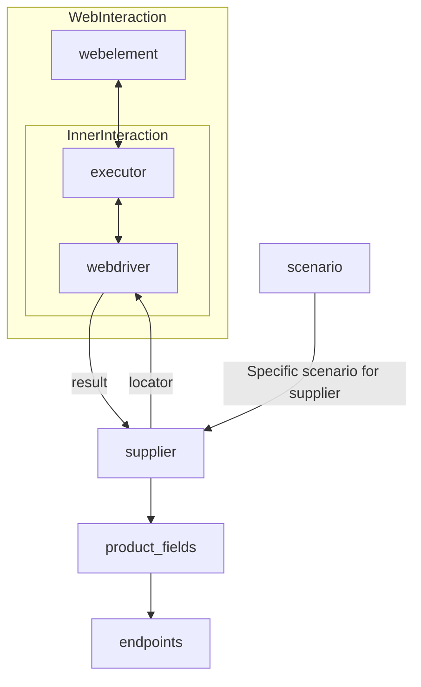
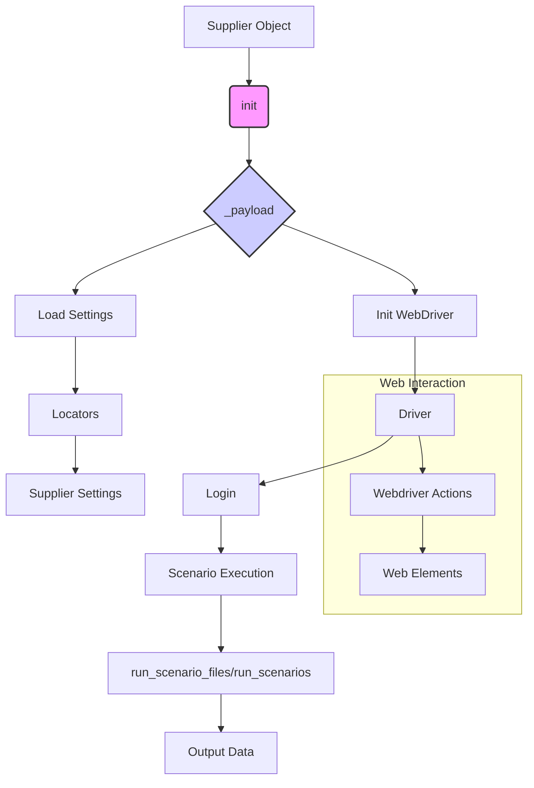

```MD
# <input code>

```[Русский](https://github.com/hypo69/hypo/blob/master/README.RU.MD)
# **Class** `Supplier`
### **Base class for all suppliers**
*In the context of the code, `Supplier` represents an information provider.  
A supplier can be a producer of goods, data, or information.  
The supplier's sources include a website's landing page, a document, a database, or a table.  
This class unifies different suppliers under a standardized set of operations.  
Each supplier has a unique prefix. ([Details on prefixes](prefixes.md))*  

The `Supplier` class serves as the foundation for managing interactions with suppliers.  
It handles initialization, configuration, authentication, and execution of workflows for various data sources, such as `amazon.com`, `walmart.com`, `mouser.com`, and `digikey.com`. Clients can also define additional suppliers.  

---

## List of implemented suppliers:

[aliexpress](aliexpress)  - Implemented with two workflows: `webdriver` and `api`  
[amazon](amazon) - `webdriver`  
[bangood](bangood)  - `webdriver`  
[cdata](cdata)  - `webdriver`  
[chat_gpt](chat_gpt)  - Interacts with the ChatGPT interface (NOT THE MODEL!)  
[ebay](ebay)  - `webdriver`  
[etzmaleh](etzmaleh)  - `webdriver`  
[gearbest](gearbest)  - `webdriver`  
[grandadvance](grandadvance)  - `webdriver`  
[hb](hb)  - `webdriver`  
[ivory](ivory) - `webdriver`  
[ksp](ksp) - `webdriver`  
[kualastyle](kualastyle) `webdriver`  
[morlevi](morlevi) `webdriver`  
[visualdg](visualdg) `webdriver`  
[wallashop](wallashop) `webdriver`  
[wallmart](wallmart) `webdriver`  
[Details on WebDriver :class: `Driver`](../webdriver)  
[Details on workflows :class: `Scenario`](../scenarios)

---

## **Attributes**
- **`supplier_id`** *(int)*: Unique identifier for the supplier.  
- **`supplier_prefix`** *(str)*: Supplier prefix, e.g., `'amazon'`, `'aliexpress'`.  
- **`supplier_settings`** *(dict)*: Supplier settings loaded from a JSON file.  
- **`locale`** *(str)*: Localization code (default: `'en'`).  
- **`price_rule`** *(str)*: Rules for price calculations (e.g., VAT rules).  
- **`related_modules`** *(module)*: Helper modules for specific supplier operations.  
- **`scenario_files`** *(list)*: List of scenario files to be executed.  
- **`current_scenario`** *(dict)*: Scenario currently being executed.  
- **`login_data`** *(dict)*: Data for authentication.  
- **`locators`** *(dict)*: Dictionary of web element locators.  
- **`driver`** *(Driver)*: WebDriver instance for interacting with the supplier's website.  
- **`parsing_method`** *(str)*: Data parsing method (e.g., `'webdriver'`, `'api'`, `'xls'`, `'csv'`).  

---

## **Methods**

### **`__init__`**
**Constructor of the `Supplier` class.**

```python
def __init__(self, supplier_prefix: str, locale: str = 'en', webdriver: str | Driver | bool = 'default', *attrs, **kwargs):
    """Initializes an instance of Supplier.

    Args:
        supplier_prefix (str): The supplier's prefix.
        locale (str, optional): Localization code. Defaults to 'en'.
        webdriver (str | Driver | bool, optional): Type of WebDriver. Defaults to 'default'.

    Raises:
        DefaultSettingsException: If default settings are not properly configured.
    """
```

### **`_payload`**
**Loads supplier settings and initializes the WebDriver.**

```python
def _payload(self, webdriver: str | Driver | bool, *attrs, **kwargs) -> bool:
    """Loads settings, locators, and initializes the WebDriver.

    Args:
        webdriver (str | Driver | bool): Type of WebDriver.

    Returns:
        bool: Returns `True` if the loading was successful.
    """
```

### **`login`**
**Handles authentication on the supplier's website.**

```python
def login(self) -> bool:
    """Authenticates the user on the supplier's website.

    Returns:
        bool: Returns `True` if login was successful.
    """
```

### **`run_scenario_files`**
**Executes one or more scenario files.**

```python
def run_scenario_files(self, scenario_files: str | List[str] = None) -> bool:
    """Runs the provided scenario files.

    Args:
        scenario_files (str | List[str], optional): List or path to scenario files.

    Returns:
        bool: Returns `True` if scenarios were executed successfully.
    """
```

### **`run_scenarios`**
**Executes specified scenarios.**

```python
def run_scenarios(self, scenarios: dict | list[dict]) -> bool:
    """Executes specified scenarios.

    Args:
        scenarios (dict | list[dict]): Scenarios to be executed.

    Returns:
        bool: Returns `True` if all scenarios were executed successfully.
    """
```

---

# <algorithm>

**Algorithm:** The `Supplier` class manages interactions with various online retailers.


1. **Initialization (`__init__`):** The class is initialized with a `supplier_prefix` (e.g., 'amazon'), `locale` (default 'en'), and WebDriver type. This sets up the basic properties for the supplier.
   * Example: `supplier = Supplier(supplier_prefix='aliexpress', locale='ru')`

2. **Loading settings and initializing WebDriver (`_payload`):** This function loads supplier-specific settings (presumably from a JSON file), locators, and initializes the WebDriver based on the provided type.
   * Example: `supplier._payload(webdriver='chrome')`

3. **Authentication (`login`):** Handles the login process for the given supplier.
   * Example: `supplier.login()`

4. **Executing scenarios (`run_scenario_files`, `run_scenarios`):** This is where the core logic for collecting data happens.  The class executes one or more scenario files (e.g., 'example_scenario.json') containing a list of operations or specific scenarios. Scenarios can also be given directly.
    *Example: `supplier.run_scenario_files(['scenario1.json', 'scenario2.json'])`
   or `supplier.run_scenarios([{'action': 'scrape', 'target': 'product_list'}])`


# <mermaid>



**Explanation of Dependencies**:

* **`Driver`:** This is a dependency representing the WebDriver (e.g., Selenium) class used for interacting with web browsers. The `Supplier` class relies on the `Driver` class for controlling the browser and interacting with web pages. This dependency is indicated in the diagram via the `G[Driver]` element.

* **`Scenario`**: The diagram shows an arrow `J --> K[run_scenario_files/run_scenarios]` suggesting the `Supplier` class may use a `Scenario` class to define and execute specific steps for data collection. The `Scenario` class is external to `Supplier`  but vital to its operation, defining how the data is collected for each supplier (the data format in the `scenario_files` may need to be compatible).

* **External Files (e.g., JSON settings):**  The `Supplier` class loads settings from external files (likely JSON).  These files contain configuration specific to the different suppliers, including credentials and locators. The dependency is implied in the `Load Settings` block (D), though not explicitly mentioned in the Mermaid diagram due to the nature of the loading process.


# <explanation>

**Imports:**

The code provided doesn't include any explicit import statements.  The comments, and the references to `../webdriver` and `../scenarios` suggest that imports for the `Driver` class and any necessary scenario classes would be present in the actual code, rather than the description itself.

**Classes:**

* **`Supplier`:** This class represents a supplier (e.g., Amazon, eBay) of data. It handles the interaction, configuration, authentication, and scenario execution for a particular supplier. It's a fundamental building block for collecting data across different sources, and the code example demonStartes methods for managing different workflows (e.g., webdriver or API) and data formats. The key concept is standardization. The supplier-specific information, locators, and scenarios are kept separate, creating a modular design.  Critically, the class design allows for easy addition of new suppliers.

**Functions:**

* **`__init__`:** Initializes the `Supplier` instance with basic information like the supplier prefix and locale.
* **`_payload`:** Loads the supplier's settings and initializes the WebDriver.  This is crucial for setting up the environment for the specific supplier's data collection operations.
* **`login`:** Handles the authentication with the supplier's website. This is a key function that's critical for accessing the required data.
* **`run_scenario_files`:** Executes scenarios defined in the given files, providing flexibility in defining different collection operations.
* **`run_scenarios`:** A flexible approach to execute various scenarios without needing files. This is likely to be a common pattern for managing different workflows (e.g., scraping the product list, collecting review data).

**Variables:**

Attributes like `supplier_prefix`, `locale`, `driver`, `locators`, `scenario_files` are all fundamental to the object's behavior and provide a means to customize the interactions with the specific data source.

**Possible Errors/Improvements:**

* **Error Handling:** The provided code lacks details on error handling.  Adding `try...except` blocks around critical operations (e.g., file loading, WebDriver initialization, login) would make the code more robust.  For example, `DefaultSettingsException` is mentioned but not implemented.

* **Testability:**  Tests would greatly enhance the reliability of the `Supplier` class. Tests for individual functions (like login, scenario execution) would demonStarte that it's working correctly.

* **Data Validation:**  Validating data retrieved from websites (e.g., prices, product names) could prevent unexpected results.  

* **Logging:** Implementing logging would provide valuable insight into the execution flow and identify issues more effectively.

* **Security:** If the authentication process involves secrets (passwords, API keys), appropriate security measures should be implemented to protect sensitive data.

* **Scalability:** The current structure seems well suited to scaling, but more details on how the data is processed further downstream are needed.

**Relationship with other parts of the project:**

The `Supplier` class relies on external resources (e.g., JSON settings, a WebDriver implementation), defined likely within the project's `webdriver` and `scenarios` modules. The code's architecture anticipates the existence of various scenario files that contain the logic for interacting with individual web pages or API endpoints, and it's designed to be used in a larger data processing pipeline.