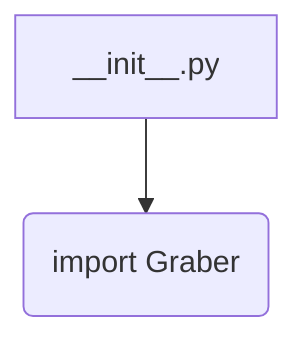
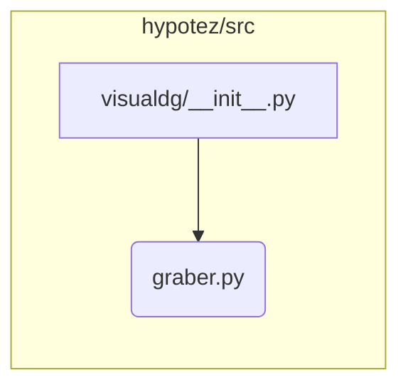

# <input code>

```python
## \file hypotez/src/suppliers/visualdg/__init__.py
# -*- coding: utf-8 -*-\
#! venv/Scripts/python.exe
#! venv/bin/python/python3.12

"""
.. module: src.suppliers.visualdg 
	:platform: Windows, Unix
	:synopsis:

"""
MODE = 'dev'

from .graber import Graber
```

# <algorithm>

Этот код является файлом инициализации модуля `visualdg` в пакете `suppliers`.  Он импортирует класс `Graber` из подмодуля `graber`.  Блок-схема простая и состоит из единственного шага: импорта.



Пример:
Этот код, будучи файлом инициализации, не выполняет никаких действий непосредственно.  Он просто делает доступным класс `Graber` для использования в других частях проекта.

# <mermaid>



**Объяснение к диаграмме:**

Диаграмма показывает, что файл `visualdg/__init__.py` импортирует класс `Graber` из файла `graber.py`, который находится в том же каталоге (подпапке `visualdg`).  Это стандартная практика для организации кода в Python.  Используется стандартная структура папок `hypotez/src/suppliers/visualdg`.

# <explanation>

* **Импорты:**
    * `from .graber import Graber`: Этот импорт вводит класс `Graber` из модуля `graber.py`, находящегося в той же директории.  Символ `.` указывает, что импортируемый модуль находится в текущей директории (в подпапке `visualdg`). Это означает, что файл `graber.py` должен существовать в директории `hypotez/src/suppliers/visualdg/`.  Он позволяет использовать класс `Graber` в файлах `visualdg` без полного пути.

* **Классы:**
    * `Graber`:  Этот класс (предположительно) содержит методы для работы с данными или функциональностью, связанной с визуализацией. Подробности о его функциональности не видны из предоставленного кода `__init__.py`, но в `graber.py`  можно ожидать определения методов для извлечения, обработки или отображения данных.

* **Функции:**
    * Нет функций.  Файл `__init__.py` предназначен главным образом для импорта других модулей, а не для определения собственных функций.

* **Переменные:**
    * `MODE = 'dev'`:  Это переменная, вероятно, определяет режим работы приложения (например, 'dev' для разработки, 'prod' для производства).  Она может использоваться для настройки поведения программы в разных окружениях. Значение переменной не используется в этом `__init__.py`, но может быть существенно в других файлах проекта.

* **Возможные ошибки или области для улучшений:**
    * Отсутствие документации (docstrings) для класса `Graber` и переменной `MODE`  уменьшает понятность кода.  
    * Лучше было бы использовать строковые константы (например, `MODE_DEV = 'dev'`, `MODE_PROD = 'prod'`), чтобы сделать значения констант более понятными.
    *  Непонятно назначение `#! venv/Scripts/python.exe` и `#! venv/bin/python/python3.12`.  Скорее всего, это части  `shebang` для указания интерпретатора Python. Если используются виртуальные окружения, эти строки могут быть избыточными.


**Цепочка взаимосвязей с другими частями проекта:**

Этот файл является частью более крупной структуры пакета `suppliers`.  Он предоставляет доступ к классу `Graber`, который вероятно, используется в других модулях для получения и обработки визуальных данных.  Более подробная информация о том, как используется `Graber`,  зависит от кода других модулей в пакете `suppliers`, а также от того, как организованы другие части проекта.