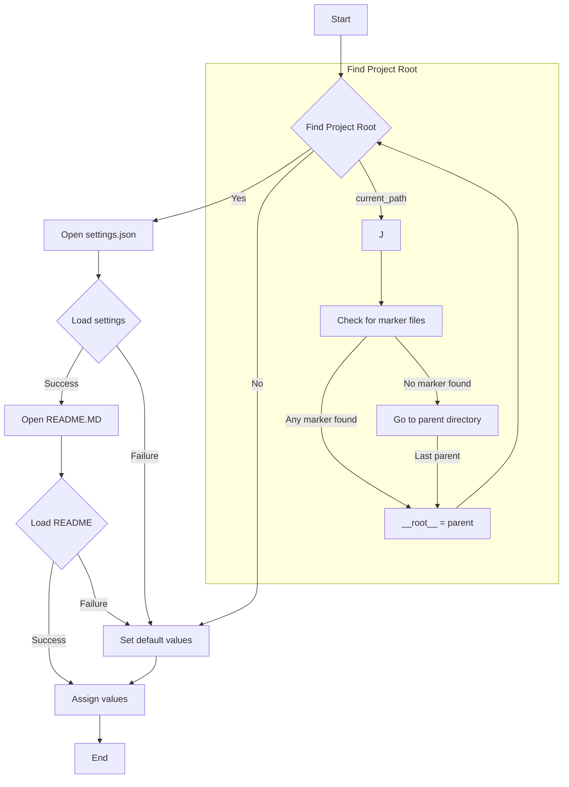
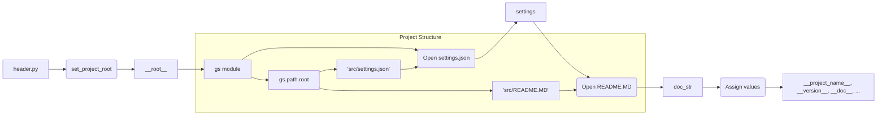

# <input code>

```python
## \file hypotez/src/suppliers/visualdg/header.py
# -*- coding: utf-8 -*-\
#! venv/Scripts/python.exe
#! venv/bin/python/python3.12

"""
.. module: src.suppliers.visualdg 
	:platform: Windows, Unix
	:synopsis:

"""
MODE = 'dev'

import sys
import json
from packaging.version import Version

from pathlib import Path
def set_project_root(marker_files=('pyproject.toml', 'requirements.txt', '.git')) -> Path:
    """
    Finds the root directory of the project starting from the current file's directory,
    searching upwards and stopping at the first directory containing any of the marker files.

    Args:
        marker_files (tuple): Filenames or directory names to identify the project root.
    
    Returns:
        Path: Path to the root directory if found, otherwise the directory where the script is located.
    """
    __root__:Path
    current_path:Path = Path(__file__).resolve().parent
    __root__ = current_path
    for parent in [current_path] + list(current_path.parents):
        if any((parent / marker).exists() for marker in marker_files):
            __root__ = parent
            break
    if __root__ not in sys.path:
        sys.path.insert(0, str(__root__))
    return __root__


# Get the root directory of the project
__root__ = set_project_root()
"""__root__ (Path): Path to the root directory of the project"""

from src import gs

settings:dict = None
try:
    with open(gs.path.root / 'src' /  'settings.json', 'r') as settings_file:
        settings = json.load(settings_file)
except (FileNotFoundError, json.JSONDecodeError):
    ...

doc_str:str = None
try:
    with open(gs.path.root / 'src' /  'README.MD', 'r') as settings_file:
        doc_str = settings_file.read()
except (FileNotFoundError, json.JSONDecodeError):
    ...


__project_name__ = settings.get("project_name", 'hypotez') if settings  else 'hypotez'
__version__: str = settings.get("version", '')  if settings  else ''
__doc__: str = doc_str if doc_str else ''
__details__: str = ''
__author__: str = settings.get("author", '')  if settings  else ''
__copyright__: str = settings.get("copyrihgnt", '')  if settings  else ''
__cofee__: str = settings.get("cofee", "Treat the developer to a cup of coffee for boosting enthusiasm in development: https://boosty.to/hypo69")  if settings  else "Treat the developer to a cup of coffee for boosting enthusiasm in development: https://boosty.to/hypo69"
```

# <algorithm>



**Пример:**

Если `__file__` указывает на `hypotez/src/suppliers/visualdg/header.py`, то `set_project_root` будет искать `pyproject.toml`, `requirements.txt` или `.git` в `hypotez/src`, `hypotez`, и т.д.  Если `pyproject.toml` найден в `hypotez`, `__root__` будет содержать путь к `hypotez`.


# <mermaid>




# <explanation>

* **Импорты:**
    * `sys`: Модуль для взаимодействия с интерпретатором Python (например, добавление путей в `sys.path`).
    * `json`: Для работы с JSON-файлами (чтение настроек проекта).
    * `packaging.version`: Для работы с версиями пакетов (не используется напрямую, но импортирован).
    * `pathlib`: Для работы с путями к файлам (более современный подход).
    * `src.gs`:  Импортируется модуль `gs` из пакета `src`. Скорее всего, этот модуль отвечает за работу с файловой системой, предоставляя функции для определения корневого каталога проекта. Связь с `src` обуславливает структуру проекта (модули и пакеты находятся в `src`).

* **Классы:**  Нет определённых классов.

* **Функции:**
    * `set_project_root(marker_files)`: Находит корневой каталог проекта, начиная с текущей директории и ища указанные файлы/директории.  Аргумент `marker_files` позволяет определить, какие файлы/директории нужно использовать для определения корня проекта. Возвращает `Path` объект к корневому каталогу или путь к текущей директории если не найдены указанные маркеры. Эта функция необходима, чтобы найти корневую директорию проекта и добавить её путь в `sys.path`, что важно для импорта модулей из других каталогов проекта.


* **Переменные:**
    * `MODE`:  Строковая переменная, вероятно, для режима работы (например, 'dev', 'prod').
    * `__root__`:  Объект `pathlib.Path` хранит путь к корневому каталогу проекта.
    * `settings`: Словарь, загруженный из `settings.json`.
    * `doc_str`: Строка, содержащая содержимое файла `README.MD`.
    * Переменные `__project_name__`, `__version__`, `__doc__`, `__details__`, `__author__`, `__copyright__`, `__cofee__`:  Строковые переменные, хранящие информацию о проекте, полученные из `settings.json` (или заданные по умолчанию).


* **Возможные ошибки/улучшения:**
    * Обработка `FileNotFoundError` и `json.JSONDecodeError` при чтении настроек и `README.MD` - хорошо.
    *  Проверка корректности формата JSON в `settings.json` - необходимо.
    * В коде есть строка `__cofee__`. Вполне возможно, что это переменная, которая должна хранить ссылки на донатную страницу.

* **Взаимосвязи с другими частями проекта:**
    * Функция `set_project_root`  необходима для корректной работы с модулем `gs`.
    * Файлы `settings.json` и `README.MD` содержат важную информацию о проекте, используемую в разных модулях проекта.
    * Модуль `gs` скорее всего содержит функции для работы с файловой системой и вероятно играет ключевую роль в определении путей к другим файлам, например к `settings.json` и `README.MD`.


Код написан хорошо, с использованием лучших практик (обработка ошибок, именования).  Это ключевая часть любого проекта Python.