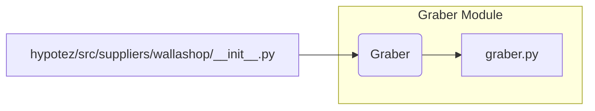

# <input code>

```python
## \file hypotez/src/suppliers/wallashop/__init__.py
# -*- coding: utf-8 -*-
#! venv/Scripts/python.exe
#! venv/bin/python/python3.12

"""
.. module: src.suppliers.wallashop 
	:platform: Windows, Unix
	:synopsis:

"""
MODE = 'dev'

from .graber import Graber
```

# <algorithm>

В этом файле происходит импорт класса `Graber` из модуля `graber.py`, находящегося в подкаталоге `wallashop` текущего каталога.  Алгоритм работы очень простой: импорт.  Нет циклов, условных операторов и каких-либо вызовов функций.  Все действия сводятся к импорту.

**Пример:**

Файл `graber.py` содержит класс `Graber`.  При импорте `from .graber import Graber`  интерпретатор выполняет загрузку и подготовку класса `Graber` к использованию в текущем скрипте.


# <mermaid>



# <explanation>

* **Импорты:**
    `from .graber import Graber`: Этот импорт подключает класс `Graber` из модуля `graber.py`, который находится в подкаталоге `wallashop` внутри пакета `suppliers` в `hypotez/src`. Символ `.` указывает на то, что модуль `graber.py` находится в текущем пакете (`wallashop`).  Этот импорт позволяет использовать класс `Graber` в других модулях или функциях этого пакета `wallashop`.

* **Классы:**
    Нет определений новых классов в данном файле.  Класс `Graber` определен в `graber.py` и импортирован для использования.

* **Функции:**
    Нет функций в данном файле.

* **Переменные:**
    `MODE = 'dev'`:  Переменная, хранящая строку 'dev'.  Вероятно, используется для настройки режима работы, например, для  разработки или производства.

* **Возможные ошибки или области для улучшений:**
    - Нет явной проверки существования файла `graber.py`. Если `graber.py` отсутствует, то возникнет ошибка импорта.
    - Нет комментариев, объясняющих использование переменной `MODE`.
    - Модуль `wallashop`  зависит от наличия и правильности работы `graber.py`. Это важно для дальнейшего развития проекта.


**Цепочка взаимосвязей:**

Файл `hypotez/src/suppliers/wallashop/__init__.py` импортирует класс `Graber` из `hypotez/src/suppliers/wallashop/graber.py`.  Это означает, что логика, связанная с получением данных (вероятно, из внешнего источника, например, веб-страницы), находится в `graber.py`.   `wallashop/__init__.py` является "входной точкой" доступа к классу `Graber`.  Следующий модуль, который использует `wallashop`,  может  обратиться к `wallashop.__init__.py` для получения доступа к `Graber` и работы с ним.
```
hypotez/src/suppliers/wallashop/__init__.py -> hypotez/src/suppliers/wallashop/graber.py
```