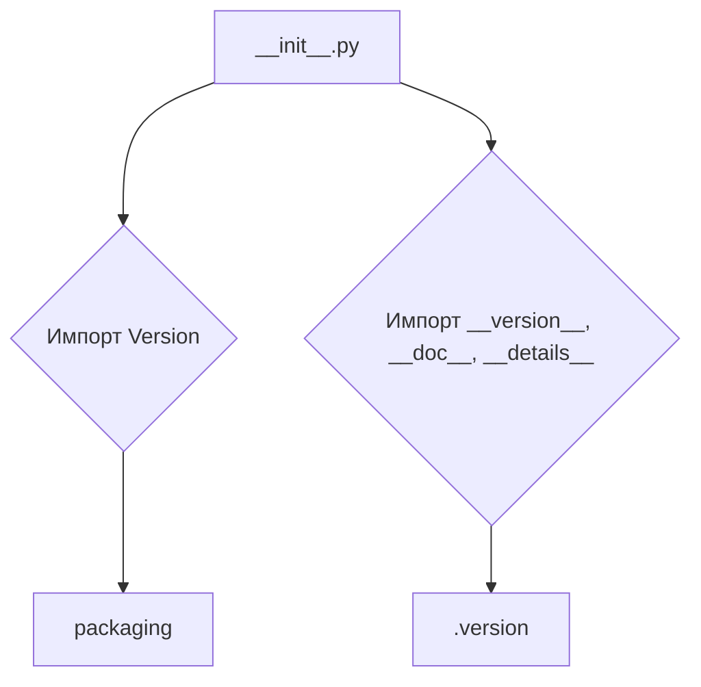

# <input code>

```python
## \file hypotez/src/templates/_examples/__init__.py
# -*- coding: utf-8 -*-\
#! venv/Scripts/python.exe
#! venv/bin/python/python3.12

"""
.. module: src.templates._examples 
	:platform: Windows, Unix
	:synopsis:

"""
MODE = 'dev'

"""
	:platform: Windows, Unix
	:synopsis:

"""


"""
	:platform: Windows, Unix
	:synopsis:

"""


"""
  :platform: Windows, Unix

"""
"""
  :platform: Windows, Unix
  :platform: Windows, Unix
  :synopsis:
"""MODE = 'dev'
  
""" module: src.templates._examples """


from packaging.version import Version
from .version import __version__, __doc__, __details__
```

# <algorithm>

Этот файл `__init__.py` является инициализатором для пакета `_examples` в директории `templates` проекта `hypotez`.  

Алгоритм работы крайне тривиален - он лишь импортирует модули и переменные из подмодуля `version`.  

Пошаговая блок-схема:

1. **Импорт:** Происходит импорт модуля `Version` из пакета `packaging`.  Этот импорт используется для работы с версиями пакетов, что может быть полезно для проверки совместимости и других подобных задач.

2. **Импорт:** Происходит импорт переменных `__version__`, `__doc__`, и `__details__` из подмодуля `version`.

**Пример:**

Этот код  выглядит как часть инициализации модуля, который будет участвовать в более сложной логике.


# <mermaid>



# <explanation>

**Импорты:**

- `from packaging.version import Version`: Импортирует класс `Version` из пакета `packaging`.  Этот пакет используется для работы с версиями пакетов Python.  Его импорт в данном случае указывает, что модуль `_examples` возможно будет взаимодействовать с другими пакетами через механизм управления версиями. Связь с другими частями проекта происходит через использование объектов `Version`.
- `from .version import __version__, __doc__, __details__`: Импортирует переменные `__version__`, `__doc__`, и `__details__`.  Эти переменные, вероятно, содержат метаданные о версии, документации и других деталях модуля `_examples`.  Их импорт означает, что эти данные будут доступны в модуле `_examples`. Связь с другими частями проекта выражена импортом из подмодуля `.version`.


**Классы:**

Нет определенных классов.

**Функции:**

Нет определенных функций.

**Переменные:**

- `MODE = 'dev'`:  Глобальная переменная, вероятно, задает режим работы (например, "разработка", "производство") для текущей задачи.  Использование `dev` подразумевает, что данный код работает в среде разработки.


**Возможные ошибки или улучшения:**

- **Комментарии:** Некоторые комментарии в файле, особенно те, которые повторяются, не несут ценной информации.  Их стоит пересмотреть и, возможно, удалить.


**Цепочка взаимосвязей:**

Модуль `_examples` скорее всего используется другими модулями или классами в проекте `hypotez`.  Подмодуль `.version` хранит данные о версии, что важно для управления зависимостями в проекте, особенно для работы с различными версиями библиотек.  Этот импорт указывает на существование подмодуля `version`. Возможно, этот файл содержит данные о версии и других метаданных для всего пакета или отдельных модулей.