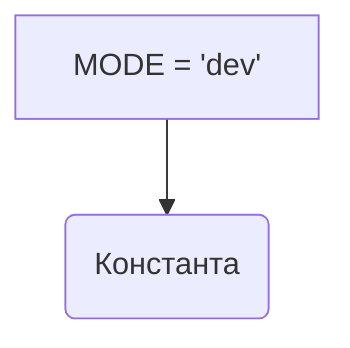

# <input code>

```python
## \file hypotez/src/translators/__init__.py
# -*- coding: utf-8 -*-\
#! venv/Scripts/python.exe
#! venv/bin/python/python3.12

"""
.. module: src.translators 
	:platform: Windows, Unix
	:synopsis:

"""
MODE = 'dev'
```

# <algorithm>

Этот код представляет собой инициализационный модуль для пакета `translators` внутри проекта `hypotez`. Он не содержит логики выполнения, а только константу, определяющую режим работы.

**Пошаговая блок-схема:**

1. **Объявление константы `MODE`:**  Присваивается строковое значение `'dev'`.

В этом модуле нет функций или классов, которые вызывают друг друга, поэтому блок-схема упрощена.

# <mermaid>



# <explanation>

**Импорты:**

Код не содержит импортов.  Это, скорее всего, инициализирующий модуль для пакета, который будет содержать другие файлы с классами и функциями для перевода.

**Классы:**

Нет определений классов.

**Функции:**

Нет определений функций.

**Переменные:**

`MODE`:  Строковая переменная, которая, вероятно, определяет режим работы всей системы (например, `dev`, `prod`).  Её значение может быть использовано другими модулями проекта для адаптации поведения.  Тип – строка.

**Возможные ошибки и улучшения:**

* **Отсутствие документации для `MODE`:**  Необходимо добавить более подробное описание, что означает `'dev'`, а также возможные альтернативные значения, например, `'prod'`.
* **Отсутствие связи с другими частями проекта:**  Без импортов и функций/классов пока сложно проследить взаимосвязи.  Однако, скорее всего, это значение константы будет использовано в других модулях проекта `translators`.


**Цепочка взаимосвязей с другими частями проекта:**

Значение `MODE = 'dev'` будет влиять на поведение других модулей в `hypotez/src/translators` и, возможно, других частях проекта, которые импортируют этот файл.  Без дальнейшего анализа кода невозможно детально проследить все зависимости.  Например, значение `MODE` может быть использовано для включения или отключения определённых логов, конфигураций или дополнительных проверок.


**Пример возможного использования в другом модуле:**

```python
from hypotez.src.translators import MODE

if MODE == 'dev':
    print("Запущен в режиме разработки.")
    # выполнить дополнительные действия в режиме разработки