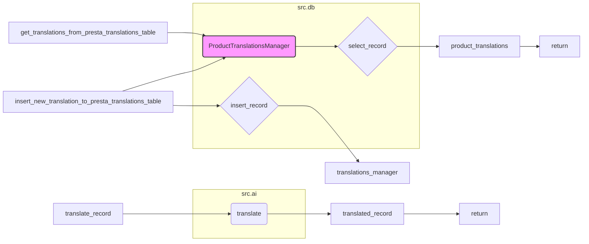

# <input code>

```python
## \file hypotez/src/translators/translate_product_fields.py
# -*- coding: utf-8 -*-
#! venv/Scripts/python.exe
#! venv/bin/python/python3.12

"""
.. module: src.translators 
	:platform: Windows, Unix
	:synopsis:

"""
MODE = 'dev'

"""
	:platform: Windows, Unix
	:synopsis:

"""


"""
	:platform: Windows, Unix
	:synopsis:

"""


"""
  :platform: Windows, Unix

"""
"""
  :platform: Windows, Unix
  :platform: Windows, Unix
  :synopsis:
"""MODE = 'dev'
  
""" module: src.translators """


""" Модуль управления переводами.
Слой связи между словарем полей товара, таблицей переводов и переводчиками

`get_translations_from_presta_translations_table(product_reference, credentials, i18n)`
    1. получает референс товара, параметры подключения к базе переводов престашоп и язык перевода в формате en_EN, he_HE, ru-RU 
    2. созадет условуе запроса
    3. возвращает результат
    

@todo
    1. Продумать какой нибудж парсер для en_EN, he_HE, ru-RU
"""
...
from pathlib import Path
from typing import List, Dict
...
from src import gs
from src.utils import  pprint
from src.product.product_fields.product_fields import record
from src.db import ProductTranslationsManager
from src.ai import translate
from src.endpoints.PrestaShop import PrestaShop
from src import gs
from src.product.product_fields.product_fields import record
from src.db import ProductTranslationsManager
from src.ai import translate
from src.endpoints.PrestaShop import PrestaShop

def get_translations_from_presta_translations_table(product_reference: str, credentials: dict, i18n: str = None) -> list:
    """Функция возвращает словарь переводов полей товара."""
    with ProductTranslationsManager(credentials) as translations_manager:
        search_filter = {'product_reference': product_reference}
        product_translations = translations_manager.select_record(**search_filter)
    return product_translations

def insert_new_translation_to_presta_translations_table(record, credentials):
    with ProductTranslationsManager(credentials) as translations_manager:
        translations_manager.insert_record(record)

def translate_record(record: dict, from_locale: str, to_locale: str) -> dict:
    """Функция для перевода полей товара."""
    translated_record = translate(record, from_locale, to_locale)
    ... # Добавить обработку переведенной записи
    return translated_record
```

# <algorithm>

**Алгоритм работы модуля `translate_product_fields.py`:**

1. **`get_translations_from_presta_translations_table`:**
   - Принимает `product_reference`, `credentials` (данные для подключения к базе) и необязательный `i18n` (язык).
   - Создаёт объект `ProductTranslationsManager` с переданными `credentials`.
   - Создаёт словарь `search_filter` с условием поиска по `product_reference`.
   - Использует метод `select_record` менеджера базы данных для выборки данных по условию.
   - Возвращает полученные данные `product_translations`.


2. **`insert_new_translation_to_presta_translations_table`:**
   - Принимает `record` (данные для вставки) и `credentials`.
   - Создаёт объект `ProductTranslationsManager` с переданными `credentials`.
   - Использует метод `insert_record` менеджера базы данных для вставки данных.

3. **`translate_record`:**
   - Принимает `record` (переводимые данные), `from_locale` и `to_locale`.
   - Использует функцию `translate` из модуля `src.ai` для перевода данных.
   - Обрабатывает переведенные данные (`translated_record`).
   - Возвращает переведённые данные.

**Пример:**

```
get_translations_from_presta_translations_table("product123", {"host": "localhost", "user": "user", "password": "pass"})
```

**Взаимодействие:**


```
+-----------------+    +-----------------+    +-----------------+
|   get_...        |--->|ProductTranslationsManager|--->|   translate     |
+-----------------+    +-----------------+    +-----------------+
       |                                |
       |          (select record)          |        |
       |          data - record        |--->|translate|
       V                                |        V
```

# <mermaid>



# <explanation>

**Импорты:**

- `from pathlib import Path`: Импортирует класс `Path` для работы с путями к файлам.  Не используется в данном коде.
- `from typing import List, Dict`: Импортирует типы данных `List` и `Dict` для явного указания типов возвращаемых значений.
- `from src import gs`: Импортирует модуль `gs` из пакета `src`.  Назначение неизвестно без контекста.
- `from src.utils import pprint`: Импортирует функцию `pprint` для красивого вывода данных (вероятно, для отладки).
- `from src.product.product_fields.product_fields import record`: Импортирует `record` из модуля `src.product.product_fields.product_fields`.  Вероятно, представляет собой структуру данных для записи о товаре.
- `from src.db import ProductTranslationsManager`: Импортирует класс `ProductTranslationsManager` для работы с базой данных переводов.  Ключевой элемент для взаимодействия с БД.
- `from src.ai import translate`: Импортирует функцию `translate` из модуля `src.ai` для перевода текста.
- `from src.endpoints.PrestaShop import PrestaShop`: Импортирует класс `PrestaShop` из модуля `src.endpoints.PrestaShop`.  Предположительно, для взаимодействия с API Престашоп.
- `from src.product.product_fields.product_fields import record`: Повторный импорт, возможно, ошибка.

**Классы:**

- `ProductTranslationsManager`: Класс для управления взаимодействием с базой данных переводов.  Он, вероятно, содержит методы для чтения (`select_record`) и записи (`insert_record`) данных в базу.

**Функции:**

- `get_translations_from_presta_translations_table(product_reference, credentials, i18n=None)`: Получает переводы для указанного товара из базы данных.  Возвращает список словарей с переводом.
- `insert_new_translation_to_presta_translations_table(record, credentials)`: Добавляет новую запись перевода в базу.
- `translate_record(record, from_locale, to_locale)`: Переводит запись `record` с `from_locale` на `to_locale` используя функцию `translate`. Неполная функция, требующая доработки.


**Переменные:**

- `MODE`:  Глобальная переменная, вероятно, для настройки режима работы.
- `product_reference`, `credentials`, `i18n`: Аргументы функций. `credentials` — важная переменная для доступа к данным авторизации.
- `search_filter`, `product_translations`, `translated_record`: Временные переменные для хранения данных в процессе работы.

**Возможные ошибки и улучшения:**

- **Неполная функция `translate_record`:**  Не хватает логики обработки результата перевода. Требуется добавить обработку ошибок и валидации входных данных.
- **Отсутствие обработки ошибок:**  В `get_translations_from_presta_translations_table` и `insert_new_translation_to_presta_translations_table` отсутствует обработка потенциальных ошибок базы данных (например, исключения `SQLAlchemyError`).
- **Неясные импорты `gs`:** Непонятно, для чего используется импортируемый модуль `gs`.
- **Недостаточная документация:** Комментарии содержат общую информацию, но не всегда достаточно подробны.


**Взаимосвязи с другими частями проекта:**

Код зависит от классов и функций из модулей `src.db`, `src.ai`, `src.endpoints.PrestaShop` и `src.utils`.  Функциональность тесно связана с хранилищем данных переводов (престашоп).