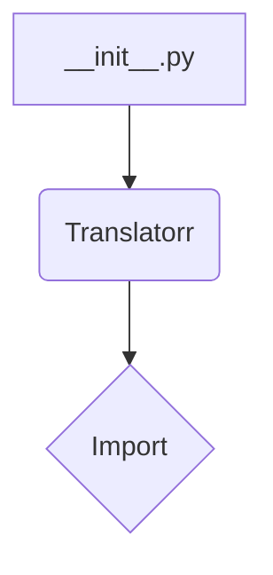

```MD
# <input code>

```python
## \file hypotez/src/translators/ttranslator/__init__.py
# -*- coding: utf-8 -*-
#! venv/Scripts/python.exe
#! venv/bin/python/python3.12

"""
.. module: src.translators.ttranslator 
	:platform: Windows, Unix
	:synopsis:

"""
MODE = 'dev'

"""
	:platform: Windows, Unix
	:synopsis:

"""


"""
	:platform: Windows, Unix
	:synopsis:

"""


"""
  :platform: Windows, Unix

"""
"""
  :platform: Windows, Unix
  :platform: Windows, Unix
  :synopsis:
"""MODE = 'dev'
  
""" module: src.translators.ttranslator """


# https://github.com/terryyin/translate-python?tab=readme-ov-file

from translate import Translatorr
```

# <algorithm>

Этот код содержит только импорт модуля `Translatorr` из пакета `translate`.  Блок-схема, в данном случае,  состоит из единственного шага: импорта. Нет вызовов функций или обработки данных.


# <mermaid>



# <explanation>

**Импорты:**

- `from translate import Translatorr`: Этот импорт подключает класс `Translatorr` из внешнего пакета `translate`, который, судя по ссылке в коде, является сторонним решением для перевода текстов.  Важное замечание: без информации о содержании пакета `translate` невозможно понять, каковы его функции и как он взаимодействует с другими частями приложения.  Необходимо изучить документацию этого пакета, чтобы понимать его функциональность.

**Классы:**

- Код не содержит определения классов.

**Функции:**

- Код не содержит определения функций.

**Переменные:**

- `MODE = 'dev'`: Эта строковая переменная, вероятно, определяет режим работы (например, 'dev' для разработки, 'prod' для производства).  Без контекста невозможно точно определить назначение этой переменной и её использование в других частях проекта.

**Возможные ошибки или улучшения:**

- **Отсутствие документации:**  Комментарии внутри файла содержат неинформативную метаданные.  Необходимо добавить более подробные комментарии о назначении модуля, переменных и, в особенности, о `Translatorr`.
- **Недостаток контекста:**  Без информации о том, как этот модуль используется в других частях проекта, невозможно полноценно оценить его значимость.
- **Зависимость от внешнего пакета:** Нужно оценить стабильность и актуальность пакета `translate`.  Он может нуждаться в обновлении или замене на более подходящий.
- **Отсутствие инициализации:**  Отсутствует логика инициализации `Translatorr`  -  это может быть необходимо, чтобы  получить доступ к его методам.


**Взаимосвязи с другими частями проекта:**

Этот `__init__.py` файл устанавливает импорт для пакета `translate`, который вероятно будет использоваться в других модулях приложения для перевода текстов.  Без кода других частей приложения сложно проследить всю цепочку. Для корректного анализа необходимо проанализировать вызовы и использование `Translatorr` в других модулях (например, в файлах `main.py` или `translation_service.py`).