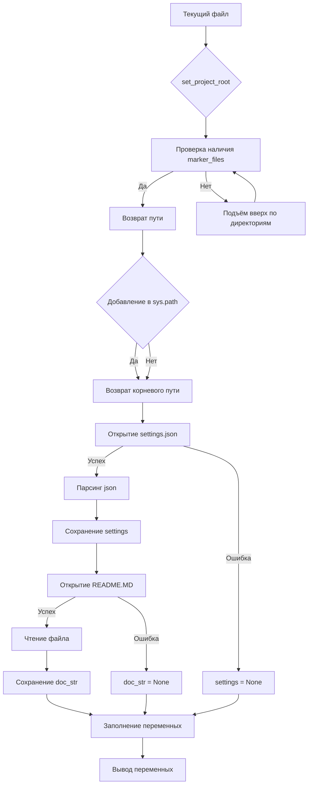

# <input code>

```python
## \file hypotez/src/logger/header.py
# -*- coding: utf-8 -*-
#! venv/Scripts/python.exe
#! venv/bin/python/python3.12

"""
.. module: src.logger 
	:platform: Windows, Unix
	:synopsis:

"""
MODE = 'dev'

"""
	:platform: Windows, Unix
	:synopsis: Модуль определяющий корневой путь к проекту. Все импорты строятся относительно этого пути.
    :TODO: В дальнейшем перенести в системную переменную"""

import sys
import json
from packaging.version import Version

from pathlib import Path
def set_project_root(marker_files=('pyproject.toml', 'requirements.txt', '.git')) -> Path:
    """
    Finds the root directory of the project starting from the current file's directory,
    searching upwards and stopping at the first directory containing any of the marker files.

    Args:
        marker_files (tuple): Filenames or directory names to identify the project root.
    
    Returns:
        Path: Path to the root directory if found, otherwise the directory where the script is located.
    """
    __root__:Path
    current_path:Path = Path(__file__).resolve().parent
    __root__ = current_path
    for parent in [current_path] + list(current_path.parents):
        if any((parent / marker).exists() for marker in marker_files):
            __root__ = parent
            break
    if __root__ not in sys.path:
        sys.path.insert(0, str(__root__))
    return __root__


# Get the root directory of the project
__root__ = set_project_root()
"""__root__ (Path): Path to the root directory of the project"""

from src import gs

settings:dict = None
try:
    with open(gs.path.root / 'src' / 'settings.json', 'r') as settings_file:
        settings = json.load(settings_file)
except (FileNotFoundError, json.JSONDecodeError):
    ...

doc_str:str = None
try:
    with open(gs.path.root / 'src' / 'README.MD', 'r') as settings_file:
        doc_str = settings_file.read()
except (FileNotFoundError, json.JSONDecodeError):
    ...


__project_name__ = settings.get("project_name", 'hypotez') if settings  else 'hypotez'
__version__: str = settings.get("version", '')  if settings  else ''
__doc__: str = doc_str if doc_str else ''
__details__: str = ''
__author__: str = settings.get("author", '')  if settings  else ''
__copyright__: str = settings.get("copyrihgnt", '')  if settings  else ''
__cofee__: str = settings.get("cofee", "Treat the developer to a cup of coffee for boosting enthusiasm in development: https://boosty.to/hypo69")  if settings  else "Treat the developer to a cup of coffee for boosting enthusiasm in development: https://boosty.to/hypo69"
```

# <algorithm>

**Шаг 1:**  Функция `set_project_root()` ищет корневую директорию проекта, начиная с текущей директории и поднимаясь вверх по иерархии директорий.

* **Вход:** Кортеж `marker_files` с именами файлов/папок, которые указывают на корень проекта.
* **Пример:** `marker_files = ('pyproject.toml', 'requirements.txt', '.git')`
* **Выход:** Объект `Path` содержащий путь к корневой директории проекта.

**Шаг 2:**  `set_project_root()` проверяет наличие файлов из `marker_files` в каждой родительской директории.

* **Пример:** Проверяется `current_path`, `current_path/parent`, `current_path/parent/parent`, ...
* **Логика:** Если какой-либо файл из `marker_files` найден, функция возвращает путь к этой директории.

**Шаг 3:** Если корень не найден, то возвращается путь текущей директории.

**Шаг 4:** Путь к корневой директории добавляется в системный путь `sys.path`, что позволяет импортировать модули из `src` папки проекта.


**Шаг 5:**  Получение данных из `settings.json` и `README.MD`.

* **Вход:** Путь к файлам `settings.json` и `README.MD` относительно корневой директории.
* **Выход:** Содержимое `settings.json` в виде словаря (`settings`) и содержимое `README.MD` в строке (`doc_str`).
* **Обработка ошибок:** Используются блоки `try...except` для перехвата `FileNotFoundError` и `json.JSONDecodeError` в случае отсутствия файлов или проблем с JSON-парсингом.


**Шаг 6:**  Получение конфигурационных данных.

* **Вход:** Словарь `settings` и строки.
* **Выход:** Переменные, содержащие данные из файла настроек.
* **Логика:** `settings.get(...)` используется для безопасного извлечения значений из словаря `settings`, возвращая значения по умолчанию в случае отсутствия ключа.

# <mermaid>


* **Зависимости:**
    * `pathlib` для работы с путями.
    * `json` для парсинга JSON.
    * `packaging.version` (вероятно, для работы с версиями).
    * `gs` -  не указанно в коде; скорее всего, это собственный модуль, определяющий константу `gs.path.root`, предоставляющую путь к корневой директории проекта.

# <explanation>

**Импорты:**

* `sys`:  Предоставляет доступ к системным переменным, в частности `sys.path`.  Используется для модификации пути поиска модулей.
* `json`:  Для сериализации и десериализации данных в формате JSON.  Используется для загрузки настроек из `settings.json`.
* `packaging.version`:  Вероятно, для работы с версиями пакетов.
* `pathlib`: Для работы с файловыми путями в объектно-ориентированном стиле.
* `gs`:  Это внутренний модуль, вероятнее всего, определён в другом месте проекта.  Он предоставляет функциональность для работы с путями проекта (`gs.path.root`).


**Классы:**

Нет классов в данном фрагменте.

**Функции:**

* `set_project_root(marker_files)`:  Находит корневой каталог проекта, идя вверх по дереву каталогов, пока не найдёт папку с `marker_files`. Если корень не найден, возвращает директорию текущего файла.  Важно для определения абсолютного пути ко всем файлам проекта.
   * `Args`: Кортеж `marker_files`  (файлы-маркеры).
   * `Returns`: Объект `pathlib.Path` (Путь к корню проекта).

**Переменные:**

* `__root__`:  Путь к корневой папке проекта.  Тип: `pathlib.Path`.
* `settings`: Словарь с настройками. Тип: `dict`.
* `doc_str`: Содержимое файла `README.MD`. Тип: `str`.
* `MODE`: Стрнг, содержит значение 'dev'.
* `__project_name__`, `__version__`, `__doc__`, `__details__`, `__author__`, `__copyright__`, `__cofee__`:  Переменные, содержащие данные из файла настроек (settings.json). Типы: `str` и `None`.

**Возможные ошибки и улучшения:**

* **Обработка ошибок:** Блоки `try...except` для `FileNotFoundError` и `json.JSONDecodeError` - хорошее решение для защиты от проблем с файлами. Но можно добавить более подробную информацию об ошибке.
* **`gs` модуль:** Необходимо понимать, как работает `gs`.
* **`sys.path`:**  Убедиться, что `__root__` не содержит символы, не допустимые в `sys.path` (например, пробелы, спецсимволы).

**Взаимосвязи с другими частями проекта:**

Файл `hypotez/src/logger/header.py` отвечает за определение и настройку пути к корневой директории проекта (`__root__`). Это критично для импорта других модулей (`gs` в данном случае), которые могут находиться в подпапках `src`.  Изменения в `settings.json` или `README.MD` повлияют на значения переменных `__project_name__` и т.д. Этот файл выступает как связующее звено между `gs` модулем и остальной частью проекта, обеспечивая доступ ко всем файлам.