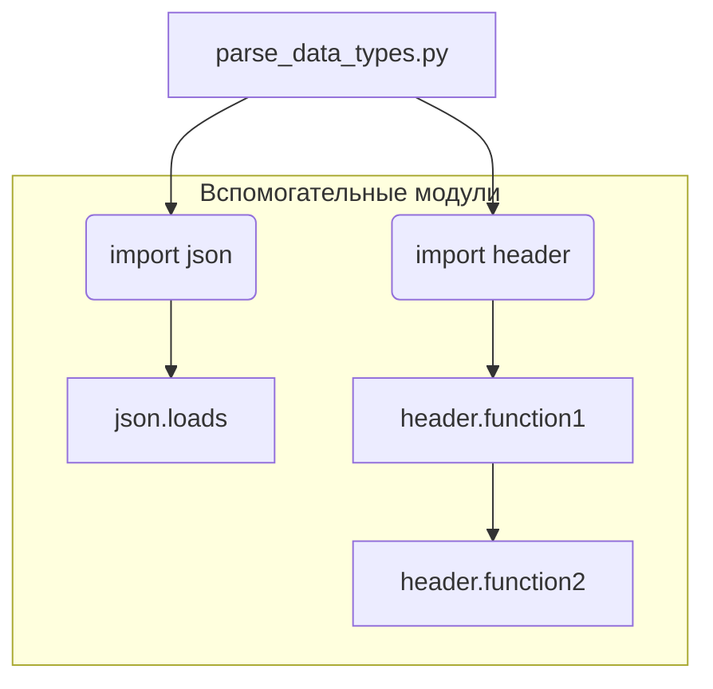

# <input code>

```python
## \file /src/utils/ai/parse_data_types.py
# -*- coding: utf-8 -*-\
#! venv/Scripts/python.exe
#! venv/bin/python/python3.12

"""
module: src.utils.ai.parse_data_types
	:platform: Windows, Unix
	:synopsis: Модуль определяющий корневой путь к проекту. Все импорты строятся относительно этого пути.
    :TODO: В дальнейшем перенести в системную переменную"""
MODE = 'dev'
...
import json
import header
```

# <algorithm>

К сожалению, предоставленный код фрагментарный и неполный.  Отсутствует основная логика.  Алгоритм не может быть описан без определения функций и классов, которые содержатся в этом файле.  Предполагается, что `header` импортирует какие-то вспомогательные функции или константы, а `json` используется для работы с JSON-данными.  Без полного кода невозможно построить блок-схему.


# <mermaid>



**Объяснение диаграммы:**

* `parse_data_types.py` - основной модуль, который импортирует `json` и `header`.
* `json` - модуль, который используется для работы с JSON-данными, содержит функции вроде `json.loads` для парсинга JSON-строк.
* `header` - предполагаемый модуль, содержащий другие функции и константы, необходимые для работы модуля `parse_data_types.py`.  Он содержит функции `header.function1` и `header.function2` (эти имена условны).

Без кода реализации, содержащейся в `header`, диаграмма очень упрощённая.  Полная диаграмма будет отображать вызовы функций в `parse_data_types.py` и их взаимодействие.


# <explanation>

* **Импорты:**
    * `json`: Стандартный модуль Python для работы с JSON-данными.  Используется для парсинга и сериализации JSON-объектов.  Связь с другими пакетами в рамках Python стандартная.
    * `header`:  Это имя предполагаемого модуля из пакета проекта.  Он содержит функции, необходимые для работы `parse_data_types.py`.  Без доступа к коду `header` невозможно определить точную связь с другими частями проекта.  Предполагается, что `header` импортирует другие модули из `src`, например, для обработки данных или конфигурации.

* **Классы:**  В предоставленном фрагменте кода нет определения классов.

* **Функции:**  Не определены.  Без определения функций невозможно сказать, что они делают.

* **Переменные:**
    * `MODE`:  Строковая переменная, хранит значение 'dev'.  Предположительно, используется для определения режима работы приложения (например, 'dev', 'prod').  В полном коде она может использоваться для управления условиями или выбором различных конфигураций.

* **Возможные ошибки и улучшения:**

    * **Неполный код:**  Фрагмент кода слишком мал для анализа. Необходимо предоставить полный код.
    * **Неявные зависимости:**  Указание `:synopsis:` не дает полную картину взаимодействия. Нужно больше деталей о функции `parse_data_types`, ее роли и назначении.
    * **Отсутствие документации:**  Недостаточно комментариев, чтобы понять назначение кода без дополнительных данных.


**Цепочка взаимосвязей с другими частями проекта (предположения):**

Вероятнее всего, `parse_data_types.py` обрабатывает различные типы данных (например, полученные из внешних источников), используя функции из модуля `header`.  Это обработанные данные используются другими частями приложения, например, для обучения моделей или подготовки данных для дальнейшей обработки.  Без полного кода сложно установить точные связи.