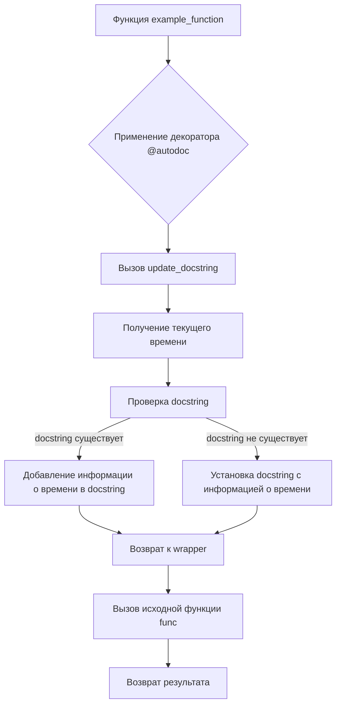

1. **<input code>**

```python
## \file hypotez/src/utils/autodoc.py
# -*- coding: utf-8 -*-
#! venv/Scripts/python.exe
#! venv/bin/python/python3.12

"""
.. module: src.utils 
   :platform: Windows, Unix
   :synopsis: Демонстрация использования декоратора для автоматического обновления docstring функции.

Описание:
    Этот модуль содержит декоратор `autodoc`, который обновляет строку документации функции с добавлением времени последнего вызова функции.
    Декоратор используется для того, чтобы автоматически обновлять docstring функции при её вызове.

    Декоратор оборачивает функцию, обновляя её docstring перед вызовом, добавляя в него строку с текущим временем.
    Для получения текущего времени используется библиотека `time`.

Пример использования:
    Пример функции `example_function`, которая использует декоратор `autodoc`. Каждый раз при её вызове её docstring обновляется, и в неё добавляется информация о времени последнего вызова функции.
    
    Пример кода:
    ```python
    @autodoc
    def example_function(param1: int, param2: str) -> None:
        "\\""Пример функции.\n    
        Args:\n            param1 (int): Первое значение.\n            param2 (str): Второе значение.\n        "\\""
        print(f"Processing {param1} and {param2}")
    
    example_function(1, "test")
    print(example_function.__doc__)  # Вывод обновленного docstring
    example_function(2, "another test")
    print(example_function.__doc__)  # Вывод обновленного docstring
    ```

"""

MODE = 'dev'

import functools
import time

def autodoc(func):
    """Декоратор для автоматического обновления docstring функции."""

    @functools.wraps(func)
    def wrapper(*args, **kwargs):
        # Обновляем docstring перед вызовом функции
        update_docstring(func)
        return func(*args, **kwargs)

    return wrapper

def update_docstring(func):
    """Обновляет docstring функции."""
    current_time = time.strftime("%Y-%m-%d %H:%M:%S")
    
    # Проверяем, существует ли docstring
    if func.__doc__:
        # Добавляем информацию о времени последнего вызова
        func.__doc__ += f"\n\nLast called at: {current_time}"
    else:
        func.__doc__ = f"Last called at: {current_time}"


# Пример использования декоратора
@autodoc
def example_function(param1: int, param2: str) -> None:
    """Пример функции.

    Args:
        param1 (int): Первое значение.
        param2 (str): Второе значение.
    """
    print(f"Processing {param1} and {param2}")

# Тестирование функции
example_function(1, "test")
print(example_function.__doc__)  # Вывод обновленного docstring
example_function(2, "another test")
print(example_function.__doc__)  # Вывод обновленного docstring
```

2. **<algorithm>**



**Пример:**

При вызове `example_function(1, "test")` алгоритм выполняет следующие шаги:
1.  Применяется декоратор `@autodoc`, который обертывает функцию `example_function` в `wrapper`.
2.  `wrapper` вызывает `update_docstring(example_function)`.
3.  `update_docstring` получает текущее время.
4.  Проверяет, что `example_function` имеет docstring.
5.  Добавляет строку с временем в docstring.
6.  `wrapper` вызывает `example_function`, которая печатает результат.
7.  Функция возвращает результат, который является None.

3. **<mermaid>**

```mermaid
graph LR
    subgraph "Модуль autodoc"
        A[autodoc(func)] --> B(wrapper);
        B --> C{update_docstring(func)};
        C --> D[time.strftime];
        D --> E[Проверка docstring];
        E -- есть --> F[Добавление в docstring];
        E -- нет --> G[Установка docstring];
        F --> H[Возврат func];
        G --> H;
        B -- wrapper(*args, **kwargs) --> I[func(*args, **kwargs)];
        I --> J[Возврат значения];
    end
    subgraph "Модуль time"
        D --> K(Время);
    end

    subgraph "Модуль functools"
        B --> L[functools.wraps(func)];
    end
    
    subgraph "example_function"
        I --> M[print(f"Processing {param1} and {param2}")];
    end
    
    
    J --> N[Вывод docstring];
```


**Подключаемые зависимости:**

*   `functools`:  Для сохранения метаданных исходной функции (`functools.wraps`).
*   `time`: Для получения текущего времени.


4. **<explanation>**

*   **Импорты:**
    *   `functools`: используется для декоратора `@functools.wraps`, который сохраняет метаданные оригинальной функции.  Это важно, чтобы  декоратор не нарушал работу  docstrings и других атрибутов оригинальной функции.
    *   `time`: используется для получения текущего времени и форматирования его в строку.

*   **Классы:** Нет определенных классов.

*   **Функции:**
    *   `autodoc(func)`: Это декоратор, который принимает функцию `func` в качестве аргумента. Он возвращает обертку `wrapper`, которая модифицирует docstring функции перед её вызовом.  Важной частью декоратора является `functools.wraps(func)`, это позволяет сохранять информацию о исходной функции.
    *   `update_docstring(func)`: Эта функция обновляет docstring функции, добавляя в неё информацию о времени последнего вызова. Она проверяет, существует ли docstring у функции, и обрабатывает оба случая (есть или нет).
    *   `example_function`: Примерная функция, которая иллюстрирует использование декоратора `@autodoc`.

*   **Переменные:**
    *   `MODE = 'dev'`:  Вероятно, константа для обозначения режима работы (разработка, производство), но прямо в коде не используется.
    *   `current_time`:  содержит строковое представление времени, полученное с помощью `time.strftime`.

*   **Возможные ошибки и улучшения:**
    *   **Обработка ошибок:**  Нет обработки потенциальных ошибок при работе с временем или docstring, например, если `func.__doc__` не является строкой.
    *   **Документация:** Документация могла бы быть более подробной, особенно по поводу функциональности `functools.wraps`.

**Взаимосвязь с другими частями проекта:**

Данный модуль `autodoc` скорее всего входит в набор утилит (`utils`) проекта `hypotez`, поэтому он не зависит от других частей проекта напрямую. Если в этом проекте есть модули, использующие функции `utils`, они будут напрямую использовать `autodoc`.