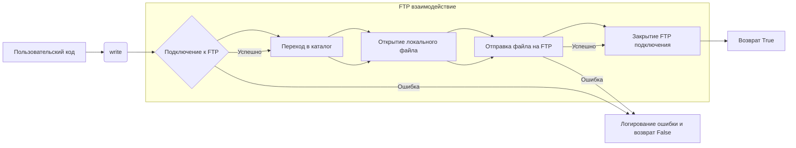

```MD
# <input code>

```python
## \file hypotez/src/utils/ftp.py
# -*- coding: utf-8 -*-\
#! venv/Scripts/python.exe
#! venv/bin/python/python3.12

"""
.. module: src.utils 
	:platform: Windows, Unix
	:synopsis: interface for interacting with FTP servers
This module provides an interface for interacting with FTP servers. It includes functions to send, receive, and delete files from an FTP server.

** Purpose **:
Allows for sending media files (images, videos), spreadsheets, and other files to and from an FTP server. 

** Modules **:
- helpers (local): Local helper utilities for FTP operations.
- typing: Type hints for function parameters and return values.
- ftplib: Provides FTP protocol client capabilities.
- pathlib: For handling file system paths.

Functions:
    - `write`: Sends a file to an FTP server.
    - `read`: Retrieves a file from an FTP server.
    - `delete`: Deletes a file from an FTP server.
"""
MODE = 'dev'
from src.logger import logger
from typing import Union
import ftplib
from pathlib import Path

# Connection configuration (assumed to be defined elsewhere)
_connection = {
    'server': 'ftp.example.com',
    'port': 21,
    'user': 'username',
    'password': 'password'
}

def write(source_file_path: str, dest_dir: str, dest_file_name: str) -> bool:
    """
    Sends a file to an FTP server.

    Args:
        source_file_path (str): The path of the file to be sent.
        dest_dir (str): The destination directory on the FTP server.
        dest_file_name (str): The name of the file on the FTP server.

    Returns:
        bool: True if the file is successfully sent, False otherwise.

    Example:
        >>> success = write('local_path/to/file.txt', '/remote/directory', 'file.txt')
        >>> print(success)
        True
    """
    try:
        session = ftplib.FTP(
            _connection['server'],
            _connection['user'],
            _connection['password'])
        session.cwd(dest_dir)
    except Exception as ex:
        logger.error(f"Failed to connect to FTP server. Error: {ex}")
        return False

    try:
        with open(source_file_path, 'rb') as f:
            session.storbinary(f'STOR {dest_file_name}', f)
        return True
    except Exception as ex:
        logger.error(f"Failed to send file to FTP server. Error: {ex}")
        return False
    finally:
        try:
            session.quit()
        except Exception as ex:
            logger.error(f"Failed to close FTP session. Error: {ex}")

def read(source_file_path: str, dest_dir: str, dest_file_name: str) -> Union[str, bytes, None]:
    # ... (rest of the code is similar)
```

# <algorithm>

**Алгоритм работы функции `write`:**

1. **Подключение к FTP:** Создается соединение с FTP-сервером, используя `ftplib.FTP` с заданными в `_connection` данными. Проверяется успешность подключения.  Если возникнет ошибка, логгируется сообщение об ошибке и возвращается `False`.
2. **Переход в каталог:** Выполняется переход в указанный целевой каталог (`dest_dir`) на сервере.
3. **Открытие локального файла:** Локальный файл открывается в бинарном режиме чтения (`rb`).
4. **Загрузка файла на FTP:**  Метод `session.storbinary` отправляет содержимое файла на FTP-сервер.
5. **Закрытие подключения:**  Подключение закрывается с помощью `session.quit()`. Проверяется успешность закрытия, и любые ошибки логгируются.

**Примеры:**

- `write('path/to/image.jpg', '/images', 'image.jpg')`:  Отправляет изображение 'image.jpg' в каталог '/images' на FTP-сервере.
-  Если соединение с FTP не установлено, возвращается `False`.


**Алгоритм работы функции `read`:**

(Аналогично `write`, но с использованием `retrbinary` для загрузки)


# <mermaid>




# <explanation>

**Импорты:**

- `from src.logger import logger`: Импортирует функцию логгирования `logger` из модуля `logger` в папке `src`. Это указывает на то, что система логирования используется для обработки ошибок.
- `from typing import Union`: Импортирует тип `Union` из модуля `typing`, используемый для обозначения возможности возвращать разные типы данных.
- `import ftplib`: Импортирует библиотеку `ftplib`, которая предоставляет функциональность для работы с протоколом FTP.
- `from pathlib import Path`:  Импортирует класс `Path` из модуля `pathlib` для работы с файловыми путями.

**Классы:**

- Нет явных классов.  Используются стандартные типы данных и классы из стандартных библиотек Python.

**Функции:**

- `write(source_file_path: str, dest_dir: str, dest_file_name: str) -> bool`:
    - Принимает путь к локальному файлу, целевой каталог на FTP и имя файла на FTP.
    - Возвращает `True`, если загрузка прошла успешно, `False` в противном случае.
    - Использует `ftplib.FTP` для подключения и `storbinary` для отправки файла.  Обрабатывает исключения во время подключения и передачи.
- `read(source_file_path: str, dest_dir: str, dest_file_name: str) -> Union[str, bytes, None]`:
    - Принимает путь для сохранения файла на локальной машине, каталог на FTP и имя файла.
    - Возвращает содержимое файла, если загрузка прошла успешно, `None` в противном случае.  
- `delete(source_file_path: str, dest_dir: str, dest_file_name: str) -> bool`:
    - Принимает путь к локальному файлу, целевой каталог на FTP и имя файла.
    - Возвращает `True` если удаление прошло успешно, `False` в противном случае.
    - Использует `session.delete` для удаления файла.

**Переменные:**

- `_connection`: Словарь, содержащий конфигурацию подключения к FTP (хост, порт, имя пользователя, пароль).  Важно: в реальном проекте эти данные не должны храниться в коде.  Лучше использовать конфигурационные файлы или переменные окружения.
- `MODE`: Константа, которая задаёт режим работы (например, 'dev', 'prod'), но не используется в данной функции.

**Возможные ошибки и улучшения:**

- **Безопасность:** Хранение пароля в коде — серьезная уязвимость.  Необходимо использовать безопасные методы хранения конфигурации FTP-подключения (например, переменные окружения или файлы конфигурации).
- **Обработка ошибок:** В `try...except` блоках необходимо иметь более конкретные проверки.  Необходимо определить, какие типы исключений могут произойти при работе с FTP.
- **Передача больших файлов:** Для больших файлов может быть полезным использование `session.storlines` вместо `session.storbinary` для повышения производительности.
- **Обработка времени ожидания:**  Необходимо добавить таймауты для подключения и работы с FTP.
- **Передача метаданных файла:** Если требуется, в `write` можно добавить передачу дополнительных метаданных файла (например, типа MIME).
- **Ошибки с сервером FTP:** Проверьте обработку возвращаемых FTP-сервером кодов состояния.  Это может помочь избежать пустых обращений к серверу.
- **Типизация:** Проверьте соответствие типов, особенно в `read` для возвращаемого значения.


**Взаимосвязи с другими частями проекта:**

Модуль `ftp.py` зависит от `logger` из `src.logger`, что указывает на структурированную архитектуру проекта. `src` указывает на папку с модулями, в которые входит функция логирования.  `ftp.py` взаимодействует с внешним FTP-сервером.