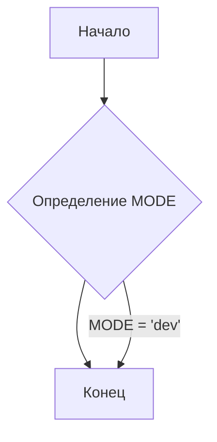

```MD
# Анализ файла hypotez/src/utils/iso/__init__.py

## <input code>

```python
## \file hypotez/src/utils/iso/__init__.py
# -*- coding: utf-8 -*-\
#! venv/Scripts/python.exe
#! venv/bin/python/python3.12

"""
.. module: src.utils.iso 
	:platform: Windows, Unix
	:synopsis:

"""
MODE = 'dev'
```

## <algorithm>

Данный файл представляет собой инициализирующий модуль для пакета `iso`.  Он не содержит функций или классов, а лишь определяет константу `MODE` со значением 'dev'.  Блок-схема здесь тривиальна:



Пример использования:

```python
import hypotez.src.utils.iso as iso

print(iso.MODE)  # Выведет 'dev'
```

## <mermaid>


## <explanation>

**Импорты:**

Файл не содержит импортов. Он не использует какие-либо функции или классы из других модулей.

**Классы:**

Нет классов.

**Функции:**

Нет функций.

**Переменные:**

- `MODE`:  Строковая константа, вероятно, определяющая режим работы, например, 'dev' (разработка) или 'prod' (производство).  Значение 'dev' по умолчанию. Тип данных - `str`.

**Возможные ошибки и улучшения:**

- **Недостаток функциональности:** Модуль не выполняет никакой реальной работы. Он только определяет константу. Для практического использования в папке `utils/iso` необходимо добавить классы и функции, которые обрабатывают данные, связанные с ISO стандартами.
- **Docstring:**  Docstring, хотя и присутствует, не содержит полезной информации о назначении и использовании `MODE`.  Следует дополнить описанием роли `MODE` в проекте.
- **Взаимосвязи с другими частями проекта:**  Без дополнительного кода, трудно определить прямую взаимосвязь с другими частями проекта. `MODE` может использоваться в других модулях для выбора различного поведения в зависимости от стадии разработки.


**Цепочка взаимосвязей (предполагаемая):**

```
hypotez.src.utils.iso.MODE -> (Возможно) другие модули проекта, которые используют MODE для выбора различных настроек или поведения в зависимости от режима.
```

**Вывод:**

Файл `hypotez/src/utils/iso/__init__.py` является пустым инициализирующим модулем для пакета `iso` в проекте `hypotez`.  Он определяет константу `MODE`, но не выполняет других функций.  Для полезного использования требуется разработка функций и классов внутри этого пакета, которые отвечают за конкретные задачи, связанные с ISO стандартами.