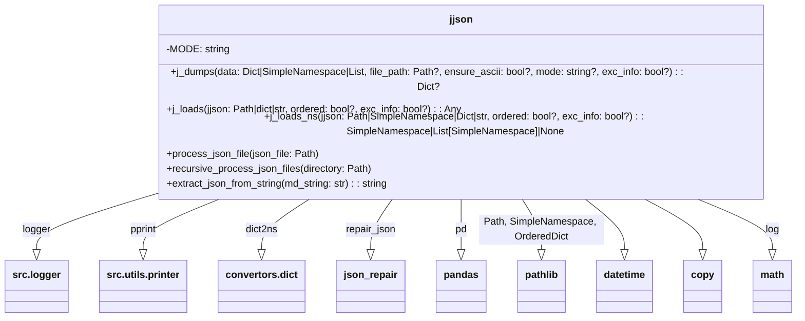

# Анализ кода jjson.py

## <input code>

```python
# ... (код из файла jjson.py)
```

## <algorithm>

Алгоритм работы кода можно представить в виде следующей блок-схемы:

```mermaid
graph TD
    A[Начало j_dumps] --> B{Тип данных data?};
    B -- str --> C[repair_json(data)];
    B -- !str --> D[_convert(data)];
    C --> E{Результат repair_json?};
    E -- ok --> F[data = _convert(data)];
    E -- error --> G[logger.error, Возврат];
    F --> H{path существует и mode = "a+" или "+a"?};
    H -- да --> I[Чтение existing_data из файла];
    I --> J{Результат чтения?};
    J -- ok --> K[data = merge(data, existing_data)];
    J -- error --> G;
    H -- нет --> K;
    K --> L{mode = "a+"?};
    L -- да --> M[data = data + existing_data];
    L -- нет --> N[data = existing_data + data];
    M --> O[Запись data в path];
    N --> O;
    O --> P[logger.error, Возврат];
    O -- ok --> Q[Возврат data];
    D --> K;
```


```mermaid
graph TD
    A[Начало j_loads] --> B{Тип данных jjson?};
    B -- Path --> C[jjson.is_dir()?];
    C -- да --> D[Считывание всех *.json из директории];
    D --> E[Обработка каждого файла];
    E --> F[j_loads на каждом файле];
    F --> G[merge_dicts];
    G --> H[Возврат результата];
    C -- нет --> I[jjson.suffix.lower() == ".csv"?];
    I -- да --> J[pd.read_csv];
    J --> K[Возврат результата];
    I -- нет --> L[jjson.read_text];
    L --> M[json.loads];
    M --> N{Ошибка?};
    N -- да --> O[repair_json];
    O --> P[json.loads];
    P --> Q[Возврат результата];
    N -- нет --> Q;
    B -- str --> R[clean_string(jjson)];
    R --> M;
    B -- dict --> H;

    B --! Path/str/dict --> S[Возврат jjson];

    subgraph Возможные ошибки
        Q --> T[FileNotFoundError];
        Q --> U[Exception];
    end
```

**Пример:**

* **j_dumps:** Если `data` – словарь {'a': 1, 'b': 2}, `file_path` – '/path/to/file.json', `mode` – 'a+', то функция прочтет данные из `/path/to/file.json`, добавит к ним новые данные и запишет результат обратно в файл.
* **j_loads:** Если `jjson` – путь к директории `/path/to/dir`, то функция прочитает все `.json` файлы в этой директории, объединит их (если структура одинаковая) и вернет объединённый результат.


## <mermaid>



## <explanation>

**Импорты:**

* `from src.logger import logger`: Импортирует логгер из модуля `src.logger`, позволяя записывать сообщения об ошибках и отладке.
* `from src.utils.printer import pprint`: Импортирует функцию `pprint` для красивой печати данных.
* `from .convertors.dict import dict2ns`: Импортирует функцию `dict2ns` для преобразования словаря в `SimpleNamespace` и наоборот.
* Другие импорты (datetime, copy, math, pathlib, typing, json, os, re, pandas, json_repair, collections) – стандартные или сторонние библиотеки, необходимые для работы с JSON, CSV, файлами, списками и словарями.

**Классы:**

Нет определенных классов, только использование `SimpleNamespace` из `types`.

**Функции:**

* **`j_dumps(data, file_path=None, ensure_ascii=True, mode="w", exc_info=True)`:**  Функция для сохранения JSON данных в файл или возврата их в виде словаря.  Принимает на вход данные, путь к файлу (необязательный), флаг для обработки не-ASCII символов, режим открытия файла ('w', 'a+', '+a'), флаг для вывода информации об ошибке.  Обрабатывает различные типы данных (dict, list, SimpleNamespace).  Поддерживает добавление данных в существующий файл (режимы 'a+' и '+a').
* **`j_loads(jjson, ordered=False, exc_info=True)`:** Функция для загрузки JSON или CSV данных из файла, директории или строки. Принимает на вход данные (строку, путь к файлу или директории). Поддерживает чтение из директорий, обрабатывает `.json` и `.csv` файлы.  Может возвращать список словарей для CSV.
* **`j_loads_ns(jjson, ordered=False, exc_info=True)`:** Преобразует загруженные данные в SimpleNamespace.
* **`process_json_file(json_file)`:** Функция для обработки конкретного JSON файла, заменяя ключ `name` на `category_name`.
* **`recursive_process_json_files(directory)`:**  Рекурсивно обрабатывает JSON файлы в заданной директории.
* **`extract_json_from_string(md_string)`:** Функция для извлечения JSON данных из Markdown строки.

**Переменные:**

* `MODE`: Строковая константа, хранящая режим работы.

**Возможные ошибки/улучшения:**

* **Неустойчивость к различным форматам входных данных:** `j_loads` может быть более устойчивым к разным вариантам JSON в строках.
* **Обработка ошибок:**  В коде есть обработка исключений, но для улучшения робастности можно добавить более подробные сообщения об ошибках.
* **Документация:** Документация может быть расширена, чтобы описать все возможные варианты использования.
* **Проверка типов данных:** В `j_dumps` и `j_loads` можно добавить больше проверок типов данных для повышения надежности.
* **Излишнее использование `...`:**  Внутри блоков `try...except` конструкции `...` используются излишне, достаточно простого `pass`
* **`json_repair`:** Неясно, как именно работает `json_repair`. Лучше добавить описание или ссылку на эту библиотеку.

**Взаимосвязь с другими частями проекта:**

Модуль `jjson` активно взаимодействует с `src.logger` (для логирования) и `src.utils.printer` (для вывода).  Возможно, есть и другие зависимости, не явно видимые в этом коде.


```