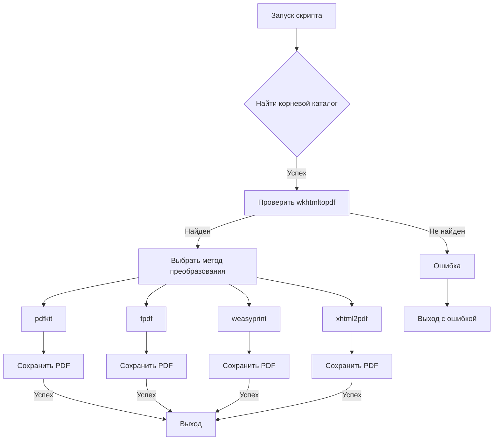
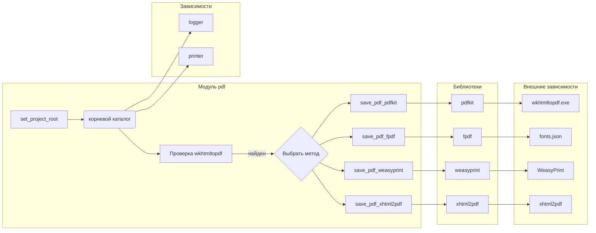

# <input code>

```python
## \file hypotez/src/utils/pdf.py
# -*- coding: utf-8 -*-\
#! venv/Scripts/python.exe
#! venv/bin/python/python3.12

"""
.. module: src.utils.pdf 
    :platform: Windows, Unix
    :synopsis: Модуль для преобразования HTML-контента или файлов в PDF

Модуль для преобразования HTML-контента или файлов в PDF с использованием различных библиотек.
Дополнительная информация:
- https://chatgpt.com/share/672266a3-0048-800d-a97b-c38f647d496b
- https://stackoverflow.com/questions/73599970/how-to-solve-wkhtmltopdf-reported-an-error-exit-with-code-1-due-to-network-err
- https://habr.com/ru/companies/bothub/articles/853490/
"""
MODE = 'dev'
import sys
import os
import json

from pathlib import Path
import pdfkit
from reportlab.pdfgen import canvas
from fpdf import FPDF
from weasyprint import HTML
from xhtml2pdf import pisa
from src.logger import logger
from src.utils.printer import pprint

def set_project_root(marker_files=('pyproject.toml', 'requirements.txt', '.git')) -> Path:
    """
    Finds the root directory of the project starting from the current file's directory,
    searching upwards and stopping at the first directory containing any of the marker files.

    Args:
        marker_files (tuple): Filenames or directory names to identify the project root.
    
    Returns:
        Path: Path to the root directory if found, otherwise the directory where the script is located.
    """
    __root__:Path
    current_path:Path = Path(__file__).resolve().parent
    __root__ = current_path
    for parent in [current_path] + list(current_path.parents):
        if any((parent / marker).exists() for marker in marker_files):
            __root__ = parent
            break
    if __root__ not in sys.path:
        sys.path.insert(0, str(__root__))
    return __root__


# Get the root directory of the project
__root__ = set_project_root()
"""__root__ (Path): Path to the root directory of the project"""


wkhtmltopdf_exe = __root__ / 'bin' / 'wkhtmltopdf' / 'files' / 'bin' / 'wkhtmltopdf.exe'

if not wkhtmltopdf_exe.exists():
    logger.error("Не найден wkhtmltopdf.exe по указанному пути.")
    raise FileNotFoundError("wkhtmltopdf.exe отсутствует")


class PDFUtils:
    """
    Класс для работы с PDF-файлами, предоставляющий методы для сохранения HTML-контента в PDF с использованием различных библиотек.
    """
    # ... (rest of the code)
```

# <algorithm>

**Алгоритм работы модуля `pdf.py`**

1. **`set_project_root`:** Определяет корневой каталог проекта, начиная с текущего файла и идя вверх по дереву каталогов, пока не найдёт каталог содержащий файлы-маркеры (`pyproject.toml`, `requirements.txt`, `.git`).  Этот шаг нужен для правильной работы импорта других модулей.
2. **Проверка `wkhtmltopdf`:**  Определяет путь к исполняемому файлу `wkhtmltopdf.exe`. Если файл не найден, генерирует ошибку.
3. **`PDFUtils.save_pdf_pdfkit`:**
    * Создает конфигурацию `pdfkit` с указанием `wkhtmltopdf.exe`.
    * Принимает на вход HTML-контент или путь к HTML-файлу.
    * Использует `pdfkit.from_string` или `pdfkit.from_file` для преобразования в PDF.
4. **`PDFUtils.save_pdf_fpdf`:**
    * Создает объект `FPDF`.
    * Устанавливает шрифты из файла `fonts.json` в корневом каталоге проекта. Важно, что путь к файлам шрифтов определяется через `__root__`.
    * Добавляет текст в PDF.
    * Сохраняет PDF-файл.
5. **`PDFUtils.save_pdf_weasyprint`:**
    * Создает объект `HTML` из HTML-контента или пути к файлу.
    * Создает PDF используя `write_pdf`.
6. **`PDFUtils.save_pdf_xhtml2pdf`:**
    * Создает PDF с использованием `xhtml2pdf` из HTML-контента или пути к файлу. Важно, что здесь происходит обработка кодировок для корректного отображения данных из HTML-файла.


**Пример данных, передаваемых между функциями:**


`set_project_root()` принимает кортеж (`pyproject.toml`, `requirements.txt`, `.git`) и возвращает `Path` к корневому каталогу проекта.


`PDFUtils.save_pdf_pdfkit` получает строку или `Path` к HTML-контенту, а также строку или `Path` к имени PDF файла и возвращает `bool`.


Блок-схема (очень упрощенная):



# <mermaid>



# <explanation>

**Импорты:**

- `sys`, `os`, `json`, `pathlib`: Стандартные библиотеки Python для работы со средой выполнения, файловой системой и JSON-данными.
- `pdfkit`, `reportlab.pdfgen`, `fpdf`, `weasyprint`, `xhtml2pdf`: Библиотеки для генерации PDF-файлов из HTML-контента или текста.
- `src.logger`: Модуль логгирования, вероятно, собственной разработки, обеспечивающий логирование ошибок и информации в проект.
- `src.utils.printer`: Модуль для красивой печати данных, возможно, также разработанный в проекте.


**Классы:**

- `PDFUtils`: Класс для работы с различными способами генерации PDF из HTML-данных.  Статические методы позволяют вызывать функции без создания экземпляра класса.


**Функции:**

- `set_project_root` : Функция находит корневой каталог проекта, что важно для корректной работы с локальными ресурсами (например, шрифтами).  Это одна из лучших практик при разработке модулей, чтобы они были автономными.
- `PDFUtils.save_pdf_pdfkit`, `PDFUtils.save_pdf_fpdf`, `PDFUtils.save_pdf_weasyprint`, `PDFUtils.save_pdf_xhtml2pdf`: Эти функции предоставляют разные способы генерации PDF из HTML.  Важное замечание: они имеют достаточно развёрнутую обработку ошибок, что хорошо, и используют различные библиотеки (wkhtmltopdf, fpdf, weasyprint и xhtml2pdf). Они принимают на вход HTML-строку или путь к HTML-файлу, а также путь к сохраняемому PDF-файлу.
    * **`save_pdf_fpdf`**: Функция обрабатывает специфику работы с библиотекой `fpdf`, в том числе установку шрифтов из файла `fonts.json`, что демонстрирует более сложную логику, чем просто `from_string`.
    * **`save_pdf_xhtml2pdf`**:  Обрабатывает потенциальные проблемы с кодировками (UTF-8), что важно при работе с внешними данными.

**Переменные:**

- `MODE`, `wkhtmltopdf_exe`: Настройки для работы с модулем. `wkhtmltopdf_exe` содержит путь к исполняемому файлу, который нужен для `pdfkit`.


**Возможные ошибки и улучшения:**

- **Обработка исключений:** В `save_pdf_*` методах присутствует обработка исключений, но в некоторых местах, например, в `save_pdf_fpdf`, можно было бы сделать более подробную обработку определенных типов ошибок для более удобной диагностики.
- **Модуль `logger`:**  Должен быть импортирован как часть проекта.
- **Надежность определения `__root__`:** Алгоритм поиска `__root__` хороший, но можно добавить проверку на существование каталогов для повышения устойчивости к разным ошибкам.
- **Использование менеджеров контекста:** В `save_pdf_xhtml2pdf` можно использовать менеджеры контекста (`with open(...)`) для открывания файлов, чтобы они автоматически закрывались, даже если произойдёт ошибка.
- **Комментарии:**  Комментарии хорошо написаны, но можно было бы добавить комментарии об особенностях, например, об обработке кодировок.
- **Универсальность:**  Можно добавить проверку на тип входных данных (`data`), чтобы лучше обрабатывать различные входные параметры.
- **Константы:**  Использование констант (например, для путей к файлам) вместо непосредственного обращения к `__root__`, сделало бы код более читаемым.


**Связь с другими частями проекта:**

Модуль `pdf.py` сильно зависит от `src.logger` и, возможно, от других модулей проекта для работы с данными (если они передаются в функции для преобразования). `src.utils.printer` используется для печати данных, но не в критическом пути работы функций.  Корректная работа модуля `pdf.py` существенно зависит от правильного пути к `wkhtmltopdf` и существования `fonts.json`.