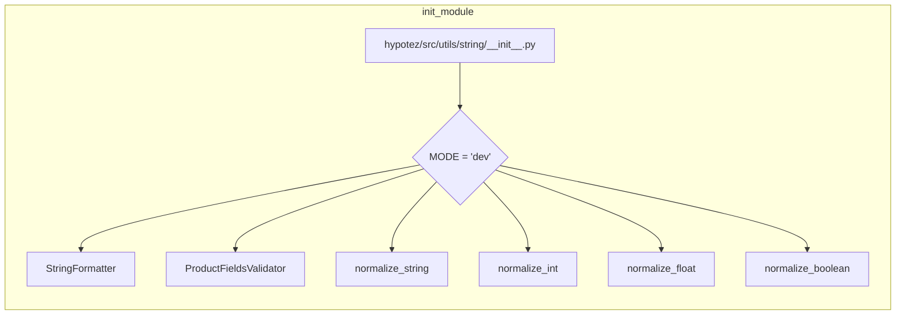

1. <input code>
```python
## \file hypotez/src/utils/string/__init__.py
# -*- coding: utf-8 -*-\
#! venv/Scripts/python.exe
#! venv/bin/python/python3.12

"""
.. module: src.utils.string 
	:platform: Windows, Unix
	:synopsis:

"""
MODE = 'dev'

from .formatter import StringFormatter
from .validator import ProductFieldsValidator
from .normalizer import (
		normalize_string,
		normalize_int,
		normalize_float,
		normalize_boolean,
		)


```

2. <algorithm>
(Диаграмма алгоритма в формате блок-схемы отсутствует, т.к. данный код представляет собой только импорты и константу. Он не содержит инструкций для выполнения, а лишь объявляет доступность функций и классов.)

3. <mermaid>


4. <explanation>
- **Импорты**: Модуль `hypotez/src/utils/string/__init__.py` отвечает за инициализацию подмодулей в пакете `utils/string`.
    - `from .formatter import StringFormatter`: Импортирует класс `StringFormatter` из подмодуля `formatter`.  Предполагается, что `formatter` содержит методы для форматирования строк.
    - `from .validator import ProductFieldsValidator`: Импортирует класс `ProductFieldsValidator` из подмодуля `validator`. Вероятно, этот класс отвечает за валидацию полей данных, связанных с продуктами.
    - `from .normalizer import ...`: Импортирует функции `normalize_string`, `normalize_int`, `normalize_float`, `normalize_boolean` из подмодуля `normalizer`. Эти функции, вероятно, отвечают за нормализацию данных разных типов (строки, целые числа, числа с плавающей точкой, булевы значения).

- **Классы**: 
    - `StringFormatter`, `ProductFieldsValidator`:  В этом файле импортируются, но их реализация содержится в других модулях (`formatter`, `validator`).

- **Функции**: 
    - `normalize_string`, `normalize_int`, `normalize_float`, `normalize_boolean`:  Функции, которые, вероятно, преобразуют входные данные к определённому формату или типы.  Детали реализации содержатся в файлах `normalizer`.


- **Переменные**:
    - `MODE = 'dev'`:  Переменная, скорее всего, определяет режим работы (например, 'dev', 'prod'). 

- **Возможные ошибки или улучшения**:
    - Отсутствует документация к коду, что затрудняет понимание назначения каждого класса и функции.
    - Необходимо больше информации о том, как эти модули взаимодействуют с другими частями проекта.
    - Без анализа реализаций `StringFormatter`, `ProductFieldsValidator`, `normalize_*`, трудно оценить полное поведение модуля.


**Цепочка взаимосвязей:**

Этот модуль `__init__.py` является точкой входа для использования функций и классов обработки строк в проекте `hypotez`.  Он предоставляет интерфейс к более сложным обработчикам строк, определённым в подмодулях `formatter`, `validator` и `normalizer`.  Дальнейшие взаимосвязи с другими частями проекта зависят от того, как эти подмодули используются в других частях кода (например, в `src.main.py` или других контроллерах).