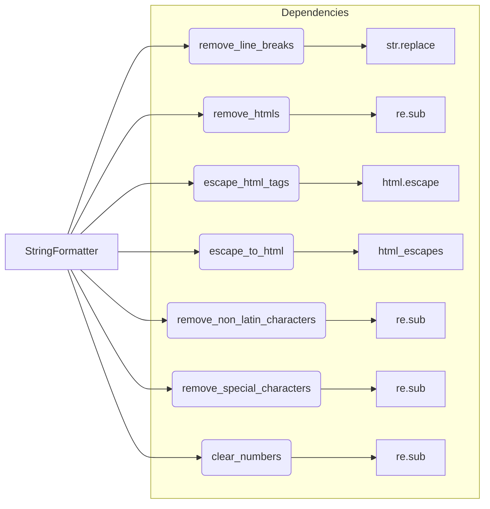

# <input code>

```python
## \file hypotez/src/utils/string/formatter.py
# -*- coding: utf-8 -*-
#! venv/Scripts/python.exe
#! venv/bin/python/python3.12

"""
.. module: src.utils.string 
	:platform: Windows, Unix
	:synopsis: String formatting functions.

Functions:
    - remove_line_breaks(input_str: str) -> str
    - remove_htmls(input_html: str) -> str
    - escape_html_tags(input_html: str) -> str
    - escape_to_html(text: str) -> str
    - remove_non_latin_characters(input_str: str) -> str
    - remove_special_characters(input_str: str | list) -> str
    - clear_numbers(input_str: str) -> str

Data transformation:
    - convert_to_list(input: str | list[str, dict, list[dict]], delimiter: str = ',') -> list
    - extract_value_from_parentheses_with_lead_dollar(input_str: str) -> str | list | bool
    - clean_url_from_protocols(url: str) -> str
"""
MODE = 'dev'
import re
import html
from typing import List, Dict
from urllib.parse import urlparse, parse_qs
from src.logger import logger
from .html_escapes import html_escapes

class StringFormatter:
    """
    StringFormatter (String Formatting):

    Provides utility functions for formatting strings, such as removing line breaks, HTML tags, non-Latin characters, and special characters.
    """

    @staticmethod
    def remove_line_breaks(input_str: str) -> str:
        """ Removes line breaks from the input string.

        Args:
            input_str (str): Input string.

        Returns:
            str: A string with line breaks removed.
        """
        return input_str.replace("\\n", " ").replace("\\r", " ").strip()

    @staticmethod
    # ... (rest of the code)
```

# <algorithm>

The code defines a `StringFormatter` class containing static methods for various string manipulation tasks.  The algorithm for each method is straightforward and based on string manipulation or regular expressions.

* **`remove_line_breaks`:** Replaces newline characters (`\n`) and carriage return characters (`\r`) with spaces and then removes leading/trailing whitespace.
* **`remove_htmls`:** Uses a regular expression `r'<.*?>'` to find and remove HTML tags from the input string.
* **`escape_html_tags`:** Uses the `html.escape()` function to escape `<` and `>` characters to `&lt;` and `&gt;` respectively.
* **`escape_to_html`:** Iterates through the input string, looking up each character's HTML escape sequence in the `html_escapes` dictionary. If found, it substitutes the character; otherwise, it keeps the original character.
* **`remove_non_latin_characters`:** Uses a regular expression `r'[^a-zA-Z\s]'` to remove all characters that are not Latin letters or whitespace.
* **`remove_special_characters`:** Similar to `remove_non_latin_characters`, removes all characters that are not alphanumeric or whitespace. Handles both string and list input, applying the processing to each string in the list.
* **`clear_numbers`:** Uses a regular expression `r'[^\\d\\.]'` to keep only digits and the decimal point from the input string.

Data flows through the methods by taking a string as input and returning a modified string.  The `remove_special_characters` method is the only one handling both string and list inputs, and it transforms a list into a list of processed strings.

# <mermaid>



**Explanation of the Mermaid Diagram:**

* `StringFormatter` is the central class (A).
* Methods (B-H) are its static methods, receiving and returning strings or lists.
* Subgraph `Dependencies` shows how individual string operations are performed.
    * `str.replace`: Used by `remove_line_breaks`.
    * `re.sub`: Used by `remove_htmls`, `remove_non_latin_characters`, `remove_special_characters`, and `clear_numbers` for regular expression based string manipulations.
    * `html.escape`: Used by `escape_html_tags`.
    * `html_escapes`: Dictionary for character escaping in `escape_to_html`.


# <explanation>

* **Imports:**
    * `re`: For regular expression operations (e.g., `re.sub`).
    * `html`: For HTML escaping (`html.escape`).
    * `typing`: For type hinting (`List`, `Dict`).
    * `urllib.parse`: For URL parsing (used in potentially related functions not shown in the snippet).
    * `src.logger`: A custom logger, likely part of a larger project's logging framework.  The presence of `logger` suggests a structured logging system within the `src` package.
    * `.html_escapes`:  Import from a local file (`html_escapes.py`) which likely contains a dictionary of HTML escape sequences. This import shows that the `StringFormatter` is a part of a larger module focused on text manipulation, possibly related to web-based content or similar.


* **Classes:**
    * `StringFormatter`:  A utility class providing static methods for formatting strings.  The `@staticmethod` decorators indicate that these methods operate on the input directly, without requiring an object instance. This promotes code reusability and reduces complexity.

* **Functions:**
    *  Each method (`remove_line_breaks`, `remove_htmls`, etc.) performs a specific string manipulation task.  They are well-documented with type hints, explaining the expected input types (e.g., `input_str: str`) and return types (e.g., `str`).  All functions are static, demonStarting good practice for utility functions.

* **Variables:**  The variable `MODE` is a global constant.  Variables within the methods are typically local variables (e.g., `input_str`, `input_html`). The code uses appropriate data types for each variable.

* **Possible Errors/Improvements:**
    * **Regular Expression Efficiency:** The regular expressions are simple for the specified tasks.  However, in more complex scenarios, you may want to consider optimization for speed and readability.
    * **Error Handling:** The code lacks error handling.  Adding `try...except` blocks to catch potential exceptions (e.g., TypeError if the input is not a string) would make it more robust.
    * **Conciseness (Optional):** Some functions could be made slightly more concise using list comprehensions in a few cases, but clarity is usually preferred over conciseness.

* **Relationship to Other Parts of the Project:** The import of `src.logger` strongly suggests that this `StringFormatter` module is part of a larger project structure, potentially a web application or data processing pipeline.   The `html_escapes` module shows a potential connection to HTML-related tasks or data processing in the project. The usage of `urllib.parse` hints at possible web-related operations later in the pipeline, requiring string formatting for URLs.