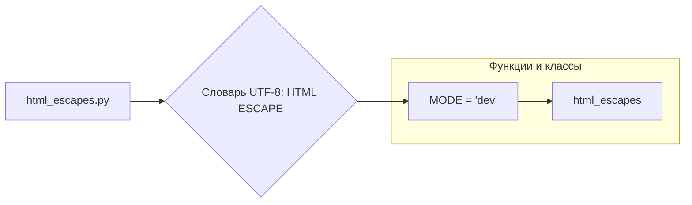

# <input code>

```python
## \file hypotez/src/utils/string/html_escapes.py
# -*- coding: utf-8 -*-\
#! venv/Scripts/python.exe
#! venv/bin/python/python3.12

"""
.. module: src.utils.string 
	:platform: Windows, Unix
	:synopsis: dictionary {UTF-8 : HTML ESCAPE}
 Словарь {UTF-8 : HTML ESCAPE}
"""
...
MODE = 'dev'

html_escapes = {
    '&': '&amp;',
    '<': '&lt;',
    '>': '&gt;',
    '"': '&quot;',
    "'": '&#39;',
    '¡': '&iexcl;',
    '¢': '&cent;',
    '£': '&pound;',
    '¤': '&curren;',
    '¥': '&yen;',
    '¦': '&brvbar;',
    '§': '&sect;',
    '¨': '&uml;',
    '©': '&copy;',
    'ª': '&ordf;',
    '«': '&laquo;',
    '¬': '&not;',
    '­': '&shy;',
    '®': '&reg;',
    '¯': '&macr;',
    '°': '&deg;',
    '±': '&plusmn;',
    '²': '&sup2;',
    '³': '&sup3;',
    '´': '&acute;',
    'µ': '&micro;',
    '¶': '&para;',
    '·': '&middot;',
    '¸': '&cedil;',
    '¹': '&sup1;',
    'º': '&ordm;',
    '»': '&raquo;',
    '¼': '&frac14;',
    '½': '&frac12;',
    '¾': '&frac34;',
    '¿': '&iquest;',
    'À': '&Agrave;',
    'Á': '&Aacute;',
    'Â': '&Acirc;',
    'Ã': '&Atilde;',
    'Ä': '&Auml;',
    'Å': '&Aring;',
    'Æ': '&AElig;',
    'Ç': '&Ccedil;',
    'È': '&Egrave;',
    'É': '&Eacute;',
    'Ê': '&Ecirc;',
    'Ë': '&Euml;',
    'Ì': '&Igrave;',
    'Í': '&Iacute;',
    'Î': '&Icirc;',
    'Ï': '&Iuml;',
    'Ð': '&ETH;',
    'Ñ': '&Ntilde;',
    'Ò': '&Ograve;',
    'Ó': '&Oacute;',
    'Ô': '&Ocirc;',
    'Õ': '&Otilde;',
    'Ö': '&Ouml;',
    '×': '&times;',
    'Ø': '&Oslash;',
    'Ù': '&Ugrave;',
    'Ú': '&Uacute;',
    'Û': '&Ucirc;',
    'Ü': '&Uuml;',
    'Ý': '&Yacute;',
    'Þ': '&THORN;',
    'ß': '&szlig;',
    'à': '&agrave;',
    'á': '&aacute;',
    'â': '&acirc;',
    'ã': '&atilde;',
    'ä': '&auml;',
    'å': '&aring;',
    'æ': '&aelig;',
    'ç': '&ccedil;',
    'è': '&egrave;',
    'é': '&eacute;',
    'ê': '&ecirc;',
    'ë': '&euml;',
    'ì': '&igrave;',
    'í': '&iacute;',
    'î': '&icirc;',
    'ï': '&iuml;',
    'ð': '&eth;',
    'ñ': '&ntilde;',
    'ò': '&ograve;',
    'ó': '&oacute;',
    'ô': '&ocirc;',
    'õ': '&otilde;',
    'ö': '&ouml;',
    '÷': '&divide;',
    'ø': '&oslash;',
    'ù': '&ugrave;',
    'ú': '&uacute;',
    'û': '&ucirc;',
    'ü': '&uuml;',
    'ý': '&yacute;',
    'þ': '&thorn;',
    'ÿ': '&yuml;',
    'Œ': '&OElig;',
    'œ': '&oelig;',
    'Š': '&Scaron;',
    'š': '&scaron;',
    'Ÿ': '&Yuml;',
    'ƒ': '&fnof;',
    'ˆ': '&circ;',
    '˜': '&tilde;',
    'Α': '&Alpha;',
    'Β': '&Beta;',
    'Γ': '&Gamma;',
    'Δ': '&Delta;',
    'Ε': '&Epsilon;',
    'Ζ': '&Zeta;',
    'Η': '&Eta;',
    'Θ': '&Theta;',
    'Ι': '&Iota;',
    'Κ': '&Kappa;',
    'Λ': '&Lambda;',
    'Μ': '&Mu;',
    'Ν': '&Nu;',
    'Ξ': '&Xi;',
    'Ο': '&Omicron;',
    'Π': '&Pi;',
    'Ρ': '&Rho;',
    'Σ': '&Sigma;',
    'Τ': '&Tau;',
    'Υ': '&Upsilon;',
    'Φ': '&Phi;',
    'Χ': '&Chi;',
    'Ψ': '&Psi;',
    'Ω': '&Omega;',
    'α': '&alpha;',
    'β': '&beta;',
    'γ': '&gamma;',
    'δ': '&delta;',
    'ε': '&epsilon;',
    'ζ': '&zeta;',
    'η': '&eta;',
    'θ': '&theta;',
    'ι': '&iota;',
    'κ': '&kappa;',
    'λ': '&lambda;',
    'μ': '&mu;',
    'ν': '&nu;',
    'ξ': '&xi;',
    'ο': '&omicron;',
    'π': '&pi;',
    'ρ': '&rho;',
    'ς': '&sigmaf;',
    'σ': '&sigma;',
    'τ': '&tau;',
    'υ': '&upsilon;',
    'φ': '&phi;',
    'χ': '&chi;',
    'ψ': '&psi;',
    'ω': '&omega;',
    'ϑ': '&thetasym;',
    'ϒ': '&Upsih;',
    'ϖ': '&piv;',
    '–': '&ndash;',
    '—': '&mdash;',
    '‘': '&lsquo;',
    '’': '&rsquo;',
    '‚': '&sbquo;',
    '“': '&ldquo;',
    '”': '&rdquo;',
    '„': '&bdquo;',
    '†': '&dagger;',
    '‡': '&Dagger;',
    '•': '&bull;',
    '…': '&hellip;',
    '‰': '&permil;',
    '′': '&prime;',
    '″': '&Prime;',
    '‹': '&lsaquo;',
    '›': '&rsaquo;',
    '‾': '&oline;',
    '⁄': '&frasl;',
    '€': '&euro;',
    'ℑ': '&image;',
    '℘': '&weierp;',
    'ℜ': '&real;',
    '™': '&trade;',
    'ℵ': '&alefsym;',
    '←': '&larr;',
    '↑': '&uarr;',
    '→': '&rarr;',
    '↓': '&darr;',
    '↔': '&harr;',
    '↵': '&crarr;',
    '⇐': '&lArr;',
    '⇑': '&uArr;',
    '⇒': '&rArr;',
    '⇓': '&dArr;',
    '⇔': '&hArr;',
    '∀': '&forall;',
    '∂': '&part;',
    '∃': '&exist;',
    '∅': '&empty;',
    '∇': '&nabla;',
    '∈': '&isin;',
    '∉': '&notin;',
    '∋': '&ni;',
    '∏': '&prod;',
    '∑': '&sum;',
    '−': '&minus;',
    '∗': '&lowast;',
    '√': '&radic;',
    '∝': '&prop;',
    '∞': '&infin;',
    '∠': '&ang;',
    '∧': '&and;',
    '∨': '&or;',
    '∩': '&cap;',
    '∪': '&cup;',
    '∫': '&int;',
    '∴': '&there4;',
    '∼': '&sim;',
    '≅': '&cong;',
    '≈': '&asymp;',
    '≠': '&ne;',
    '≡': '&equiv;',
    '≤': '&le;',
    '≥': '&ge;',
    '⊂': '&sub;',
    '⊃': '&sup;',
    '⊄': '&nsub;',
    '⊆': '&sube;',
    '⊇': '&supe;',
    '⊕': '&oplus;',
    '⊗': '&otimes;',
    '⊥': '&perp;',
    '⋅': '&sdot;',
    '⌈': '&lceil;',
    '⌉': '&rceil;',
    '⌊': '&lfloor;',
    '⌋': '&rfloor;',
    '⟨': '&lang;',
    '⟩': '&rang;',
    '◊': '&loz;',
    '♠': '&spades;',
    '♣': '&clubs;',
    '♥': '&hearts;',
    '♦': '&diams;'
}
```

# <algorithm>

**Шаг 1:** Создать словарь `html_escapes`.

**Пример:**

```
html_escapes = {
    '&': '&amp;',
    '<': '&lt;',
    ...
}
```

Этот словарь содержит соответствия между символами UTF-8 и их HTML-экранированными версиями.

**Шаг 2:** Инициализировать константу `MODE`.

**Пример:**

```
MODE = 'dev'
```

Эта константа, скорее всего, используется для определения режима работы модуля, например, 'dev' или 'prod'.

# <mermaid>



**Объяснение диаграммы:**

*   **html_escapes.py:** Файл, содержащий код.
*   **Словарь UTF-8: HTML ESCAPE:** Словарь, описывающий соответствие символов UTF-8 и их HTML-экранированных аналогов.
*   **MODE = 'dev':** Переменная, вероятно, используемая для управления режимом работы модуля (например, девелоперский или производственный).
*   **html_escapes:**  Самый основной словарь для работы, хранящий в себе данные.

# <explanation>

**Импорты:**

В коде отсутствуют импорты, что естественно, поскольку он представляет собой словарь, содержащий соответствия между символами UTF-8 и их HTML-экранированными представлениями.

**Классы:**

В коде нет объявления классов.

**Функции:**

Код не содержит функций.

**Переменные:**

*   `html_escapes`: Словарь, содержащий соответствия между символами UTF-8 и их HTML-экранированными представлениями.  Ключи - символы UTF-8, значения - их HTML-экранированные аналоги.  Это основной элемент кода, предоставляющий функциональность для экранирования символов.

*   `MODE`:  Переменная, скорее всего, для управления режимом работы модуля. Значение `'dev'` предполагает что это режим разработки.

**Возможные ошибки или области для улучшений:**

*   **Сложность:** Словарь содержит очень большое количество пар ключ-значение. Вместо того, чтобы хранить все эти данные в одном месте, можно рассмотреть возможность чтения данных из файла или базы данных для лучшей масштабируемости. Это особенно важно, если количество символов будет расширяться в будущем.
*   **Документация:**  В документации (в строках с `"""Docstrings"""`) нет информации о том, как использовать этот словарь. Не хватает информации о назначении и использовании `MODE`.
*   **Обработка ошибок:**  Код не обрабатывает исключения, которые могут возникнуть при попытке доступа к несуществующему ключу в словаре.
*   **Повторное использование:**  Возможно, этот словарь будет полезен в других частях проекта. Если это так, лучше было бы разместить его в отдельном файле или в другом, более структурированном формате.

**Взаимосвязи с другими частями проекта:**

Вероятно, этот словарь будет использоваться в других модулях проекта для экранирования HTML-символов в строках.  Например, в модулях, связанных с генерацией HTML-страниц, или в сервисах, обрабатывающих пользовательский ввод, где необходимо избежать небезопасного использования HTML-символов.