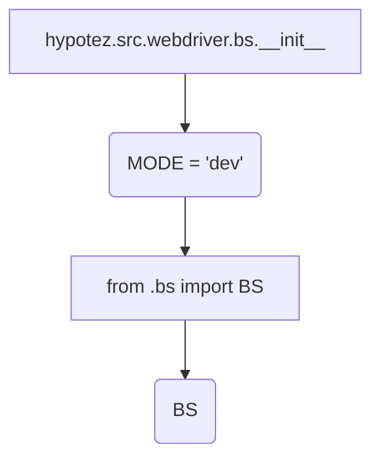
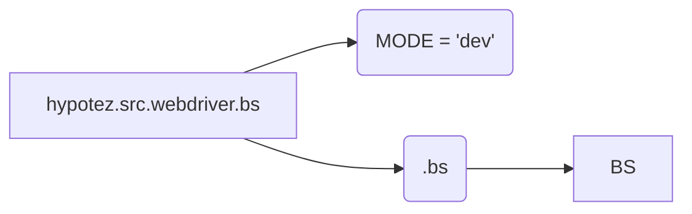

# <input code>

```python
## \file hypotez/src/webdriver/bs/__init__.py
# -*- coding: utf-8 -*-
#! venv/Scripts/python.exe
#! venv/bin/python/python3.12

"""
.. module: src.webdriver.bs 
	:platform: Windows, Unix
	:synopsis:

"""
MODE = 'dev'

from .bs import BS
```

# <algorithm>

Этот код является модулем инициализации для пакета `webdriver.bs`.  Он не содержит логики выполнения, а лишь импортирует необходимый модуль.  Алгоритм работы прост:

1. **Инициализация:** Модуль импортирует переменную `MODE` со значением 'dev'.  Эта переменная, вероятно, используется для управления режимом работы системы (например, dev/prod).
2. **Импорт:**  Из подпапки `./bs` импортируется класс или функция под именем `BS`.  Этот импорт делает `BS` доступным в текущем модуле.

**Пример:**

При запуске другого модуля, который использует `hypotez.src.webdriver.bs`, этот файл будет загружен.  В этом файле будут доступны класс `BS` (если он был определен в файле `bs.py`) и переменная `MODE`, что позволит контролировать режим работы.




# <mermaid>



# <explanation>

* **Импорты:**
    * `from .bs import BS`: Этот импорт из подпапки `./bs`  импортирует класс или функцию `BS`.  Символ `.` указывает на поиск в текущей папке (папка `bs`).  Важно, что `__init__.py` в папке `bs` является важной частью структуры пакета.  Без файла `__init__.py` в `bs` данный импорт работать не будет.
    * `#! venv/Scripts/python.exe`: Эта строка – это комментарий, указывающий интерпретатор Python, который должен быть использован для выполнения скрипта. Это не часть импорта и не влияет на поведение кода.
    * `#! venv/bin/python/python3.12`: аналогично предыдущей строке, это комментарий, указывающий интерпретатор Python.


* **Переменные:**
    * `MODE = 'dev'`:  Эта переменная хранит строковое значение, скорее всего, определяющее режим работы программы (например, dev/production). Это конфигурационная переменная,  используемая другими частями проекта.


* **Классы:**
    * `BS`: Определён в файле `bs.py` и доступен через импорт в `__init__.py`.  Подробная информация о классе `BS` требует просмотра файла `bs.py`.

* **Функции:**
    * Нет явных функций в данном `__init__.py`.  В файле `bs.py` (если он есть) могут быть определены функции, связанные с классом `BS`.


* **Возможные ошибки или области для улучшений:**

    *  Не указан путь к `venv`, который должен быть понятен пользователю.
    * Отсутствие документации к классу `BS` усложняет работу с модулем.
    * Для лучшей читабельности и поддержки, рекомендуется использовать `import bs` вместо `from .bs import BS`.  Это более явно показывает, что импортируется целый модуль `bs`.
    * Отсутствует проверка существования файла `bs.py` или `bs` модуля.


**Взаимосвязь с другими частями проекта:**

Файл `hypotez/src/webdriver/bs/__init__.py` является частью пакета `webdriver.bs`. Он импортирует класс `BS` из модуля `bs.py` внутри этого пакета.  Другие части проекта могут использовать класс `BS` для взаимодействия с драйвером веб-драйвера.


**Вывод:**

Код выполняет простую задачу: импортирует необходимую функциональность из подпапки `bs`.  Для понимания полной функциональности необходимо изучить файл `hypotez/src/webdriver/bs/bs.py`.