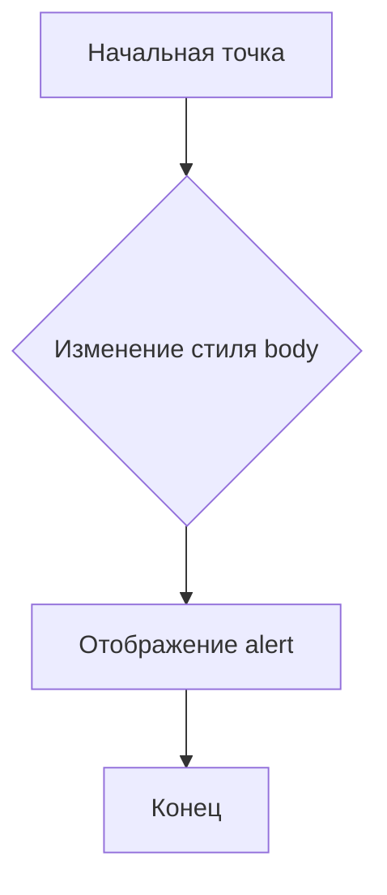

```MD
# Анализ кода borderify.js

## <input code>

```javascript
document.body.style.border = "5px solid red";
alert()
```

## <algorithm>

**Шаг 1:** `document.body.style.border = "5px solid red";`

* **Описание:** Эта строка кода изменяет свойство `border` элемента `body` на странице.  Она устанавливает толщину рамки (border) в 5 пикселей, тип рамки (`solid`), и цвет рамки в красный.
* **Пример:** Если на странице был белый фон, после выполнения этой строки, вокруг всего содержимого страницы появится красная рамка.
* **Данные:** Переменная `document.body` содержит ссылку на элемент body документа. Свойство `style` позволяет получить доступ к стилям этого элемента, а последующее присваивание строки "5px solid red" изменяет свойство border элемента.

**Шаг 2:** `alert()`;

* **Описание:** Эта строка вызывает диалоговое окно с предупреждением (alert).
* **Пример:** Пользователь увидит всплывающее окно с текстом (иногда пустым).
* **Данные:**  Эта строка не использует никаких входящих данных, а её выполнение приводит к отображению всплывающего окна.

**Общая блок-схема:**




## <mermaid>

```mermaid
graph LR
    A[document.body] --> B(style.border = "5px solid red");
    B --> C[alert()];
    C --> D[Конец];
```

**Объяснение диаграммы:**

Диаграмма отображает последовательность действий.  `document.body` является источником данных для изменения стилей (`style.border`), и эта операция, в свою очередь, запускает `alert()`.


## <explanation>

**Импорты:** Нет импортов, код использует встроенные объекты JavaScript.

**Классы:** Нет классов.

**Функции:** Нет функций в данном примере. `alert()` - встроенная функция JavaScript.

**Переменные:** Нет переменных, кроме косвенно создаваемых за счет обращения к объекту `document`.

**Подробное описание:**

Код выполняет две операции:

1. **`document.body.style.border = "5px solid red";`:** Эта строка изменяет стиль элемента `body` в документе.  В данном случае, она добавляет красную границу вокруг всего содержимого веб-страницы.  Это прямое изменение стилей без использования внешних стилей (CSS).

2. **`alert();`:** Эта строка вызывает системное диалоговое окно, которое отображает сообщение пользователю, зачастую без какого-либо ввода или параметров.

**Возможные ошибки или улучшения:**

* **Отсутствие проверки на ошибку:** Код не проверяет, существует ли элемент `body`.  Если страница еще не загружена, или `body` отсутствует, то может быть исключение.
* **Жесткое кодирование:** Цвет границы ("red") и толщину ("5px") заданы напрямую в коде. Лучше использовать переменные или CSS.
* **Отсутствие контекста:** Код не зависит от других элементов страницы. Если требуется более сложное изменение внешнего вида, рекомендуется использовать CSS.
* **Упрощение:** Если единственная цель - вывести алерт, то можно обойтись только `alert();`.

**Цепочка взаимосвязей с другими частями проекта:**

Код `borderify.js` не имеет прямых зависимостей от других частей проекта, кроме базовых возможностей JavaScript.  Он непосредственно взаимодействует с DOM (Document Object Model) страницы.  Он может использоваться как самостоятельный сценарий или как часть более сложного приложения, но в данном примере он функционирует как изолированный кусок кода.