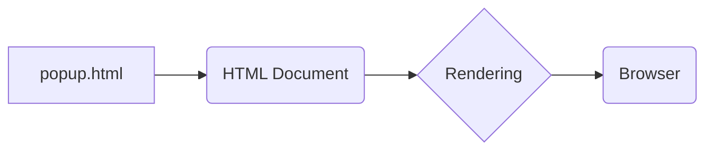

```MD
# Анализ кода popup.html

## <input code>

```html
## \file hypotez/src/webdriver/chrome/extentions/test_extention/html/popup.html
# -*- coding: utf-8 -*-
#! venv/Scripts/python.exe

""" module: src.webdriver.chrome.extentions.test_extention.html """
MODE = 'debug'
<!-- popup.html -->

<!DOCTYPE html>
<html>
<head>
    <title>hypotez</title>
    <style>
        body {
            width: 200px;
            padding: 10px;
        }
    </style>
</head>
<body>
    <h1>hypotez</h1>
    <p>Click the extension icon to collect data from the current webpage.</p>
</body>
</html>
```

## <algorithm>

Поскольку код представляет собой HTML-документ, алгоритм работы связан с отображением страницы.  Нет логики выполнения в стиле Python-скрипта.  Этот HTML-код описывает структуру веб-страницы, которая будет отображаться в всплывающем окне расширения Chrome.

Пошаговая блок-схема не требуется для этого HTML-кода.

## <mermaid>



**Объяснение диаграммы:**

Диаграмма показывает, что файл `popup.html` представляет собой HTML-документ, который будет отображен браузером.  В конечном итоге браузер (D) использует информацию из этого HTML-документа для визуализации страницы (C).  Никаких дополнительных взаимодействий с другими частями проекта нет.

## <explanation>

**Импорты:**

В данном коде нет импортов Python.  Файл `popup.html` - это обычный HTML-файл, который описывает содержание страницы, не связанный напрямую с кодом Python.

**Классы:**

Нет определенных классов.  HTML-код использует разметку HTML для отображения содержимого страницы.

**Функции:**

Нет функций в этом коде.

**Переменные:**

Переменная `MODE` определена, но ее значение (`'debug'`) в контексте HTML-файла не имеет прямого влияния на выполнение кода.

**Возможные ошибки и улучшения:**

* Этот HTML-файл, скорее всего, является частью расширения Chrome.  Чтобы сделать его функциональным, необходим связанный JavaScript-код для обработки кликов и взаимодействия с расширением Chrome.
* Для взаимодействия с расширением, потребуется JavaScript-код для обработки действий пользователя на странице, например, обработку нажатий на кнопки и отправку данных в backend.

**Взаимосвязь с другими частями проекта:**

Этот HTML-файл (`popup.html`) является частью расширения Chrome, и он будет связан с другими частями проекта, содержащими JavaScript-код для обработки действий пользователя и взаимодействия с веб-страницей, которую нужно проанализировать.  То есть, это не основной, но вспомогательный элемент проекта.  Он определяет, что будет отображаться в всплывающем окне, но не содержит логики работы расширения.  Чтобы взаимодействовать с ним, нужно использовать JavaScript-код, который подключен к этому HTML и выполняется в контексте Chrome Extension.