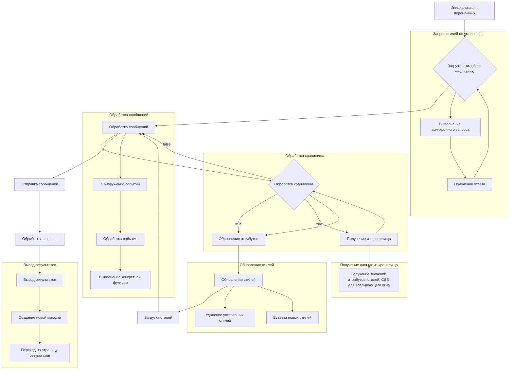

```MD
# Анализ кода try_xpath_background.js

## <input code>

```javascript
/* This Source Code Form is subject to the terms of the Mozilla Public
 * License, v. 2.0. If a copy of the MPL was not distributed with this
 * file, You can obtain one at http://mozilla.org/MPL/2.0/. */

(function (window, undefined) {
    "use strict";

    // alias
    var tx = tryxpath;
    var fu = tryxpath.functions;

    var popupState = null;
    var popupCss = "body{width:367px;height:auto;}";
    var results = {};
    var css = "";
    var attributes = {
        "element": "data-tryxpath-element",
        "context": "data-tryxpath-context",
        "focused": "data-tryxpath-focused",
        "focusedAncestor": "data-tryxpath-focused-ancestor",
        "frame": "data-tryxpath-frame",
        "frameAncestor": "data-tryxpath-frame-ancestor"
    };

    function loadDefaultCss() {
        return new Promise((resolve, reject) => {
            var req = new XMLHttpRequest();
            req.open("GET",
                     browser.runtime.getURL("/css/try_xpath_insert.css"));
            req.responseType = "text";
            req.onreadystatechange = function () {
                if (req.readyState === XMLHttpRequest.DONE) {
                    resolve(req.responseText);
                }
            };
            req.send();
        });
    }

    // ... (остальной код)
```

## <algorithm>




## <mermaid>

```mermaid
graph LR
    subgraph "Обработка сообщений"
        A[genericListener] --> B{listener.exists?};
        B -- true --> C[listener(message, sender, sendResponse)];
        B -- false --> D[return];
    end
    subgraph "Обработка события storePopupState"
        A --> E[storePopupState];
        E --> F[popupState = message.state];
    end
    subgraph "Обработка события requestRestorePopupState"
        A --> G[requestRestorePopupState];
        G --> H[sendMessage({event: 'restorePopupState', state: popupState})];
    end
    subgraph "Обработка события requestInsertStyleToPopup"
        A --> I[requestInsertStyleToPopup];
        I --> J[sendMessage({event: 'insertStyleToPopup', css: popupCss})];
    end
    subgraph "Обработка события showAllResults"
        A --> K[showAllResults];
        K --> L[results = message];
        K --> M[results.tabId = sender.tab.id];
        K --> N[results.frameId = sender.frameId];
        K --> O[browser.tabs.create({url: '/pages/show_all_results.html'})];
    end
        
    subgraph "Обработка события updateCss"
        A --> P[updateCss];
        P --> Q[Цикл по message.expiredCssSet];
        Q --> R[browser.tabs.removeCSS];
        R --> S[browser.tabs.sendMessage];
        P --> T[browser.tabs.insertCSS];
        T --> U[browser.tabs.sendMessage];

    end
    subgraph "Обработка события loadResults"
        A --> V[loadResults];
        V --> W[sendResponse(results)];
        V --> X[return true];
    end

    subgraph "Обработка события loadOptions"
    A --> Y[loadOptions];
    Y --> Z[sendResponse({attributes, css, popupCss})];
    Y --> AA[return true];
    end

    subgraph "Обработка изменения настроек"
        browser.storage.onChanged --> BB[Обработка изменений];
        BB --> CC[Обновление переменных];
        CC --> D; // Возвращение к обработке сообщений
    end

    subgraph "Загрузка стилей по умолчанию"
        A --> DD[loadDefaultCss];
        DD --> EE[Promise resolve/reject];
        EE --> FF[Получение CSS];
    end
```

## <explanation>

**Импорты:**  Код использует алиасы `tx` и `fu`, предположительно, для `tryxpath` и `tryxpath.functions`.  Без знания `tryxpath` и `tryxpath.functions`, сложно прокомментировать этот импорт более детально.

**Классы:** Нет явно определенных классов.  Код использует функции (например, `loadDefaultCss()`) и объекты (например, `attributes`).

**Функции:**
* `loadDefaultCss()`: Асинхронно загружает CSS из файла `/css/try_xpath_insert.css` используя `XMLHttpRequest`. Возвращает Promise, содержащий полученный текст CSS.
* `genericListener()`: Слушатель сообщений, используемый для обработки различных событий (напр., `storePopupState`, `requestRestorePopupState`).  Функция `genericListener`  является центральным обработчиком сообщений, которые поступают в расширение. Она перенаправляет сообщения различным обработчикам в зависимости от `message.event`.
* `genericListener.listeners.<event>`: Функции-обработчики конкретных событий (типа `storePopupState`, `showAllResults`).  Они определяют как отвечать на различные типы сообщений, например, сохранение состояния всплывающего окна или запуск процесса отображения всех результатов поиска.  Внутри обработчиков сообщений происходит обмен данными с помощью `browser.runtime.sendMessage()`, `browser.tabs.sendMessage()` и др.

**Переменные:**
* `popupState`: Хранит состояние всплывающего окна.
* `popupCss`: CSS для всплывающего окна.
* `results`: Объект, содержащий результаты поиска.
* `css`:  Содержимое CSS для вставки в текущую вкладку.
* `attributes`: Объект, содержащий данные атрибутов, которые используются для идентификации элементов.

**Возможные ошибки и улучшения:**

* **Обработка ошибок:** Функции, которые взаимодействуют с `browser.tabs`, `browser.runtime` и т.д., могут порождать исключения.  В коде присутствует `catch(fu.onError)`, но нужно обеспечить более подробную обработку ошибок (например, логирование).
* **Упрощение кода:** Возможно, некоторые функции могли бы быть разбиты на более мелкие, более специализированные функции.
* **Типизация:** Использование JavaScript-объектов в качестве носителей данных в некоторых местах может привести к ошибкам, особенно в случае несоответствия ожидаемого типа данных. Введение типов данных могло бы помочь в выявлении ошибок во время разработки.


**Взаимосвязи с другими частями проекта:**

* Код использует `browser.runtime.getURL`, `browser.runtime.sendMessage`, `browser.tabs.create`, `browser.tabs.sendMessage`, `browser.tabs.removeCSS`, `browser.tabs.insertCSS`. Это указывает на связь с расширением и с компонентами браузера.
* Наличие `/css/try_xpath_insert.css`, `/pages/show_all_results.html`, а также переменных, относящихся к CSS, указывает на взаимодействие с ресурсами, которые, вероятно, находятся в других частях проекта (фоновой или основной части расширения).  Например, `/pages/show_all_results.html` - это, вероятно, страница, на которой выводятся результаты.


В целом, код организован в виде обработчиков сообщений (`genericListener` и его слушатели), которые управляют взаимодействием с вкладками и хранением данных.  Есть явные зависимости от API браузера (e.g. `browser.runtime`, `browser.tabs`), что указывает на использование расширения Chrome или другого браузера с аналогичным API.