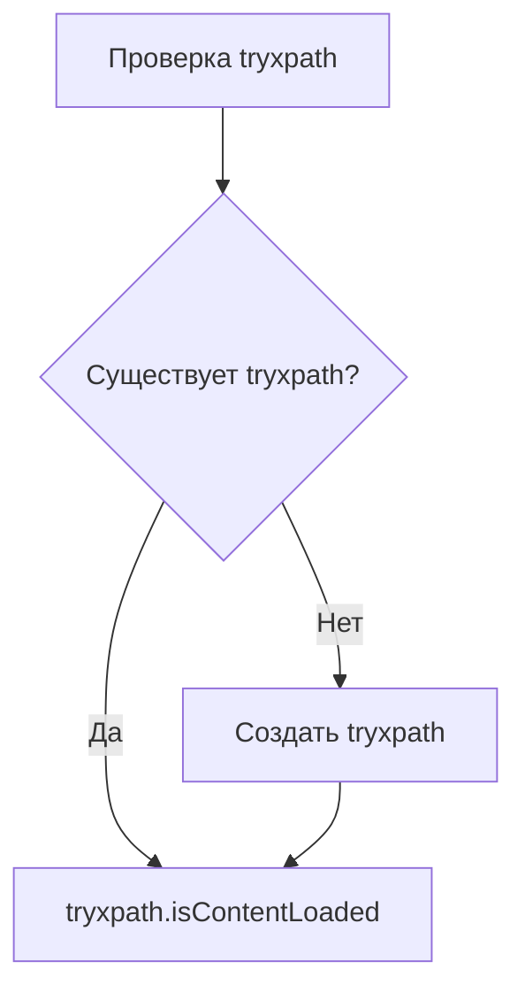

```MD
# Анализ кода try_xpath_check_frame.js

**<input code>**

```javascript
/* This Source Code Form is subject to the terms of the Mozilla Public
 * License, v. 2.0. If a copy of the MPL was not distributed with this
 * file, You can obtain one at http://mozilla.org/MPL/2.0/. */

// namespace
if (!tryxpath) {
    var tryxpath = {};
}

tryxpath.isContentLoaded;
```

**<algorithm>**

Код представляет собой фрагмент JavaScript, который создает или проверяет существование объекта `tryxpath` в глобальном пространстве имен. Алгоритм крайне прост:

1. **Проверка существования:** Проверяется, существует ли свойство `tryxpath` в глобальном объекте.
2. **Создание объекта (если необходимо):** Если свойство `tryxpath` не существует, оно создается и инициализируется как пустой объект.
3. **Использование объекта (предположительно):**  Свойство `isContentLoaded` объявляется, но не используется в данном фрагменте.  Это может служить заготовкой для дальнейшего использования.

**Пример:**

Если `tryxpath` не существует, то выполнение кода создаст его.

```
// До выполнения кода: tryxpath не существует
// После выполнения кода: tryxpath - пустой объект {}
```


**<mermaid>**



**<explanation>**

* **Импорты:** В данном фрагменте нет импорта других модулей или файлов.  Код находится в глобальном пространстве.

* **Классы:** Нет определений классов.

* **Функции:** Нет определений функций.

* **Переменные:**  `tryxpath` - ключевая переменная.  Она представляет собой объект в глобальном пространстве имен.  `tryxpath.isContentLoaded` - свойство объекта. Это переменная, которая, предположительно, будет использоваться для указания состояния загрузки контента (например, когда документ полностью загружен).


* **Возможные ошибки или области для улучшений:**

    * Код очень прост и не выполняет какую-либо значимую работу без дополнительных контекста.  `tryxpath.isContentLoaded`  не используется, что делает этот фрагмент бесполезным без дальнейших действий.  Неясно, что он должен делать в контексте остального проекта.

* **Цепочка взаимосвязей с другими частями проекта:**

    Без дополнительной информации о проекте, сложно сказать, где этот код используется и как он взаимодействует с другими частями. Предположительно, этот код является частью кода для работы с веб-драйвером и/или тестирования, но без дополнительного контекста невозможно сказать наверняка.   Код, скорее всего, входит в состав  структуры обработки событий (по типу "когда документ загрузился"), и дальнейшие функции будут проверять состояние `tryxpath.isContentLoaded` для синхронизации действий.  Без остальной части кода, это лишь предположение.


**Вывод:**

Данный фрагмент кода представляет собой простую проверку и инициализацию переменной, что не является функцией большой сложности.  Его роль будет понятна лишь после изучения остальной части проекта.