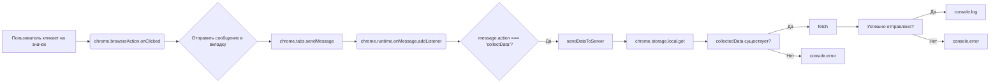

```MD
# Анализ кода background.js

## <input code>

```javascript
// background.js

chrome.browserAction.onClicked.addListener(tab => {
    chrome.tabs.sendMessage(tab.id, { action: 'collectData', url: tab.url });
});

/**
 * 
 * This function listens for messages sent from other parts of the extension, 
 * such as content scripts or other background scripts, using the `chrome.runtime.sendMessage()` method.
 */
chrome.runtime.onMessage.addListener((message, sender, sendResponse) => {
    if (message.action === 'collectData') {
        sendDataToServer(message.url);
    }
});

function sendDataToServer(url) {
    const serverUrl = 'http://127.0.0.1/hypotez.online/api/'; // Change to your server endpoint
    chrome.storage.local.get('collectedData', (result) => {
        const collectedData = result.collectedData;
        if (collectedData) {
            fetch(serverUrl, {
                method: 'POST',
                headers: {
                    'Content-Type': 'application/json'
                },
                body: JSON.stringify(collectedData)
            })
                .then(response => {
                    if (!response.ok) {
                        throw new Error('Failed to send data to server');
                    }
                    console.log('Data sent to server successfully');
                })
                .catch(error => {
                    console.error('Error sending data to server:', error);
                });
        } else {
            console.error('No collected data found');
        }
    });
}
```

## <algorithm>

**Шаг 1:** При клике на значок расширения в браузере.

* Пример: Пользователь нажимает на иконку расширения.
* Действие: Вызывается обработчик `chrome.browserAction.onClicked.addListener`.

**Шаг 2:** Отправка сообщения в активную вкладку.

* Пример: Переменная `tab` содержит информацию об активной вкладке.
* Действие: Функция `chrome.tabs.sendMessage` отправляет сообщение `{ action: 'collectData', url: tab.url }` в активную вкладку с идентификатором `tab.id`.  

**Шаг 3:** Получение сообщения из вкладки.

* Пример: Контент-скрипт в активной вкладке получает сообщение `{ action: 'collectData', url: 'https://example.com' }`.
* Действие: Функция `chrome.runtime.onMessage.addListener` обрабатывает входящие сообщения.

**Шаг 4:** Обработка сообщения.

* Пример: Обработка сообщения `collectData`.
* Действие: Если `message.action === 'collectData'`, то вызывается функция `sendDataToServer(message.url)`.

**Шаг 5:** Отправка данных на сервер.

* Пример: Переменная `url` содержит значение `https://example.com`.
* Действие: `sendDataToServer` получает значение `url`.  `chrome.storage.local.get('collectedData')` получает сохраненные данные.  `fetch` отправляет POST запрос на `serverUrl` с данными `collectedData`.

**Шаг 6:** Обработка ответа сервера.

* Пример: Сервер успешно обработал запрос.
* Действие: Обработка `response.ok` для проверки успешности отправки, вывод сообщений об успехе или ошибке.


## <mermaid>



## <explanation>

**Импорты:**  Нет явных импортов, код использует встроенные API Chrome.

**Классы:** Нет классов.

**Функции:**

* `chrome.browserAction.onClicked.addListener(tab => { ... })`: Обрабатывает клик на значке расширения.  Принимает объект `tab` с информацией о вкладке. Отправляет сообщение о сборе данных в активную вкладку.
* `chrome.runtime.onMessage.addListener((message, sender, sendResponse) => { ... })`: Обработчик сообщений. Принимает `message`, `sender` (отправитель) и `sendResponse` (функция для отправки ответа).  Проверяет поле `action` в сообщении. Если оно равно `'collectData'`, вызывает функцию `sendDataToServer`.
* `sendDataToServer(url)`: Отправляет данные на сервер.  Принимает строку `url`.  Получает сохраненные данные из локального хранилища с ключом `collectedData`.  Делает POST запрос к серверу `serverUrl` c данными `collectedData`. Обрабатывает результат запроса, ловит ошибки, выводит сообщения в консоль.


**Переменные:**

* `serverUrl`:  Строковая переменная, содержащая URL сервера. Должно быть константой, но для читабельности помечено как переменная.
* `collectedData`:  Содержит данные, полученные из локального хранилища. Может быть `undefined` или `null`.
* `url`:  Строковая переменная, содержащая URL страницы, для которой собираются данные.
*  `message`: Объект сообщения, полученного от других частей расширения.  Включает `action` и `url`.


**Возможные ошибки и улучшения:**

* **Обработка ошибок `fetch`:**  Обработка ошибки на уровне `fetch` не очень полная.  Необходимо ловить и обрабатывать ошибки, например, сетевые ошибки, проблемы с авторизацией.
* **Проверка корректности `url`:** Необходимо проверить корректность URL, перед использованием его для запроса на сервер.
* **Обработка `response.status`:**  Вместо `response.ok` стоит использовать метод `response.status` и проверять код статуса ответа сервера (2xx означает успешную операцию).
* **Обработка `collectedData`:**  Код не содержит логики, описывающей, откуда берутся данные, хранящиеся в `collectedData`.  Нужно определить источник и способ загрузки данных в хранилище.
* **Улучшение логирования:**  Логирование можно сделать более информативным, добавляя в сообщения ID запроса или другую полезную информацию.
* **Обработка ошибок в `chrome.storage`:** Функция `chrome.storage.local.get` должна обрабатывать возможные ошибки при получении данных из локального хранилища.


**Взаимосвязи с другими частями проекта:**

* `background.js` получает сообщения о сборе данных от `content.js` (вероятно), которая отвечает за сбор данных с веб-страниц.
* `background.js` взаимодействует с локальным хранилищем Chrome, чтобы сохранить и получить собранные данные.
* `background.js` отправляет данные на сервер `hypotez.online`. Необходимо проверить наличие и правильность работы серверной части приложения.


В целом, код работает для отправки данных с активной вкладки на сервер, но требует улучшений для надежности, безопасности, и корректной обработки ошибок.