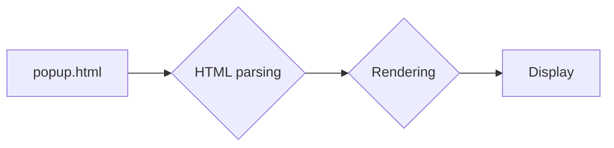

# Анализ кода popup.html

## <input code>

```html
## \file hypotez/src/webdriver/edge/extentions/test_extention/html/popup.html
# -*- coding: utf-8 -*-\n#! venv/Scripts/python.exe\n\n""" module: src.webdriver.edge.extentions.test_extention.html """\nMODE = \'debug\'\n<!-- popup.html -->\n\n<!DOCTYPE html>\n<html>\n<head>\n    <title>hypotez</title>\n    <style>\n        body {\n            width: 200px;\n            padding: 10px;\n        }\n    </style>\n</head>\n<body>\n    <h1>hypotez</h1>\n    <p>Click the extension icon to collect data from the current webpage.</p>\n</body>\n</html>
```

## <algorithm>

Код представляет собой HTML-документ, который отображается в всплывающем окне расширения браузера.  Алгоритм работы сводится к отображению статической страницы.  В нем нет управляемого кода на JavaScript или других языках, который бы взаимодействовал с браузером или внешними данными. 

**Пошаговая блок-схема (применительно к HTML):**

1. **Загрузка HTML файла:**  Браузер загружает содержимое файла `popup.html`.
2. **Парсинг HTML:**  Браузер анализирует HTML-код, определяя элементы (`<h1>`, `<p>`, `<style>` и т.д.).
3. **Отображение:** Браузер отображает полученные данные в виде HTML страницы.
4. **Ожидание событий:** Страница ожидает кликов пользователя или других событий, которые могут быть обработаны JavaScript-кодом (если он присутствует).

**Пример:**

Пользователь нажимает иконку расширения. Браузер открывает `popup.html`.  Страница отображается с заголовком "hypotez" и текстом "Click the extension icon...".  Дальнейшая логика будет определяться кодом, который потенциально может присутствовать в связанных файлах JavaScript.


## <mermaid>



**Объяснение диаграммы:**

* `popup.html` — исходный HTML-файл.
* `HTML parsing` — процесс парсинга HTML-документа браузером.
* `Rendering` — процесс рендеринга HTML-элементов в графический интерфейс.
* `Display` — отображаемый результат в браузере.


## <explanation>

**Импорты:**

В данном коде нет импортов, это чисто HTML-документ. Он не использует внешние библиотеки или модули Python.

**Классы:**

Нет классов, так как это HTML, не содержащий JavaScript или другого кода, который бы создавал классы.

**Функции:**

Нет функций.  Это HTML, не содержащий функциональный код.

**Переменные:**

`MODE = 'debug'`:  Это переменная, определённая в HTML.  Вероятно, она используется для конфигурации или диагностики, если в этом проекте есть связанный скрипт Python или JavaScript. Поскольку это HTML, она не участвует в работе программы, её можно проигнорировать.

**Возможные ошибки или улучшения:**

* **Отсутствие JavaScript:** Отсутствие JavaScript-кода означает, что расширение не может реагировать на пользовательские взаимодействия.  Для этого необходимо добавить JavaScript-код в файл, который свяжется с HTML.
* **Добавление функциональности:** Чтобы расширение работало, нужно добавить JavaScript-код в файл `popup.js` и связать его с HTML с помощью тега `<script>`.
* **Связь с основным кодом:** Чтобы это расширение собирало данные, необходимы элементы взаимодействия с другими частями проекта, например, с `webdriver` или `edge`, которые инициируют работу расширения с браузером.

**Цепочка взаимосвязей:**

`popup.html` взаимодействует с другими частями проекта через JavaScript-код, который может быть реализован в `popup.js`.  В свою очередь, `popup.js` может использовать API браузера, а также вызывать функции из других модулей проекта, например, из модулей, ответственных за взаимодействие с драйвером Edge и за обработку данных.
```