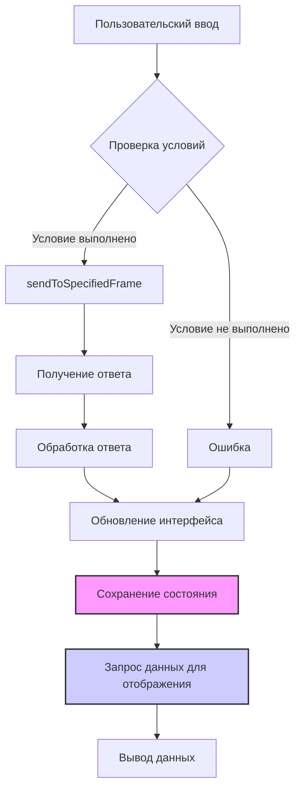

# Анализ кода popup.js

**1. <input code>**

```javascript
/* This Source Code Form is subject to the terms of the Mozilla Public
 * License, v. 2.0. If a copy of the MPL was not distributed with this
 * file, You can obtain one at http://mozilla.org/MPL/2.0/. */

(function (window) {
    "use strict";

    // alias
    var tx = tryxpath;
    var fu = tryxpath.functions;

    var document = window.document;

    const noneClass = "none";
    const helpClass = "help";
    const invalidTabId = browser.tabs.TAB_ID_NONE;
    const invalidExecutionId = NaN;
    const invalidFrameId = -1;

    // ... (остальной код)
```

**2. <algorithm>**

К сожалению, построить подробную блок-схему для всего кода затруднительно из-за его объема и сложности.  Однако, можно описать основные алгоритмы:

* **Инициализация:** Код ищет элементы на странице (например, `mainWay`, `mainExpression`), назначает им слушатели событий и подготавливает таблицы результатов.
* **Обработка событий:** При нажатии кнопок, вводе текста (Enter) происходит вызов функций `sendToSpecifiedFrame`, `showDetailsPage`, `showError` и других, которые отправляют сообщения в активную вкладку, обрабатывают полученные данные и обновляют отображение результатов.
* **Сохранение и восстановление состояния:**  Функция `collectPopupState` собирает текущее состояние виджетов, а `genericListener` обрабатывает сообщения о результатах и обновляет пользовательский интерфейс.
* **Отправка сообщений:** Функции `sendToActiveTab` и `sendToSpecifiedFrame` отправляют сообщения в активную вкладку или в указанный фрейм, используя API браузера.
* **Обновление отображения:**  Функции `fu.updateDetailsTable` обновляют таблицы результатов, `showDetailsPage` отображает результаты, `showError` отображает сообщения об ошибках.

**Пример:**

При нажатии на кнопку "Выполнить" (sendExecute) происходит отправка сообщения о запросе к фрейму. Далее, обработчик событий ожидает ответ с данными, которые загружаются в таблицу.


**3. <mermaid>**




**4. <explanation>**

* **Импорты:**  `tryxpath` и `tryxpath.functions` — это, скорее всего, внутренние модули или пакеты, определенные в проекте. Их точное местоположение, и взаимодействие с другими частями проекта, без доступа к остальному коду проекта, определить сложно.
* **Классы:** Нет видимых классов.
* **Функции:**
    * `sendToActiveTab`: Отправляет сообщение в активную вкладку.  Аргументы: `msg` (сообщение), `opts` (опции). Возвращает `Promise`.
    * `sendToSpecifiedFrame`: Отправляет сообщение в указанный фрейм, обращается к `try_xpath_check_frame.js` и `try_xpath_functions.js`.
    * `collectPopupState`: Собирает текущее состояние виджетов. Не возвращает ничего.
    * `changeContextVisible`, `changeResolverVisible`, `changeFrameDesignationVisible`, `changeFrameIdVisible`: Изменяют видимость блоков.
    * `makeExecuteMessage`: Создает сообщение для выполнения запроса. Возвращает объект `msg`.
    * `getSpecifiedFrameId`: Возвращает идентификатор фрейма.
    * `execContentScript`: Выполняет скрипты в контексте страницы.
    * `showError`: Отображает ошибку.
    * `handleExprEnter`: Обрабатывает нажатие Enter.
    * `showDetailsPage`: Отображает детализированные результаты.
    * `genericListener`: Обрабатывает сообщения, полученные от других частей приложения.
* **Переменные:** Переменные хранят различные значения, включая идентификаторы вкладок, фреймов, ссылки на элементы DOM и т. д.
* **Возможные ошибки и улучшения:**
    * Отсутствие проверки валидности вводимых пользователем данных (например, проверка `frameIdExpression`).
    *  Использование глобальных переменных.  Хотя в данном примере это не критично, в больших проектах лучше использовать изолированные контексты и структуры.
    * Неудобство в отладке из-за большого объёма кода.

**Цепочка взаимосвязей:**

Код взаимодействует с другими частями проекта через API браузера (`browser.tabs.sendMessage`, `browser.runtime.sendMessage`). Он отправляет запросы, получает результаты и обновляет интерфейс на основе этих результатов. Файлы `try_xpath_check_frame.js`, `try_xpath_functions.js`, `try_xpath_content.js`, находятся в папке `scripts` проекта.  Судя по имени, они выполняют задачи, связанные с вычислением XPath в контексте страницы.  Недостаточно информации, чтобы точно сказать как, но вероятно, эти скрипты работают с DOM дерева страницы.

**Выводы:**

Код реализует функциональность расширения браузера, позволяющего выполнять XPath запросы на веб-странице. Он собирает данные из пользовательского интерфейса, отправляет запросы на страницу и отображает результаты в виде таблицы.  Понимание кода требует дополнительного контекста о `tryxpath` и `tryxpath.functions`.