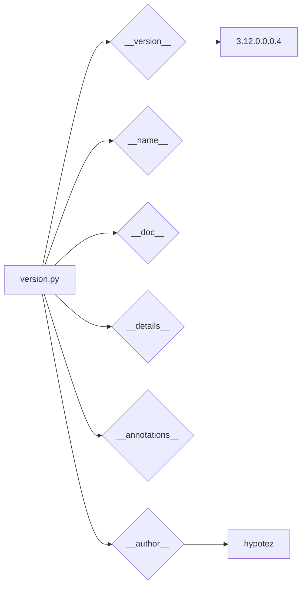

```MD
# Анализ кода файла hypotez/src/webdriver/edge/extentions/version.py

## <input code>

```python
## \file hypotez/src/webdriver/edge/extentions/version.py
# -*- coding: utf-8 -*-\n#! venv/Scripts/python.exe
#! venv/bin/python/python3.12
"""
.. module: src.webdriver.edge.extentions 
	:platform: Windows, Unix
	:synopsis:

"""
MODE = 'dev'

"""
	:platform: Windows, Unix
	:synopsis:

"""


"""
	:platform: Windows, Unix
	:synopsis:

"""


"""
  :platform: Windows, Unix

"""
"""
  :platform: Windows, Unix
  :platform: Windows, Unix
  :synopsis:
"""MODE = 'dev'
  
""" module: src.webdriver.edge.extentions """


"""
- `__version__`: This variable holds the version of the module or package.
- `__name__`: Contains the name of the module. If the script is being run directly, the value will be `"__main__"`.
- `__doc__`: The module's documentation string.
- `__details__`: This variable likely contains additional details about the module, but the exact purpose depends on the specific module or package.
- `__annotations__`: Contains type annotations for variables and functions in the module.
- `__author__`: The name(s) of the author(s) of the module.
"""
__name__:str
__version__="3.12.0.0.0.4"
__doc__:str
__details__:str="Details about version for module or class"
__annotations__

__author__='hypotez '
```

## <algorithm>

Этот код не содержит логики выполнения в традиционном понимании. Он определяет переменные, которые вероятно будут использоваться в других частях проекта для определения версии, имени модуля, документации и других метаданных.  Несмотря на большое количество комментариев, алгоритм отсутствует, так как код не включает циклов, условий или вызовов функций, выполняющих действия.

## <mermaid>



## <explanation>

Этот файл `version.py` определяет константы, которые, скорее всего, используются для метаданных модуля (или пакета) `src.webdriver.edge.extentions`.

**Импорты:**  Файл не содержит импортов, все необходимые переменные определены в нём.

**Классы:** Нет определённых классов.

**Функции:** Нет определённых функций.

**Переменные:**
- `__version__`: Строковая переменная, хранящая версию модуля.  Значение "3.12.0.0.0.4" указывает на высокую версию (множественные цифры). Возможно, это специальный формат версии, используемый разработчиком.
- `__name__`: Строковая переменная, хранящая имя модуля, в данном случае `"__main__"`.
- `__doc__`: Строковая переменная, содержащая описание модуля.  Она пустая.
- `__details__`: Строковая переменная, хранящая детали о модуле. Она пустая.
- `__annotations__`:  Переменная, которая должна содержать аннотации типов для переменных и функций.  Но она не содержит значения.
- `__author__`: Строковая переменная, хранящая имя автора модуля.

**Возможные ошибки или области для улучшений:**

- **Неявный формат версии:**  Формат версии "3.12.0.0.0.4" не соответствует стандартным соглашениям и может быть неоднозначно понят другими системами.  Возможно, более ясный формат облегчил бы автоматизацию процесса управления версиями.
- **Отсутствие конкретной функциональности:** Не определена какая-либо полезная функциональность, кроме указания метаданных.  Это скорее "конфигурационный" файл, нежели содержащий логику.
- **Пустые поля документации:** Переменные `__doc__` и `__details__` имеют пустые значения.

**Взаимосвязь с другими частями проекта:**

Этот файл является частью проекта, ориентированного на взаимодействие с веб-драйвером Edge.  Его метаданные будут использоваться в других частях проекта, например, при генерации отчетов, верификации версий и/или для задач построения и управления.