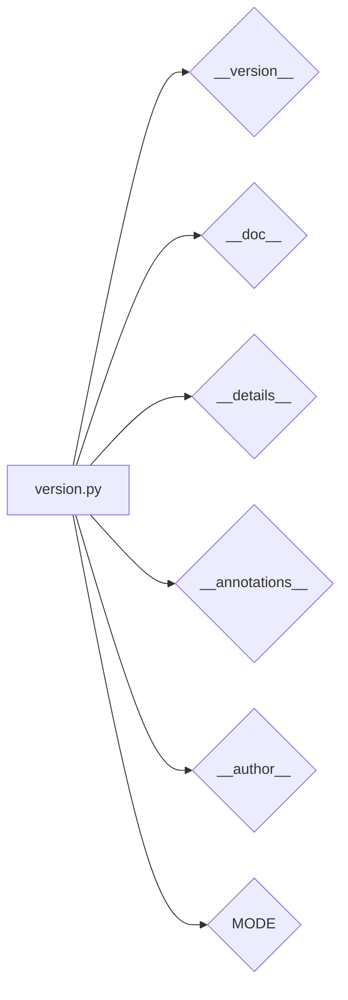

# <input code>

```python
## \file hypotez/src/webdriver/firefox/_examples/version.py
# -*- coding: utf-8 -*-
#! venv/Scripts/python.exe
#! venv/bin/python/python3.12

"""
.. module: src.webdriver.firefox._examples 
	:platform: Windows, Unix
	:synopsis:

"""
MODE = 'dev'

"""
	:platform: Windows, Unix
	:synopsis:

"""


"""
	:platform: Windows, Unix
	:synopsis:

"""


"""
  :platform: Windows, Unix

"""
"""
  :platform: Windows, Unix
  :platform: Windows, Unix
  :synopsis:
"""MODE = 'dev'
  
""" module: src.webdriver.firefox._examples """


"""
- `__version__`: This variable holds the version of the module or package.
- `__name__`: Contains the name of the module. If the script is being run directly, the value will be `"__main__"`.
- `__doc__`: The module's documentation string.
- `__details__`: This variable likely contains additional details about the module, but the exact purpose depends on the specific module or package.
- `__annotations__`: Contains type annotations for variables and functions in the module.
- `__author__`: The name(s) of the author(s) of the module.
"""
__name__:str
__version__="3.12.0.0.0.4"
__doc__:str
__details__:str="Details about version for module or class"
__annotations__

__author__='hypotez '
```

# <algorithm>

Этот код не содержит алгоритма в привычном понимании. Он представляет собой модуль Python, содержащий константные значения (строковые и переменная MODE) и атрибуты (`__version__`, `__doc__`, `__details__`, `__annotations__`, `__author__`). Эти атрибуты устанавливают метаданные модуля, например, версию, описание, автора и т.д., и используются для автодокументации или других целей метаинформации.  Перемещение данных здесь отсутствует, так как нет вычислений или циклов.

# <mermaid>



# <explanation>

Этот Python-модуль (`version.py`) не содержит логики выполнения, а скорее представляет собой объявление метаданных.  Он определяет различные атрибуты, которые обычно используются для описания модуля, класса или функции.  Эти атрибуты, такие как `__version__`, `__doc__`, `__author__`,  представляют собой строки или данные, которые описывают контекст модуля.

**Импорты:**

В коде нет импортов, поэтому связь с другими пакетами `src` отсутствует.

**Классы:**

В коде нет классов.

**Функции:**

В коде нет функций.

**Переменные:**

- `MODE = 'dev'`:  Строковая константа, вероятно, определяющая режим работы.
- `__version__ = "3.12.0.0.0.4"`:  Строковая константа, указывающая версию модуля.
- `__doc__`, `__details__`, `__annotations__`, `__author__`: Это атрибуты Python, которые содержат метаданные о самом модуле (документацию, детали, аннотации, автора).


**Возможные ошибки или области для улучшений:**

- **Нет смысловой связи:**  В этом случае модуль `version.py` скорее является фрагментом кода, предназначенным для метаинформации, чем для самостоятельного выполнения каких-либо действий.  Поэтому нет конкретных ошибок, а улучшения могут заключаться в уточнении использования этих атрибутов, например, в организации их в соответствующую структуру данных для их последующего использования другим модулем (например, модулем, который будет считывать версию).


**Цепочка взаимосвязей с другими частями проекта:**

Модуль `version.py` скорее всего используется другими модулями в проекте, которые используют атрибуты этого файла для получения метаданных.  Например, в `test` модуле для тестирования программы используется версия из `version.py` (если это предполагается в архитектуре).

**Заключение:**

Код является частью метаданных проекта, а не исполняемой программой.  Он задает мета-информацию о модуле, таких как версия, описание и автор.  Эта информация используется для организации и документирования кодовой базы.