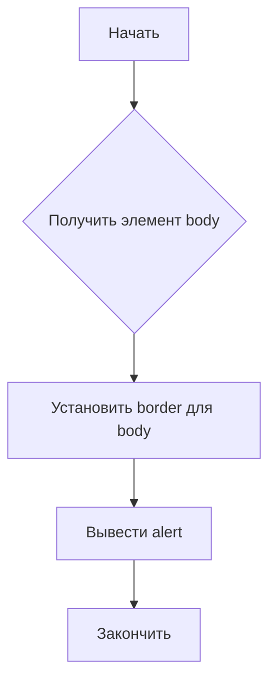
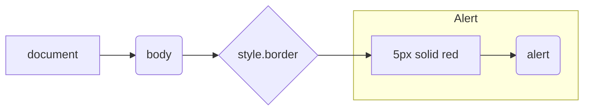

```MD
# Анализ кода borderify.js

## <input code>

```javascript
document.body.style.border = "5px solid red";
alert()
```

## <algorithm>



**Пошаговое описание:**

1. **Получить элемент body:** Код получает доступ к элементу `<body>` документа.
2. **Установить border для body:** К свойству `style.border` элемента `body` присваивается значение `"5px solid red"`. Это устанавливает красную границу шириной 5 пикселей вокруг всего содержимого страницы.
3. **Вывести alert:** Вызывается функция `alert()`, которая отображает диалоговое окно с сообщением.
4. **Закончить:** Выполнение программы завершается.

**Пример:**

Если пользователь откроет страницу, на которой выполняется этот код, то весь контент страницы будет окружён красной границей. После этого появится диалоговое окно с предупреждением.


## <mermaid>



**Объяснение диаграммы:**

Диаграмма описывает поток данных в коде. `document` — это глобальный объект, предоставляющий доступ к DOM.  `body` — это элемент `<body>`, часть DOM.  `style.border` — свойство стилей элемента `body`.  Значение `"5px solid red"` устанавливается для этого свойства.  `alert()` — вызов встроенной функции JavaScript для отображения диалогового окна. Зависимости внешние, так как `document`, `body` и `alert` — встроенные объекты JavaScript.


## <explanation>

**Импорты:**

В коде нет импортов. Используются встроенные объекты JavaScript (`document`, `alert`).

**Классы:**

Код не использует классы.

**Функции:**

- `alert()`: Встроенная функция JavaScript, которая выводит диалоговое окно с сообщением. У этой функции нет параметров и она ничего не возвращает.

**Переменные:**

В коде нет явных объявлений переменных.

**Возможные ошибки или области для улучшений:**

- Код слишком прост и не выполняет сложных задач.
- В реальных приложениях лучше использовать CSS для изменения стилей. В этом случае можно избежать манипуляций с `document.body.style`.
- Код не гибкий и не адаптируемый, он просто устанавливает фиксированные стили для всего элемента `<body>`.

**Цепочка взаимосвязей с другими частями проекта:**

Этот код работает изолированно и не зависит от других частей проекта, кроме стандартного JavaScript-окружения браузера.

**Заключение:**

Этот код выполняет простую задачу по установке границы вокруг элемента `<body>` и отображению сообщения в диалоговом окне.  Он демонстрирует базовые возможности работы с DOM и встроенными функциями JavaScript, но не подходит для сложных веб-приложений.