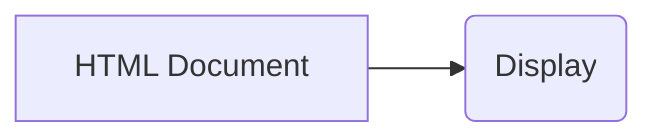

```MD
# Анализ кода popup.html

## <input code>

```html
## \file hypotez/src/webdriver/firefox/extentions/test_extention - Copy/html/popup.html
# -*- coding: utf-8 -*-
#! venv/Scripts/python.exe

""" module: src.webdriver.firefox.extentions.test_extention - Copy.html """
MODE = 'debug'
<!DOCTYPE html>
<html lang="en">
<head>
    <meta charset="UTF-8">
    <meta name="viewport" content="width=device-width, initial-scale=1.0">
    <title>Hypotez</title>
</head>
<body>
    <h1>Hypotez</h1>
    <p>Привет, Это Давидка. Я обучаю модель</p>
</body>
</html>
```

## <algorithm>

Данный код представляет собой HTML-документ, который, вероятно, будет отображаться в всплывающем окне (popup) расширения Firefox.  Алгоритм его работы сводится к отображению статического HTML-контента.  Пошаговая блок-схема не применима, т.к. нет динамических элементов или процессов.

## <mermaid>



## <explanation>

Этот HTML-файл определяет структуру и содержимое всплывающего окна расширения браузера Firefox.

**Импорты**:  Нет импортов в традиционном смысле. `#! venv/Scripts/python.exe` указывает интерпретатор Python, который, вероятно, используется для запуска скрипта, который, в свою очередь, генерирует этот HTML.  `# -*- coding: utf-8 -*-` определяет кодировку файла как UTF-8.

**Классы**: Нет классов. Это чисто HTML-код.

**Функции**: Нет функций.  Это статический HTML-документ.

**Переменные**: `MODE = 'debug'` -  переменная, определяющая режим работы (вероятно, используется в скриптах, которые генерируют этот HTML).

**Возможные ошибки или области для улучшений**:

* Не указано, как этот HTML-файл связан с другими частями проекта `src.webdriver.firefox.extentions.test_extention-Copy`.  Нужно просмотреть связанные Python-файлы, чтобы понять, как эта HTML-страница используется в расширении.
* Отсутствует JavaScript.  Чтобы сделать функциональным расширение, нужно использовать JavaScript для взаимодействия с расширением, обработкой событий и взаимодействия с браузерным окружением.

**Цепочка взаимосвязей**:

Файл `popup.html` является частью расширения Firefox.  Для работы расширения необходимы:

1.  **Скрипты Python**: Вероятно, эти скрипты обрабатывают данные, формируют HTML и другие действия, необходимые для отображения всплывающего окна.
2.  **Файлы JavaScript**: Эти файлы отвечают за поведение всплывающего окна, например, за обработку событий и взаимодействие с расширением.
3.  **manifest.json**:  Этот файл описывает расширение, включая его функции и разрешения.

Без файлов JavaScript, связанных с `popup.html`, это просто статический HTML, который не взаимодействует с окружающим контекстом.  Для создания полезного расширения требуется взаимодействие с JavaScript.