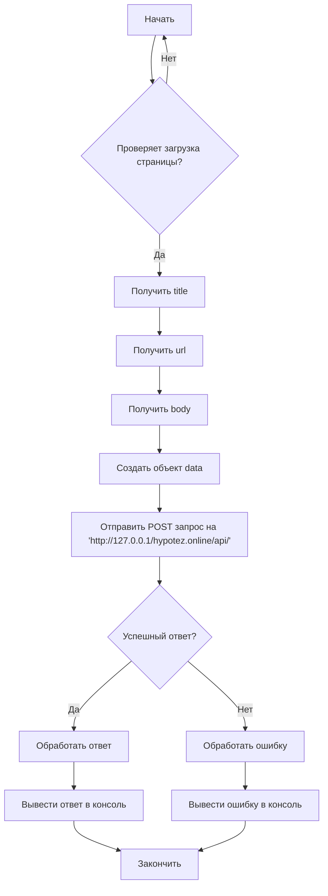

```MD
# Анализ кода send_data.js

## <input code>

```javascript
// Создаем обработчик события для загрузки страницы
function onPageLoad() {
    // Собираем информацию о странице
    var title = document.title;
    var url = window.location.href;
    var body = document.body.innerHTML;

    // Формируем объект с данными для отправки
    var data = {
        title: title,
        url: url,
        body: body
    };

    // Отправляем данные на указанный адрес
    fetch('http://127.0.0.1/hypotez.online/api/', {
        method: 'POST',
        headers: {
            'Content-Type': 'application/json'
        },
        body: JSON.stringify(data)
    })
        .then(response => {
            if (!response.ok) {
                throw new Error('Network response was not ok');
            }
            return response.json();
        })
        .then(json => {
            console.log('Response:', json);
        })
        .catch(error => {
            console.error('Error:', error);
        });
}

// Добавляем обработчик события для загрузки страницы
window.addEventListener('load', onPageLoad);
```

## <algorithm>

**Блок-схема:**



**Примеры:**

* **B - Да:** Если страница загружена, переходим к получению информации. Например, `title = "Моя страница"`, `url = "https://example.com"`, `body = "<p>Текст страницы</p>"`.
* **F - Создать объект data:** `data = {title: "Моя страница", url: "https://example.com", body: "<p>Текст страницы</p>"}`
* **G - Отправить POST запрос:**  Отправляем `data` в формате JSON.
* **H - Да:** Сервер успешно обработает запрос и вернёт JSON ответ.
* **H - Нет:** Сервер вернул ошибку (например, 404).


## <mermaid>

```mermaid
graph LR
    A[send_data.js] --> B(document);
    B --> C[title];
    B --> D[url];
    B --> E[body];
    F[data] --> G('http://127.0.0.1/hypotez.online/api/');
    G --> H(fetch);
    H --> I(response);
    I --> J{response.ok?};
    J -- Да --> K(response.json());
    J -- Нет --> L[Ошибка];
    K --> M[console.log];
    L --> N[console.error];
    B --> O[window.addEventListener];
    O --> A;
```


## <explanation>

**Импорты:**

Нет импортируемых модулей, код использует встроенные методы JavaScript (`document`, `window`, `fetch`).

**Классы:**

Нет классов в коде.

**Функции:**

* `onPageLoad()`: Обработчик события `load` для страницы. Собирает информацию о странице (`title`, `url`, `body`) и отправляет её на сервер с помощью `fetch`.
   * **Аргументы:**  Нет входных аргументов.
   * **Возвращаемое значение:** Не имеет возвращаемого значения.
   * **Пример использования:** При загрузке страницы автоматически запускается `onPageLoad`.

**Переменные:**

* `title`, `url`, `body`, `data`: Переменные содержат информацию о странице (строки) и сформированный JSON объект для отправки.
* `response`: Переменная содержит ответ от сервера, полученный с помощью `fetch`.


**Возможные ошибки и улучшения:**

* **Отсутствие обработки ошибок на сервере:**  Код не проверяет статус кода ответа `response.status` на стороне сервера. Это может привести к некорректной обработке ошибок. Необходимо добавить обработку статусов ответа на серверной стороне.
* **Невозможность дебага:** Код не содержит логирования промежуточных шагов, что затрудняет отладку и анализ.  Добавление `console.log` на промежуточных этапах (например, перед отправкой запроса) значительно облегчит дебаг.
* **Ошибка при отправке запроса:** Необходимо добавить дополнительную проверку на возможные ошибки при использовании `fetch` (например, проверка на  `error` в .catch блоке).
* **Упрощение кода:** Можно использовать одну строку для создания `data` объекта, например `data = {title: document.title, url: window.location.href, body: document.body.innerHTML};`.
* **Загрузка данных из источника (если это требуется):** Код просто извлекает данные с загруженной страницы. Если нужно загружать данные из других источников, нужно будет изменить код `onPageLoad`.
* **Безопасность:**  Заглушка для `http://127.0.0.1/hypotez.online/api/` . Нужно убедиться, что адрес сервера корректен и безопасен.

**Взаимосвязи с другими частями проекта:**

Функция `onPageLoad` взаимодействует с серверной стороной (`http://127.0.0.1/hypotez.online/api/`), предполагая, что на этом сервере есть обработчик POST запросов, который обрабатывает полученную информацию. Подробнее о взаимодействии с `hypotez.online/api/`  необходимо получить документацию или исходный код этой части проекта.