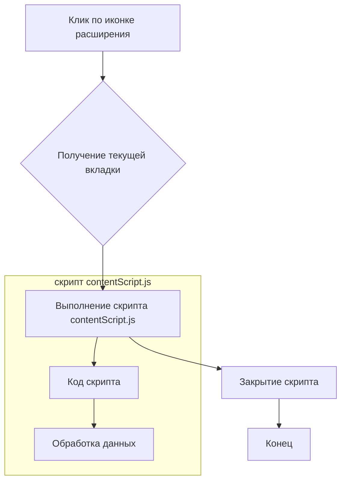
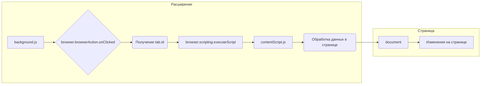

```MD
# Анализ кода background.js

**1. <input code>**

```javascript
// background.js
// background.js
browser.browserAction.onClicked.addListener((tab) => {
    browser.scripting.executeScript({
        target: { tabId: tab.id },
        files: ["contentScript.js"],
    });
});
```

**2. <algorithm>**

**Блок-схема:**



**Описание шагов:**

1. **Клик по иконке расширения:** Пользователь кликает по иконке расширения в адресной строке браузера.
2. **Получение текущей вкладки:**  `browser.browserAction.onClicked.addListener` — обработчик события клика.  Получает информацию о текущей вкладке (объект `tab`), содержащий `tab.id`.
3. **Выполнение скрипта contentScript.js:**  `browser.scripting.executeScript` отправляет в указанную вкладку (по `tab.id`) скрипт `contentScript.js` для выполнения.
4. **Закрытие скрипта:**  После завершения выполнения `contentScript.js` скрипт завершается.
5. **Конец:** Процесс завершается.

**Пример:**

Представьте, что пользователь кликает по иконке расширения на странице с адресом `https://example.com`.  `tab.id` будет содержать идентификатор этой вкладки. Скрипт `contentScript.js` будет выполнен в этой вкладке.


**3. <mermaid>**



**Описание диаграммы:**

Диаграмма демонстрирует взаимодействие расширения (background.js) и страницы.  Расширение, реагируя на клик по иконке, запускает `contentScript.js` на странице. `contentScript.js` взаимодействует с `document` страницы, производя изменения.


**4. <explanation>**

* **Импорты:**  В данном коде нет прямых импортов, так как нет зависимости от других модулей, кроме встроенных API браузера.
* **Классы:**  Нет классов.
* **Функции:** Отсутствуют.  Используется обработчик события `browser.browserAction.onClicked.addListener((tab) => {...})`. Это функция, которая выполняется, когда происходит клик по иконке.
* **Переменные:**  `tab` — переменная, содержащая объект с информацией о вкладке.  Используется переменная `tab.id`, содержащая идентификатор вкладки. Тип `tab` — объект.
* **Возможные ошибки или области для улучшений:**
    * Отсутствие обработки ошибок. Если `browser.scripting.executeScript` не удастся, то ошибка не будет обработана.
    * Недостаток описания функции `contentScript.js` в этом примере.
    * Не указана цель расширения.


**Цепочка взаимосвязей с другими частями проекта:**

Расширение взаимодействует с вкладами. `contentScript.js` является скриптом, выполняемым *на странице*, он осуществляет взаимодействие с DOM и элеметами страницы. В зависимости от кода `contentScript.js`, расширение может изменять элементы страницы или взаимодействовать с API веб-страницы.  Следовательно, `background.js` является частью расширения, которое координирует взаимодействие со `contentScript.js`, что, в свою очередь, меняет страницы.

**Вывод:**

Код `background.js` выполняет простую функцию: при клике по иконке расширения запускает скрипт `contentScript.js` в текущей вкладке.  Для более сложных операций, потребуется более сложная структура кода с обработкой ошибок и логикой.