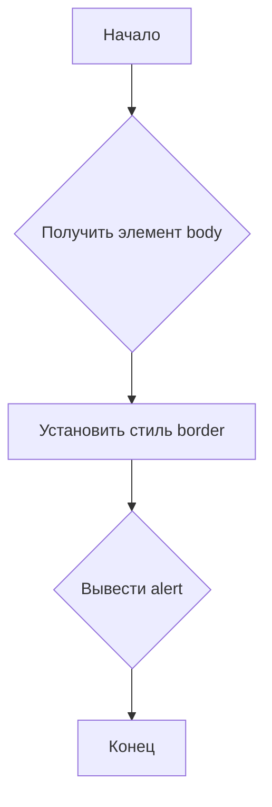

```MD
# Анализ кода borderify.js

## <input code>

```javascript
document.body.style.border = "5px solid red";
alert()
```

## <algorithm>



**Описание:**

1. **Начало:** Инициализируется выполнение скрипта.
2. **Получить элемент body:** Считывается DOM-элемент `document.body`.
3. **Установить стиль border:**  Свойству `style.border` элемента `body` присваивается значение "5px solid red". Это добавляет красную рамку толщиной 5 пикселей вокруг всего документа.
4. **Вывести alert:** Вызывается функция `alert()`, которая отображает диалоговое окно с сообщением. Примерно выглядит так: `<alert>  </alert>`

## <mermaid>

```mermaid
graph LR
    A[document] --> B(body);
    B --> C{style.border = "5px solid red"};
    C --> D[alert()];
```

**Объяснение диаграммы:**

Диаграмма показывает, как скрипт взаимодействует с DOM-деревом.  `document` - корень DOM, `body` — это его главный элемент. Скрипт устанавливает стиль `border` прямо на элемент `body`. `alert()` вызывает системный диалог, не влияя непосредственно на DOM.

## <explanation>

**Импорты:**

В данном коде нет импортов.  Все функции и методы, используемые в коде (`document.body`, `alert`), являются встроеными в браузер и не требуют внешних зависимостей.

**Классы:**

Код не содержит классов.

**Функции:**

Функция `alert()`: Эта функция встроенная в JavaScript и отображает системное диалоговое окно с информацией для пользователя. Она принимает один аргумент (строку, которую нужно отобразить в диалоговом окне), но в данном случае аргумент отсутствует. Возвращаемое значение - `undefined`.

**Переменные:**

В коде нет явно объявленных переменных, но используется встроенная переменная `document` для доступа к DOM-структуре документа.

**Возможные ошибки и улучшения:**

* **Отсутствие обработки ошибок:** Если `document.body` не найден, то код выполнится, но без эффекта.  Добавление проверки `if (document.body)` улучшило бы надежность кода.
* **Неинформативный alert:** В данном контексте `alert()` не слишком информативен. Лучше использовать `console.log()` для отладки или `alert()` с более осмысленным сообщением, указывающим на результат действия.
* **Неявное действие:** Код изменяет визуальное представление страницы без запроса или взаимодействия с пользователем. Это может быть неожиданным или нежелательным поведением, особенно в контексте расширения браузера.

**Взаимосвязи с другими частями проекта:**

Этот код представляет собой автономный скрипт и не имеет явных зависимостей от других частей проекта. Если код встраивается в контекст расширения браузера, то он взаимодействует с окружением расширения.


**Выводы:**

Код просто добавляет красную рамку вокруг всего документа и показывает всплывающее окно. В нём есть небольшие недочёты с точки зрения обработки ошибок и  взаимодействия с пользователем. Для использования в расширении браузера этот код может быть неадекватным или неточным, если он не входит в запланированную функциональность расширения.