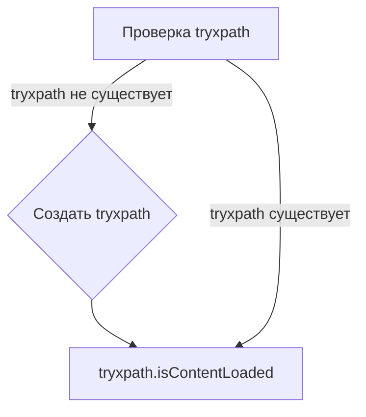

# Анализ кода try_xpath_check_frame.js

## <input code>

```javascript
/* This Source Code Form is subject to the terms of the Mozilla Public
 * License, v. 2.0. If a copy of the MPL was not distributed with this
 * file, You can obtain one at http://mozilla.org/MPL/2.0/. */

// namespace
if (!tryxpath) {
    var tryxpath = {};
}

tryxpath.isContentLoaded;
```

## <algorithm>

Этот код определяет, существует ли свойство `isContentLoaded` в объекте `tryxpath`. Если оно отсутствует, то создается пустой объект `tryxpath`.  Далее, для `tryxpath` создается свойство `isContentLoaded`, которое не имеет значения.

**Пошаговая блок-схема:**

1. **Проверка существования объекта:** Проверяется, существует ли объект `tryxpath`.
   - Если `tryxpath` не существует, создается пустой объект с именем `tryxpath`.
   - Если `tryxpath` уже существует, пропускается создание.

2. **Создание свойства:** Создается свойство `isContentLoaded` объекта `tryxpath`.  Значение свойства остается не определённым (undefined).


## <mermaid>



## <explanation>

**Импорты:** Нет импортов, в коде отсутствуют операторы `import` или `require`. Код оперирует только переменной `tryxpath`, которая является глобальной в текущем контексте.  Отсутствуют зависимости от других модулей или файлов.

**Классы:** Нет определенных классов.

**Функции:** Нет определенных функций.

**Переменные:**
- `tryxpath`: Переменная, которая инициализируется в случае необходимости, чтобы гарантировать существование объекта в глобальном пространстве имён. Тип - объект.

**Возможные ошибки или области для улучшений:**

- **Неясная функциональность:** Код не выполняет никакой значимой работы. Свойство `isContentLoaded` не используется, и его назначение неясно. Возможно, оно предназначено для будущей функциональности.
- **Неиспользование:** Свойство `isContentLoaded` не используется в коде. Это потенциальная ошибка, если оно должно использоваться в другом месте кода.

**Взаимосвязи с другими частями проекта:**

С учётом того, что код объявлен в файле `try_xpath_check_frame.js`, который находится в папке `extentions`, можно предположить, что он используется для проверки состояния, связанного с  загрузкой контента в контексте расширения Firefox (и возможно взаимодействия с драйвером Selenium). Код является частью более крупного проекта по работе с XPath. Конкретная роль в этом процессе требует дополнительной информации о контексте и других модулях, участвующих в процессе.