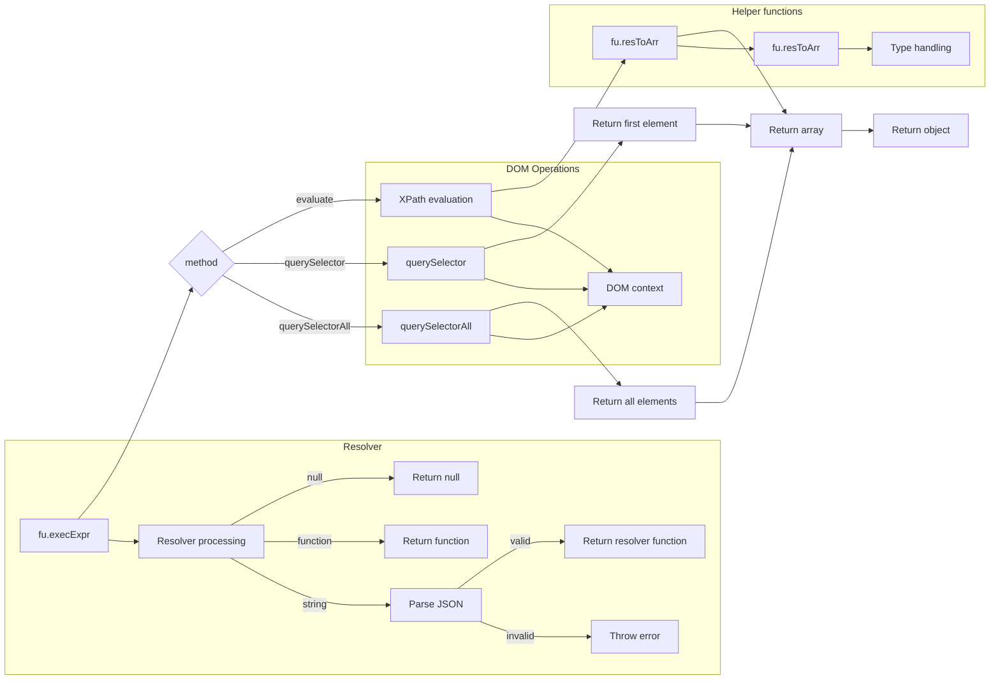

# Анализ кода try_xpath_functions.js

## <input code>

```javascript
/* ... (Комментарии) */

// namespace
if (!tryxpath) {
    var tryxpath = {};
}
if (!tryxpath.functions) {
    tryxpath.functions = {};
}

(function (window, undefined) {
    "use strict";

    // alias
    var tx = tryxpath;
    var fu = tryxpath.functions;

    // prevent multiple execution
    if (fu.done) {
        return;
    }
    fu.done = true;

    // ... (остальной код)
});
```

## <algorithm>

Код реализует набор функций для работы с XPath, DOM-элементами и атрибутами.  Алгоритм работы функций пошагово:

* **`fu.execExpr(expr, method, opts)`:**
    1. Получает XPath выражение (`expr`), метод (`method`) - "evaluate", "querySelector", "querySelectorAll" и опции (`opts`).
    2. Выбирает контекст (`context`) для XPath, по умолчанию `document`.
    3. Обрабатывает `method`:
        * **"evaluate":** Выполняет XPath запрос на `context` и сохраняет результат в `result`. Преобразует результат (`result`) в массив (`items`).
        * **"querySelector":** Возвращает первый элемент, соответствующий выражению `expr`, в массиве `items`.
        * **"querySelectorAll":** Возвращает все элементы, соответствующие выражению `expr`, в массиве `items`.
    4. Возвращает объект с `items`, `method` и `resultType`.

* **`fu.resToArr(res, type)`:**
    1. Преобразует результат XPath запроса (`res`) в массив (`arr`).
    2. Определяет тип результата (`type`).
    3. В зависимости от типа результата, заполняет `arr` значениями (`res.numberValue`, `res.stringValue`, `res.booleanValue`, результатами итерации через `res.iterateNext()` или `res.snapshotItem(i)`).
    4. Возвращает массив `arr`.

* **`fu.makeResolver(obj)`:**
    1. Обрабатывает опцию `resolver` из `opts`.
    2. Если `resolver` - null, возвращает null.
    3. Если `resolver` - функция, возвращает функцию.
    4. Если `resolver` - строка, пытается распарсить JSON и создать функцию, которая возвращает значение из `map`, если ключ `str` есть в `map`. В противном случае возвращает пустую строку.
    5. Если `resolver` - некорректный объект, выбрасывает ошибку.

* **Остальные функции**:
    - Обрабатывают различные аспекты работы с DOM-элементами, атрибутами, типами данных и т.п.

**Пример:** `fu.execExpr("//div", "evaluate", {"context": document})`.  Это приведет к выполнению XPath запроса `"//div"` на `document` и возврату массива найденных элементов `div`.


## <mermaid>



## <explanation>

**Импорты:**
Код не содержит импортов в традиционном понимании, так как это JavaScript код, работающий в браузере.  `tryxpath` и `tryxpath.functions` - это имена пространств имён, определяемые внутри кода.

**Классы:**
Код не содержит объявления классов в привычном ООП понимании.  Используется функциональное программирование и пространства имён для организации функций.

**Функции:**
* **`fu.execExpr`:**  Основная функция для выполнения XPath запросов.  Принимает XPath выражение, тип операции и опции (включая контекст). Возвращает объект с результатами.
* **`fu.resToArr`:** Преобразует результат XPath в массив узлов.
* **`fu.makeResolver`:** Создает функцию-резолвер для обработки опции `resolver`.
* **`fu.isDocOrElem`:** Проверяет, является ли объект документом или элементом.
* **`fu.listToArr`:** Преобразует объект-список в массив.
* **`fu.getItemDetail`:** Возвращает подробную информацию об элементе.
* **`fu.getItemDetails`:** Возвращает массив подробной информации об элементах.
* **`fu.createDetailTableHeader`:** Создает заголовок для таблицы с подробностями.
* **`fu.createDetailRow`:** Создает строку таблицы для отображения детальной информации.
* **`fu.appendDetailRows`:** Принимает массив детальной информации и добавляет строки в таблицу.

**Переменные:**
Переменные используются для хранения значений, например, `context` (контекст XPath), `items` (массив результатов), `resultType` (тип результата XPath).

**Возможные ошибки и улучшения:**
* Недостаточно ясное документирование.
* Использование `undefined` вместо `null` в некоторых случаях (например, `opts.resolver`).
* Не все методы учитывают специфику `Node` и `Attr`, что может привести к ошибкам при работе с разными типами данных.
* Нехватка проверки входных данных: `fu.execExpr` может принимать невалидные XPath выражения.
* Отсутствие обработки ошибок при парсинге `JSON.parse`.


**Взаимосвязи с другими частями проекта:**
Код напрямую зависит от `document` (DOM), `xpathResult`, и `Node` (Node interface). Код предполагает существование этих объектов браузера, но не содержит реализаций, которые могут использоваться в сторонних контекстах, таких как Node.js.

**Общий вывод:**
Код предоставляет набор полезных функций для работы с XPath и DOM-элементами в браузере. Однако, для повышения надежности и удобства использования необходимо улучшить документирование, обработку ошибок, валидацию входных данных и добавить расширенные возможности для работы с различными типами данных.