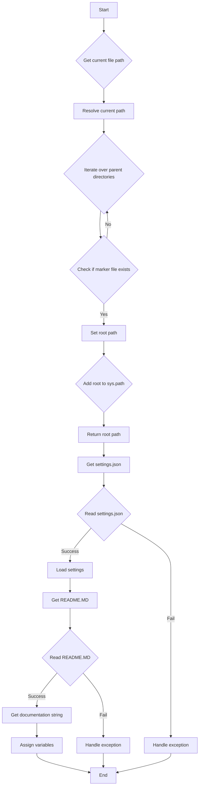
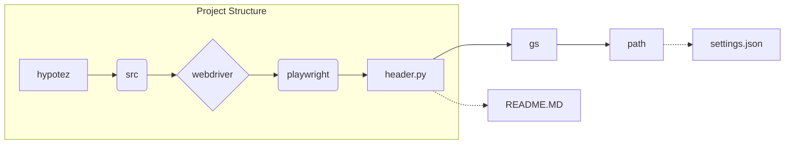

```MD
# <input code>

```python
## \file hypotez/src/webdriver/playwright/header.py
# -*- coding: utf-8 -*-\
#! venv/Scripts/python.exe
#! venv/bin/python/python3.12

"""
.. module: src.webdriver.playwright 
	:platform: Windows, Unix
	:synopsis:

"""
MODE = 'dev'

import sys
import json
from packaging.version import Version

from pathlib import Path
def set_project_root(marker_files=('pyproject.toml', 'requirements.txt', '.git')) -> Path:
    """
    Finds the root directory of the project starting from the current file's directory,
    searching upwards and stopping at the first directory containing any of the marker files.

    Args:
        marker_files (tuple): Filenames or directory names to identify the project root.
    
    Returns:
        Path: Path to the root directory if found, otherwise the directory where the script is located.
    """
    __root__:Path
    current_path:Path = Path(__file__).resolve().parent
    __root__ = current_path
    for parent in [current_path] + list(current_path.parents):
        if any((parent / marker).exists() for marker in marker_files):
            __root__ = parent
            break
    if __root__ not in sys.path:
        sys.path.insert(0, str(__root__))
    return __root__


# Get the root directory of the project
__root__ = set_project_root()
"""__root__ (Path): Path to the root directory of the project"""

from src import gs

settings:dict = None
try:
    with open(gs.path.root / 'src' /  'settings.json', 'r') as settings_file:
        settings = json.load(settings_file)
except (FileNotFoundError, json.JSONDecodeError):
    ...

doc_str:str = None
try:
    with open(gs.path.root / 'src' /  'README.MD', 'r') as settings_file:
        doc_str = settings_file.read()
except (FileNotFoundError, json.JSONDecodeError):
    ...


__project_name__ = settings.get("project_name", 'hypotez') if settings  else 'hypotez'
__version__: str = settings.get("version", '')  if settings  else ''
__doc__: str = doc_str if doc_str else ''
__details__: str = ''
__author__: str = settings.get("author", '')  if settings  else ''
__copyright__: str = settings.get("copyrihgnt", '')  if settings  else ''
__cofee__: str = settings.get("cofee", "Treat the developer to a cup of coffee for boosting enthusiasm in development: https://boosty.to/hypo69")  if settings else "Treat the developer to a cup of coffee for boosting enthusiasm in development: https://boosty.to/hypo69"
```

# <algorithm>



**Пример:** Если скрипт находится в `hypotez/src/webdriver/playwright`, функция `set_project_root` будет искать корневую директорию, содержащую `pyproject.toml`, `requirements.txt` или `.git`. Если найдена `hypotez`, эта директория будет возвращена.


# <mermaid>



**Объяснение:**  Диаграмма показывает структуру проекта, где `hypotez` является корневой директории, а `header.py` взаимодействует с `settings.json` и `README.MD` в директории `src`.  Зависимость `gs` определена в `src` и обеспечивает путь к необходимым файлам.


# <explanation>

**Импорты:**

- `sys`: предоставляет доступ к системным переменным, включая `sys.path`. Используется для добавления корневой директории проекта в `sys.path`, чтобы модули из других частей проекта были доступны.
- `json`: используется для сериализации и десериализации данных в формате JSON. Используется для чтения файла `settings.json`.
- `packaging.version`: используется для работы с версиями пакетов. В данном случае не используется напрямую, но импортируется для возможного использования в дальнейшем.
- `pathlib`:  предоставляет классы для работы с путями к файлам и директориям, обеспечивая переносимость между разными операционными системами.
- `src.gs`:  Обращается к модулю `gs` из пакета `src`, вероятно, содержащему функции для работы с путями в проекте.


**Классы:**

- Нет явных классов, кроме встроенного `Path`. `Path` используется для работы с путями к файлам и директориям.

**Функции:**

- `set_project_root(marker_files=...)`: Ищет корневую директорию проекта, начиная с текущей директории и двигаясь вверх по дереву директорий, пока не найдет директорию, содержащую указанные файлы (например, `pyproject.toml`). Возвращает `Path` к найденной директории.  Ключевой частью является добавление найденного пути к `sys.path`, что позволяет импортировать модули из других частей проекта.

**Переменные:**

- `MODE`: Строковая константа, вероятно, для определения режима работы приложения (например, 'dev', 'prod').
- `__root__`: `Path` объект, содержащий путь к корневой директории проекта.
- `settings`: Словарь, содержащий данные из файла `settings.json`.
- `doc_str`: Строка, содержащая содержимое файла `README.MD`.
- `__project_name__`, `__version__`, `__doc__`, `__details__`, `__author__`, `__copyright__`, `__cofee__`:  Переменные, содержащие информацию о проекте, полученные из `settings` или имеющие значения по умолчанию.


**Возможные ошибки и улучшения:**

- **Обработка исключений:** Используются `try...except` блоки для обработки `FileNotFoundError` и `json.JSONDecodeError`, что важно для устойчивости кода.  Однако, можно улучшить логику обработки ошибок: например, выводить более информативные сообщения об ошибках или использовать более конкретные исключения.
- **Документация:** Документация внутри кода (`"""docstring"""`) является хорошей практикой, но стоит добавить `type hints` (аннотации типов) для переменных и аргументов функций для повышения читаемости и понимания кода.


**Взаимосвязи с другими частями проекта:**

Функция `set_project_root` является критической для корректного импорта модулей из других частей проекта, т.к. она обеспечивает добавление корневой директории проекта в `sys.path`.  Взаимодействие с модулем `gs` подразумевает, что `gs` предоставляет методы для доступа к пути к корневой директории проекта. Эта функция, вероятно, используется в других модулях проекта для поиска файлов конфигурации и других ресурсов.