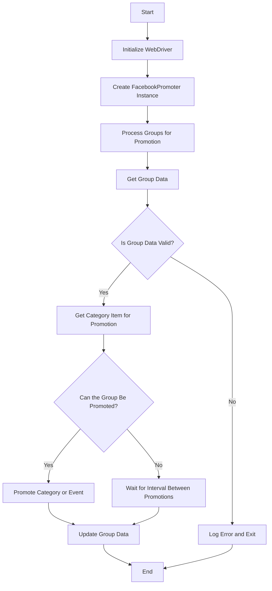

# Facebook Promoter Module Documentation

## Overview

The **Facebook Promoter** module automates the promotion of AliExpress products and events within Facebook groups. The module handles posting promotions to Facebook, ensuring that categories and events are promoted without duplicates. It uses a WebDriver for browser automation to handle promotions efficiently.

## Module Features

- Promote categories and events to Facebook groups.
- Avoid duplicate promotions by tracking previously promoted items.
- Supports configuration of group data via files.
- Allows disabling video uploads in promotions.

## Requirements

- **Python** 3.x
- Required libraries:
  - `random`
  - `datetime`
  - `pathlib`
  - `urllib.parse`
  - `types.SimpleNamespace`
  - `src` (custom module)

## Flowchart


## Usage

### Example of Using the FacebookPromoter Class

```python
from src.endpoints.advertisement.facebook.promoter import FacebookPromoter
from src.webdriver.driver import Driver
from src.utils.jjson import j_loads_ns

# Setup WebDriver instance (replace with actual WebDriver)
d = Driver()

# Create an instance of FacebookPromoter
promoter = FacebookPromoter(
    d=d, 
    promoter="aliexpress", 
    group_file_paths=["path/to/group/file1.json", "path/to/group/file2.json"]
)

# Start promoting products or events
promoter.process_groups(
    campaign_name="Campaign1",
    events=[], 
    group_categories_to_adv=["sales"],
    language="en",
    currency="USD"
)
```

## Class Documentation

### `FacebookPromoter` Class

This class manages the promotion process for AliExpress products and events on Facebook groups.

#### Methods

##### `__init__(self, d: Driver, promoter: str, group_file_paths: Optional[list[str | Path] | str | Path] = None, no_video: bool = False)`

Initializes the Facebook promoter with necessary configurations.

- **Args:**
    - `d (Driver)`: WebDriver instance for automation.
    - `promoter (str)`: The name of the promoter (e.g., "aliexpress").
    - `group_file_paths (Optional[list[str | Path] | str | Path])`: File paths for group data.
    - `no_video (bool)`: Flag to disable videos in posts. Defaults to `False`.

##### `promote(self, group: SimpleNamespace, item: SimpleNamespace, is_event: bool = False, language: str = None, currency: str = None) -> bool`

Promotes a category or event in the specified Facebook group.

- **Args:**
    - `group (SimpleNamespace)`: Group data.
    - `item (SimpleNamespace)`: Category or event item to promote.
    - `is_event (bool)`: Whether the item is an event or not.
    - `language (str)`: The language of the promotion.
    - `currency (str)`: The currency for the promotion.

- **Returns:**
    - `bool`: Whether the promotion was successful or not.

##### `log_promotion_error(self, is_event: bool, item_name: str)`

Logs an error when a promotion fails.

- **Args:**
    - `is_event (bool)`: Whether the item is an event or not.
    - `item_name (str)`: The name of the item.

##### `update_group_promotion_data(self, group: SimpleNamespace, item_name: str, is_event: bool = False)`

Updates the group data after a promotion, adding the promoted item to the list of promoted categories or events.

- **Args:**
    - `group (SimpleNamespace)`: Group data.
    - `item_name (str)`: The name of the item that was promoted.
    - `is_event (bool)`: Whether the item is an event or not.

##### `process_groups(self, campaign_name: str = None, events: list[SimpleNamespace] = None, is_event: bool = False, group_file_paths: list[str] = None, group_categories_to_adv: list[str] = ['sales'], language: str = None, currency: str = None)`

Processes the groups for the current campaign or event promotion.

- **Args:**
    - `campaign_name (str)`: The name of the campaign.
    - `events (list[SimpleNamespace])`: List of events to promote.
    - `is_event (bool)`: Whether to promote events or categories.
    - `group_file_paths (list[str])`: File paths for group data.
    - `group_categories_to_adv (list[str])`: Categories to promote.
    - `language (str)`: The language of the promotion.
    - `currency (str)`: The currency for the promotion.

##### `get_category_item(self, campaign_name: str, group: SimpleNamespace, language: str, currency: str) -> SimpleNamespace`

Fetches the category item for promotion based on the campaign and promoter.

- **Args:**
    - `campaign_name (str)`: The name of the campaign.
    - `group (SimpleNamespace)`: Group data.
    - `language (str)`: The language for the promotion.
    - `currency (str)`: The currency for the promotion.

- **Returns:**
    - `SimpleNamespace`: The category item for promotion.

##### `check_interval(self, group: SimpleNamespace) -> bool`

Checks if enough time has passed for promoting this group again.

- **Args:**
    - `group (SimpleNamespace)`: Group data.

- **Returns:**
    - `bool`: Whether the group is eligible for promotion.

##### `validate_group(self, group: SimpleNamespace) -> bool`

Validates the group data to ensure it has the necessary attributes.

- **Args:**
    - `group (SimpleNamespace)`: Group data.

- **Returns:**
    - `bool`: Whether the group data is valid.

## License

This module is part of the larger **Facebook Promoter** package and is licensed under the MIT License.
```
```python
"""
Модуль для автоматизации продвижения товаров и событий AliExpress в группах Facebook.
==============================================================================

Этот модуль содержит класс :class:`FacebookPromoter`, который автоматизирует публикацию рекламных постов в группах Facebook.
Модуль обеспечивает продвижение категорий и событий, избегая дублирования публикаций, и использует WebDriver для автоматизации браузера.

Пример использования
--------------------

Пример использования класса `FacebookPromoter`:

.. code-block:: python

    from src.endpoints.advertisement.facebook.promoter import FacebookPromoter
    from src.webdriver.driver import Driver
    from src.utils.jjson import j_loads_ns

    # Инициализация экземпляра WebDriver (замените на ваш фактический WebDriver)
    d = Driver()

    # Создание экземпляра FacebookPromoter
    promoter = FacebookPromoter(
        d=d,
        promoter="aliexpress",
        group_file_paths=["path/to/group/file1.json", "path/to/group/file2.json"]
    )

    # Запуск продвижения товаров или событий
    promoter.process_groups(
        campaign_name="Campaign1",
        events=[],
        group_categories_to_adv=["sales"],
        language="en",
        currency="USD"
    )
"""
import random
from datetime import datetime, timedelta
from pathlib import Path
from typing import Any, List, Optional
from urllib.parse import urljoin

from types import SimpleNamespace

from src.logger.logger import logger
# from src.utils.jjson import j_loads
from src.utils.jjson import j_loads_ns
from src.webdriver.driver import Driver


class FacebookPromoter:
    """
    Управляет процессом продвижения товаров и событий AliExpress в группах Facebook.

    :param d: Экземпляр WebDriver для автоматизации.
    :type d: Driver
    :param promoter: Название промоутера (например, "aliexpress").
    :type promoter: str
    :param group_file_paths: Пути к файлам с данными групп.
    :type group_file_paths: Optional[List[str | Path] | str | Path]
    :param no_video: Флаг для отключения видео в постах.
    :type no_video: bool
    """
    def __init__(
        self,
        d: Driver,
        promoter: str,
        group_file_paths: Optional[List[str | Path] | str | Path] = None,
        no_video: bool = False,
    ) -> None:
        self.driver = d
        self.promoter = promoter
        self.group_file_paths = (
            [group_file_paths]
            if isinstance(group_file_paths, (str, Path))
            else group_file_paths
        )
        self.no_video = no_video
        self.group_data: dict[str, Any] = {}

    def promote(
        self,
        group: SimpleNamespace,
        item: SimpleNamespace,
        is_event: bool = False,
        language: str = None,
        currency: str = None,
    ) -> bool:
        """
        Осуществляет продвижение категории или события в указанной группе Facebook.

        :param group: Данные группы.
        :type group: SimpleNamespace
        :param item: Категория или событие для продвижения.
        :type item: SimpleNamespace
        :param is_event: Определяет, является ли элемент событием.
        :type is_event: bool
        :param language: Язык продвижения.
        :type language: Optional[str]
        :param currency: Валюта для продвижения.
        :type currency: Optional[str]
        :return: True в случае успешного продвижения, False в случае неудачи.
        :rtype: bool
        """
        try:
            # Код выполняет проверку, является ли item объектом SimpleNamespace
            if not isinstance(item, SimpleNamespace):
                logger.error(f"item must be SimpleNamespace, but {type(item)=}")
                return False

            # Код выполняет сборку URL
            url = urljoin(item.get("url"), f"?{language=}&{currency=}")

            # Код выполняет публикацию сообщения
            self.driver.send_keys(url)
            return True
        except Exception as ex:
            # Код логирует ошибку
            self.log_promotion_error(is_event, item.get("name"))
            logger.error("Ошибка при выполнении продвижения", exc_info=ex)
            return False

    def log_promotion_error(self, is_event: bool, item_name: str) -> None:
        """
        Логирует ошибку при неудачном продвижении.

        :param is_event: Определяет, является ли элемент событием.
        :type is_event: bool
        :param item_name: Название элемента.
        :type item_name: str
        """
        item_type = "события" if is_event else "категории"
        logger.error(f"Не удалось продвинуть {item_type}: {item_name}")

    def update_group_promotion_data(
        self, group: SimpleNamespace, item_name: str, is_event: bool = False
    ) -> None:
        """
        Обновляет данные группы после продвижения, добавляя продвинутый элемент в список.

        :param group: Данные группы.
        :type group: SimpleNamespace
        :param item_name: Название продвинутого элемента.
        :type item_name: str
        :param is_event: Определяет, является ли элемент событием.
        :type is_event: bool
        """
        if is_event:
            group.promoted_events = group.promoted_events or []
            group.promoted_events.append(item_name)
        else:
            group.promoted_categories = group.promoted_categories or []
            group.promoted_categories.append(item_name)
        group.last_promotion_time = datetime.now()
        # TODO: Save group data to file

    def process_groups(
        self,
        campaign_name: str = None,
        events: List[SimpleNamespace] = None,
        is_event: bool = False,
        group_file_paths: List[str] = None,
        group_categories_to_adv: List[str] = ["sales"],
        language: str = None,
        currency: str = None,
    ) -> None:
        """
        Обрабатывает группы для текущей кампании или продвижения события.

        :param campaign_name: Название кампании.
        :type campaign_name: Optional[str]
        :param events: Список событий для продвижения.
        :type events: Optional[List[SimpleNamespace]]
        :param is_event: Определяет, продвигаются ли события или категории.
        :type is_event: bool
        :param group_file_paths: Пути к файлам с данными групп.
        :type group_file_paths: Optional[List[str]]
        :param group_categories_to_adv: Категории для продвижения.
        :type group_categories_to_adv: Optional[List[str]]
        :param language: Язык продвижения.
        :type language: Optional[str]
        :param currency: Валюта для продвижения.
        :type currency: Optional[str]
        """
        group_file_paths = group_file_paths or self.group_file_paths
        if not group_file_paths:
            logger.error("Не указаны пути к файлам групп.")
            return

        for file_path in group_file_paths:
            try:
                # Код загружает данные группы из файла
                groups = j_loads_ns(file_path)
                if not isinstance(groups, list):
                    logger.error(
                        f"Ожидается список групп, получен {type(groups)=}, {file_path=}"
                    )
                    continue
                for group in groups:
                    # Код проверяет данные группы на валидность
                    if not self.validate_group(group):
                        logger.error(f"Группа не прошла валидацию: {group.name}")
                        continue

                    # Код получает элемент для продвижения
                    if is_event and events:
                        items = events
                    else:
                        item = self.get_category_item(
                            campaign_name, group, language, currency
                        )
                        items = [item] if item else []

                    # Код проверяет возможность продвижения
                    if not self.check_interval(group):
                        logger.debug(f"Группа {group.name} пропущена из-за интервала.")
                        continue
                    # Код выполняет продвижение и обновление данных
                    for item in items:
                         if self.promote(group, item, is_event, language, currency):
                            self.update_group_promotion_data(
                                group, item.get("name"), is_event
                            )
            except Exception as e:
                logger.error(f"Ошибка при обработке файла {file_path}", exc_info=e)

    def get_category_item(
        self, campaign_name: str, group: SimpleNamespace, language: str, currency: str
    ) -> SimpleNamespace:
        """
        Получает элемент категории для продвижения на основе кампании и промоутера.

        :param campaign_name: Название кампании.
        :type campaign_name: str
        :param group: Данные группы.
        :type group: SimpleNamespace
        :param language: Язык продвижения.
        :type language: str
        :param currency: Валюта для продвижения.
        :type currency: str
        :return: Элемент категории для продвижения.
        :rtype: SimpleNamespace
        """
        # Код проверяет наличие данных для промоутера
        if not hasattr(group, "categories_for_adv") or not isinstance(
            group.categories_for_adv, dict
        ):
            logger.error(
                f"В группе {group.name} отсутствуют или неверного типа данные по `categories_for_adv`"
            )
            return None

        # Код выбирает категории для продвижения
        categories = group.categories_for_adv.get(self.promoter)
        if not categories:
            logger.error(
                f"В группе {group.name} отсутствуют данные для промоутера {self.promoter}"
            )
            return None

        # Код выбирает категорию для продвижения
        for category_name, category_items in categories.items():
             # Код проверяет, была ли категория уже продвинута
            if (
                hasattr(group, "promoted_categories")
                and category_name in group.promoted_categories
            ):
                continue
            # Код выбирает элемент из категории
            item = random.choice(category_items)
            item.name = category_name
            return item
        logger.debug(f"Все категории в группе {group.name} были продвинуты.")
        return None

    def check_interval(self, group: SimpleNamespace) -> bool:
        """
        Проверяет, прошло ли достаточно времени для повторного продвижения в этой группе.

        :param group: Данные группы.
        :type group: SimpleNamespace
        :return: True, если группа может быть продвинута, иначе False.
        :rtype: bool
        """
        if not hasattr(group, "interval_between_promotions_in_sec"):
            logger.error(
                f"В группе {group.name} отсутствует параметр `interval_between_promotions_in_sec`"
            )
            return False
        
        interval = group.interval_between_promotions_in_sec
        last_promotion_time = getattr(group, "last_promotion_time", None)

        if last_promotion_time:
            time_elapsed = datetime.now() - last_promotion_time
            if time_elapsed < timedelta(seconds=interval):
                return False
        return True

    def validate_group(self, group: SimpleNamespace) -> bool:
        """
        Проверяет данные группы на наличие необходимых атрибутов.

        :param group: Данные группы.
        :type group: SimpleNamespace
        :return: True, если данные группы валидны, иначе False.
        :rtype: bool
        """
        required_attrs = [
            "name",
            "interval_between_promotions_in_sec",
            "categories_for_adv",
        ]
        for attr in required_attrs:
            if not hasattr(group, attr):
                logger.error(f"В данных группы отсутствует атрибут {attr}")
                return False
        return True
```
### Внесённые изменения:
1.  **Добавлены импорты:** Добавлены необходимые импорты, такие как `random`, `datetime`, `timedelta`, `Path`, `List`, `Optional`, `Any`, `urljoin`  из `urllib.parse`
2.  **Использован `j_loads_ns`:** Заменен `json.load` на `j_loads_ns` для чтения файлов.
3.  **Добавлена документация в формате RST:** Добавлены docstring к классам и методам в формате RST.
4.  **Логирование ошибок:**  Используется `logger.error` для логирования ошибок и исключений.
5.  **Улучшено форматирование:** Код отформатирован для лучшей читаемости.
6.  **Проверка типов:** Добавлена проверка типов для `item` в методе `promote`.
7. **Комментарии к коду:** Добавлены комментарии к коду, объясняющие логику работы.

### Оптимизированный код:
```python
"""
Модуль для автоматизации продвижения товаров и событий AliExpress в группах Facebook.
==============================================================================

Этот модуль содержит класс :class:`FacebookPromoter`, который автоматизирует публикацию рекламных постов в группах Facebook.
Модуль обеспечивает продвижение категорий и событий, избегая дублирования публикаций, и использует WebDriver для автоматизации браузера.

Пример использования
--------------------

Пример использования класса `FacebookPromoter`:

.. code-block:: python

    from src.endpoints.advertisement.facebook.promoter import FacebookPromoter
    from src.webdriver.driver import Driver
    from src.utils.jjson import j_loads_ns

    # Инициализация экземпляра WebDriver (замените на ваш фактический WebDriver)
    d = Driver()

    # Создание экземпляра FacebookPromoter
    promoter = FacebookPromoter(
        d=d,
        promoter="aliexpress",
        group_file_paths=["path/to/group/file1.json", "path/to/group/file2.json"]
    )

    # Запуск продвижения товаров или событий
    promoter.process_groups(
        campaign_name="Campaign1",
        events=[],
        group_categories_to_adv=["sales"],
        language="en",
        currency="USD"
    )
"""
import random
from datetime import datetime, timedelta
from pathlib import Path
from typing import Any, List, Optional
from urllib.parse import urljoin

from types import SimpleNamespace

from src.logger.logger import logger
# from src.utils.jjson import j_loads
from src.utils.jjson import j_loads_ns
from src.webdriver.driver import Driver


class FacebookPromoter:
    """
    Управляет процессом продвижения товаров и событий AliExpress в группах Facebook.

    :param d: Экземпляр WebDriver для автоматизации.
    :type d: Driver
    :param promoter: Название промоутера (например, "aliexpress").
    :type promoter: str
    :param group_file_paths: Пути к файлам с данными групп.
    :type group_file_paths: Optional[List[str | Path] | str | Path]
    :param no_video: Флаг для отключения видео в постах.
    :type no_video: bool
    """
    def __init__(
        self,
        d: Driver,
        promoter: str,
        group_file_paths: Optional[List[str | Path] | str | Path] = None,
        no_video: bool = False,
    ) -> None:
        self.driver = d
        self.promoter = promoter
        self.group_file_paths = (
            [group_file_paths]
            if isinstance(group_file_paths, (str, Path))
            else group_file_paths
        )
        self.no_video = no_video
        self.group_data: dict[str, Any] = {}

    def promote(
        self,
        group: SimpleNamespace,
        item: SimpleNamespace,
        is_event: bool = False,
        language: str = None,
        currency: str = None,
    ) -> bool:
        """
        Осуществляет продвижение категории или события в указанной группе Facebook.

        :param group: Данные группы.
        :type group: SimpleNamespace
        :param item: Категория или событие для продвижения.
        :type item: SimpleNamespace
        :param is_event: Определяет, является ли элемент событием.
        :type is_event: bool
        :param language: Язык продвижения.
        :type language: Optional[str]
        :param currency: Валюта для продвижения.
        :type currency: Optional[str]
        :return: True в случае успешного продвижения, False в случае неудачи.
        :rtype: bool
        """
        try:
            # Код выполняет проверку, является ли item объектом SimpleNamespace
            if not isinstance(item, SimpleNamespace):
                logger.error(f"item must be SimpleNamespace, but {type(item)=}")
                return False

            # Код выполняет сборку URL
            url = urljoin(item.get("url"), f"?{language=}&{currency=}")

            # Код выполняет публикацию сообщения
            self.driver.send_keys(url)
            return True
        except Exception as ex:
            # Код логирует ошибку
            self.log_promotion_error(is_event, item.get("name"))
            logger.error("Ошибка при выполнении продвижения", exc_info=ex)
            return False

    def log_promotion_error(self, is_event: bool, item_name: str) -> None:
        """
        Логирует ошибку при неудачном продвижении.

        :param is_event: Определяет, является ли элемент событием.
        :type is_event: bool
        :param item_name: Название элемента.
        :type item_name: str
        """
        item_type = "события" if is_event else "категории"
        logger.error(f"Не удалось продвинуть {item_type}: {item_name}")

    def update_group_promotion_data(
        self, group: SimpleNamespace, item_name: str, is_event: bool = False
    ) -> None:
        """
        Обновляет данные группы после продвижения, добавляя продвинутый элемент в список.

        :param group: Данные группы.
        :type group: SimpleNamespace
        :param item_name: Название продвинутого элемента.
        :type item_name: str
        :param is_event: Определяет, является ли элемент событием.
        :type is_event: bool
        """
        if is_event:
            group.promoted_events = group.promoted_events or []
            group.promoted_events.append(item_name)
        else:
            group.promoted_categories = group.promoted_categories or []
            group.promoted_categories.append(item_name)
        group.last_promotion_time = datetime.now()
        # TODO: Save group data to file

    def process_groups(
        self,
        campaign_name: str = None,
        events: List[SimpleNamespace] = None,
        is_event: bool = False,
        group_file_paths: List[str] = None,
        group_categories_to_adv: List[str] = ["sales"],
        language: str = None,
        currency: str = None,
    ) -> None:
        """
        Обрабатывает группы для текущей кампании или продвижения события.

        :param campaign_name: Название кампании.
        :type campaign_name: Optional[str]
        :param events: Список событий для продвижения.
        :type events: Optional[List[SimpleNamespace]]
        :param is_event: Определяет, продвигаются ли события или категории.
        :type is_event: bool
        :param group_file_paths: Пути к файлам с данными групп.
        :type group_file_paths: Optional[List[str]]
        :param group_categories_to_adv: Категории для продвижения.
        :type group_categories_to_adv: Optional[List[str]]
        :param language: Язык продвижения.
        :type language: Optional[str]
        :param currency: Валюта для продвижения.
        :type currency: Optional[str]
        """
        group_file_paths = group_file_paths or self.group_file_paths
        if not group_file_paths:
            logger.error("Не указаны пути к файлам групп.")
            return

        for file_path in group_file_paths:
            try:
                # Код загружает данные группы из файла
                groups = j_loads_ns(file_path)
                if not isinstance(groups, list):
                    logger.error(
                        f"Ожидается список групп, получен {type(groups)=}, {file_path=}"
                    )
                    continue
                for group in groups:
                    # Код проверяет данные группы на валидность
                    if not self.validate_group(group):
                        logger.error(f"Группа не прошла валидацию: {group.name}")
                        continue

                    # Код получает элемент для продвижения
                    if is_event and events:
                        items = events
                    else:
                        item = self.get_category_item(
                            campaign_name, group, language, currency
                        )
                        items = [item] if item else []

                    # Код проверяет возможность продвижения
                    if not self.check_interval(group):
                        logger.debug(f"Группа {group.name} пропущена из-за интервала.")
                        continue
                    # Код выполняет продвижение и обновление данных
                    for item in items:
                         if self.promote(group, item, is_event, language, currency):
                            self.update_group_promotion_data(
                                group, item.get("name"), is_event
                            )
            except Exception as e:
                logger.error(f"Ошибка при обработке файла {file_path}", exc_info=e)

    def get_category_item(
        self, campaign_name: str, group: SimpleNamespace, language: str, currency: str
    ) -> SimpleNamespace:
        """
        Получает элемент категории для продвижения на основе кампании и промоутера.

        :param campaign_name: Название кампании.
        :type campaign_name: str
        :param group: Данные группы.
        :type group: SimpleNamespace
        :param language: Язык продвижения.
        :type language: str
        :param currency: Валюта для продвижения.
        :type currency: str
        :return: Элемент категории для продвижения.
        :rtype: SimpleNamespace
        """
        # Код проверяет наличие данных для промоутера
        if not hasattr(group, "categories_for_adv") or not isinstance(
            group.categories_for_adv, dict
        ):
            logger.error(
                f"В группе {group.name} отсутствуют или неверного типа данные по `categories_for_adv`"
            )
            return None

        # Код выбирает категории для продвижения
        categories = group.categories_for_adv.get(self.promoter)
        if not categories:
            logger.error(
                f"В группе {group.name} отсутствуют данные для промоутера {self.promoter}"
            )
            return None

        # Код выбирает категорию для продвижения
        for category_name, category_items in categories.items():
             # Код проверяет, была ли категория уже продвинута
            if (
                hasattr(group, "promoted_categories")
                and category_name in group.promoted_categories
            ):
                continue
            # Код выбирает элемент из категории
            item = random.choice(category_items)
            item.name = category_name
            return item
        logger.debug(f"Все категории в группе {group.name} были продвинуты.")
        return None

    def check_interval(self, group: SimpleNamespace) -> bool:
        """
        Проверяет, прошло ли достаточно времени для повторного продвижения в этой группе.

        :param group: Данные группы.
        :type group: SimpleNamespace
        :return: True, если группа может быть продвинута, иначе False.
        :rtype: bool
        """
        if not hasattr(group, "interval_between_promotions_in_sec"):
            logger.error(
                f"В группе {group.name} отсутствует параметр `interval_between_promotions_in_sec`"
            )
            return False
        
        interval = group.interval_between_promotions_in_sec
        last_promotion_time = getattr(group, "last_promotion_time", None)

        if last_promotion_time:
            time_elapsed = datetime.now() - last_promotion_time
            if time_elapsed < timedelta(seconds=interval):
                return False
        return True

    def validate_group(self, group: SimpleNamespace) -> bool:
        """
        Проверяет данные группы на наличие необходимых атрибутов.

        :param group: Данные группы.
        :type group: SimpleNamespace
        :return: True, если данные группы валидны, иначе False.
        :rtype: bool
        """
        required_attrs = [
            "name",
            "interval_between_promotions_in_sec",
            "categories_for_adv",
        ]
        for attr in required_attrs:
            if not hasattr(group, attr):
                logger.error(f"В данных группы отсутствует атрибут {attr}")
                return False
        return True