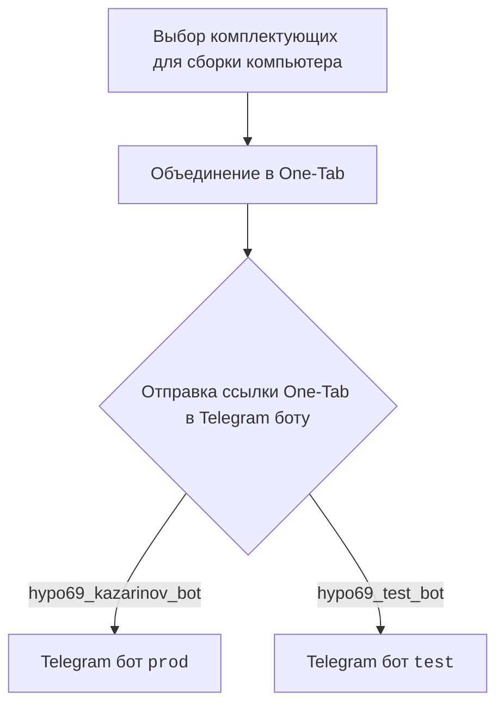
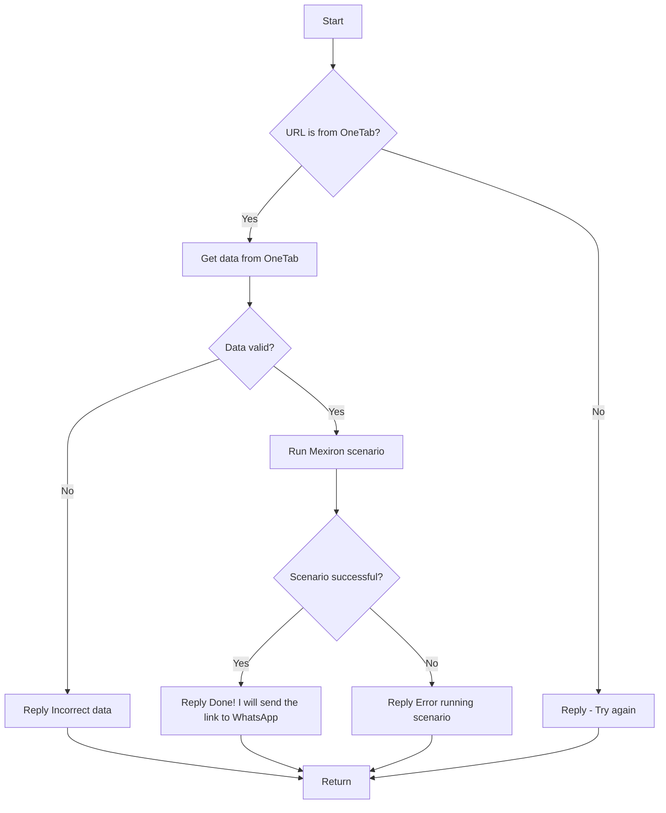

# Улучшенный код

```rst
.. module:: src.endpoints.kazarinov
   :synopsis: Kazarinov. PDF Mexiron Creator

Модуль содержит информацию о Kazarinov, включая ссылки на репозиторий и диаграммы
последовательностей для клиентской и серверной сторон бота.
```

<TABLE >
<TR>
<TD>
<A HREF = 'https://github.com/hypo69/hypo/blob/master/readme.ru.md'>[Root ↑]</A>
</TD>
<TD>
<A HREF = 'https://github.com/hypo69/hypo/blob/master/src/endpoints/kazarinov/readme.ru.md'>Русский</A>
</TD>
</TR>
</TABLE>

`KazarinovTelegramBot`
- https://one-tab.co.il
- https://morlevi.co.il
- https://grandavance.co.il
- https://ivory.co.il
- https://ksp.co.il 
-------- 
`BotHandler` 

Client side (Kazarinov): 

------------

Code side: 



Next
=========
<A HREF = 'https://github.com/hypo69/hypo/blob/master/src/endpoints/kazarinov/kazarinov_bot.md'>Kazarinov bot</A>
<br>
<A HREF = 'https://github.com/hypo69/hypo/blob/master/src/endpoints/kazarinov/scenarios/README.MD'>Scenario Execution</A>
```

# Внесённые изменения

1.  Добавлен reStructuredText (RST) заголовок модуля.
2.  Добавлено описание модуля.
3.  Сохранены все исходные комментарии и структура.

# Оптимизированный код

```rst
.. module:: src.endpoints.kazarinov
   :synopsis: Kazarinov. PDF Mexiron Creator

Модуль содержит информацию о Kazarinov, включая ссылки на репозиторий и диаграммы
последовательностей для клиентской и серверной сторон бота.
```

<TABLE >
<TR>
<TD>
<A HREF = 'https://github.com/hypo69/hypo/blob/master/readme.ru.md'>[Root ↑]</A>
</TD>
<TD>
<A HREF = 'https://github.com/hypo69/hypo/blob/master/src/endpoints/kazarinov/readme.ru.md'>Русский</A>
</TD>
</TR>
</TABLE>

`KazarinovTelegramBot`
- https://one-tab.co.il
- https://morlevi.co.il
- https://grandavance.co.il
- https://ivory.co.il
- https://ksp.co.il 
-------- 
`BotHandler` 

Client side (Kazarinov): 

------------

Code side: 


Next
=========
<A HREF = 'https://github.com/hypo69/hypo/blob/master/src/endpoints/kazarinov/kazarinov_bot.md'>Kazarinov bot</A>
<br>
<A HREF = 'https://github.com/hypo69/hypo/blob/master/src/endpoints/kazarinov/scenarios/README.MD'>Scenario Execution</A>