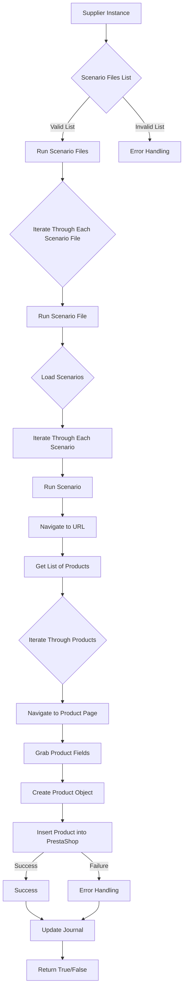

# Анализ кода модуля `src.scenario`

**Качество кода**
8
-  Плюсы
    - Код хорошо структурирован и разбит на отдельные функции, что облегчает понимание и поддержку.
    -  Используется Markdown для документации, что делает ее читаемой.
    -  Есть описание основных функций и компонентов модуля.
    -  Присутствует пример сценария JSON.
    -  В целом, код хорошо документирован на уровне функций и их назначений.
-  Минусы
    -  Отсутствуют импорты, необходимые для работы кода.
    -  Не используются `j_loads` или `j_loads_ns` для чтения файлов.
    -  Отсутствуют docstring для функций и классов в формате reStructuredText (RST).
    -  Нет обработки ошибок с использованием `logger.error` для логирования ошибок.
    -  Не везде есть конкретные формулировки в комментариях.
    -  Не указано, где именно и как используется объект настроек `s`.
    -  Комментарии в Markdown не соответствуют стандарту reStructuredText (RST).

**Рекомендации по улучшению**

1.  **Добавить импорты**: Необходимо добавить все необходимые импорты для корректной работы модуля (например, `json`, `os`, `requests`, `from src.utils.jjson import j_loads`).
2.  **Использовать `j_loads`**: Заменить `json.load` на `j_loads` или `j_loads_ns` для чтения JSON файлов.
3.  **Добавить docstring в RST**: Добавить docstring в формате reStructuredText (RST) для всех функций, классов и модулей.
4.  **Логирование ошибок**: Использовать `logger.error` для обработки ошибок вместо общих `try-except` блоков.
5.  **Уточнить комментарии**: Использовать более конкретные формулировки в комментариях, избегая слов "получаем", "делаем" и т.д.
6.  **Уточнить использование `s`**: Добавить более подробное описание, что такое объект настроек `s`, и как он используется.
7.  **Использовать RST в комментариях**: Переписать комментарии в формате reStructuredText (RST).
8. **Обработка ошибок**: Обеспечить обработку ошибок, которая не прерывает выполнение скрипта, а записывает ошибки в журнал.
9. **Уточнить взаимодействие с PrestaShop**: Добавить подробности о том, как происходит взаимодействие с PrestaShop (какие модули или API используются).
10. **Обработка исключений**: Добавить более детальную обработку исключений, чтобы минимизировать вероятность непредвиденных остановок скрипта.

**Оптимизированный код**
```markdown
# Анализ кода модуля `src.scenario`

## Модуль `src.scenario`

=========================================================================================

Модуль предназначен для автоматизации взаимодействия с поставщиками, используя сценарии, описанные в JSON-файлах.
Он адаптирует процесс извлечения и обработки данных о продуктах с веб-сайтов поставщиков и синхронизирует эту
информацию с базой данных (например, PrestaShop).  Модуль включает чтение сценариев, взаимодействие с веб-сайтами,
обработку данных, запись журнала выполнения и организацию всего процесса.

Пример использования
--------------------

Пример использования функций модуля::

    from src.config.config import Config
    from src.scenario import scenario

    s = Config()
    scenario_files = ['scenario1.json', 'scenario2.json'] # пример файлов со сценарием
    scenario.run_scenario_files(s, scenario_files)
    print(f'{len(scenario.journal)=}')

## Обзор

Модуль `src.scenario` предназначен для автоматизации взаимодействия с поставщиками, используя сценарии, описанные в JSON-файлах. Он адаптирует процесс извлечения и обработки данных о продуктах с веб-сайтов поставщиков и синхронизирует эту информацию с базой данных (например, PrestaShop).  Модуль включает чтение сценариев, взаимодействие с веб-сайтами, обработку данных, запись журнала выполнения и организацию всего процесса.

## Оглавление

* [Модуль `src.scenario`](#модуль-src-scenario)
* [Обзор](#обзор)
* [Основные функции модуля](#основные-функции-модуля)
* [Основные компоненты модуля](#основные-компоненты-модуля)
    * [`run_scenario_files(s, scenario_files_list)`](#run_scenario_files-s-scenario_files_list)
    * [`run_scenario_file(s, scenario_file)`](#run_scenario_file-s-scenario_file)
    * [`run_scenario(s, scenario)`](#run_scenario-s-scenario)
    * [`dump_journal(s, journal)`](#dump_journal-s-journal)
    * [`main()`](#main)
* [Пример сценария](#пример-сценария)
* [Как это работает](#как-это-работает)


## Основные функции модуля

1.  **Чтение сценариев**: Загрузка сценариев из JSON-файлов, содержащих информацию о продуктах и их URL на сайте поставщика.
2.  **Взаимодействие с веб-сайтами**:  Обработка URL-адресов из сценариев для извлечения данных о продуктах.
3.  **Обработка данных**: Преобразование извлечённых данных в формат, подходящий для базы данных, и сохранение в неё.
4.  **Запись журнала выполнения**: Ведение журнала с деталями выполнения сценариев и результатами работы для отслеживания процесса и выявления ошибок.



## Основные компоненты модуля

### `run_scenario_files(s, scenario_files_list)`

**Описание**: Принимает список файлов сценариев и выполняет их по очереди, вызывая функцию `run_scenario_file` для каждого файла.

**Параметры**:\
- `s`: Объект настроек (например, для соединения с базой данных).\
- `scenario_files_list` (list): Список путей к файлам сценариев.

**Возвращает**:\
- None

**Вызывает исключения**:\
- `FileNotFoundError`: Если файл сценария не найден.\
- `JSONDecodeError`: Если файл сценария содержит невалидный JSON.


### `run_scenario_file(s, scenario_file)`

**Описание**: Загружает сценарии из указанного файла и вызывает `run_scenario` для каждого сценария в файле.

**Параметры**:\
- `s`: Объект настроек.\
- `scenario_file` (str): Путь к файлу сценария.

**Возвращает**:\
- None

**Вызывает исключения**:\
- `FileNotFoundError`: Если файл сценария не найден.\
- `JSONDecodeError`: Если файл сценария содержит невалидный JSON.\
- `Exception`: При любых других проблемах при работе со сценариями.


### `run_scenario(s, scenario)`

**Описание**: Обрабатывает отдельный сценарий. Переходит по URL, извлекает данные о продуктах и сохраняет их в базе данных.

**Параметры**:\
- `s`: Объект настроек.\
- `scenario` (dict): Словарь, содержащий сценарий (например, с URL, категориями).

**Возвращает**:\
- None

**Вызывает исключения**:\
- `requests.exceptions.RequestException`: Если есть проблемы с запросом к веб-сайту.\
- `Exception`: При любых других проблемах в процессе обработки сценария.


### `dump_journal(s, journal)`

**Описание**: Сохраняет журнал выполнения сценариев в файл для последующего анализа.

**Параметры**:\
- `s`: Объект настроек.\
- `journal` (list): Список записей журнала выполнения.

**Возвращает**:\
- None

**Вызывает исключения**:\
- `Exception`: При проблемах с записью в файл.


### `main()`

**Описание**: Основная функция для запуска модуля.

**Параметры**:\
- None

**Возвращает**:\
- None

**Вызывает исключения**:\
- `Exception`: При любых критических ошибках во время выполнения.


## Пример сценария

Пример сценария JSON описывает взаимодействие с категориями продуктов на веб-сайте. Он содержит URL, имя категории и идентификаторы категорий в базе данных PrestaShop.


```json
{
    "scenarios": {
        "минеральные+кремы": {
            "url": "https://example.com/category/mineral-creams/",
            "name": "минеральные+кремы",
            "presta_categories": {
                "default_category": 12345,
                "additional_categories": [12346, 12347]
            }
        }
    }
}
```


## Как это работает

Модуль загружает сценарии, извлекает данные с веб-сайтов, обрабатывает их и сохраняет в базе данных.  Он ведёт журнал выполнения для отслеживания процесса и выявления ошибок.  В целом, модуль автоматизирует взаимодействие с поставщиками, улучшая эффективность и надежность процесса.
```

```python
"""
Модуль для автоматизации взаимодействия с поставщиками, используя сценарии, описанные в JSON-файлах.
=========================================================================================

Этот модуль включает чтение сценариев, взаимодействие с веб-сайтами,
обработку данных, запись журнала выполнения и организацию всего процесса.
"""
import json  # импортируем модуль json для работы с JSON
import os  # импортируем модуль os для работы с файловой системой
import requests  # импортируем модуль requests для выполнения HTTP-запросов
from typing import List, Dict, Any  # импортируем типы данных для аннотации
from src.utils.jjson import j_loads  # импортируем функцию j_loads для чтения JSON файлов
from src.logger.logger import logger  # импортируем logger для логирования ошибок


journal: List[Dict[str, Any]] = []  # список для хранения записей журнала выполнения


def run_scenario_files(s: Any, scenario_files_list: List[str]) -> None:
    """
    Выполняет сценарии из списка файлов.

    :param s: Объект настроек.
    :type s: Any
    :param scenario_files_list: Список путей к файлам сценариев.
    :type scenario_files_list: List[str]
    :raises FileNotFoundError: Если файл сценария не найден.
    :raises json.JSONDecodeError: Если файл сценария содержит невалидный JSON.
    """
    # для каждого файла сценария в списке
    for scenario_file in scenario_files_list:
        try:
            # код исполняет запуск сценария из текущего файла
            run_scenario_file(s, scenario_file)
        except FileNotFoundError as e:
            # регистрируем ошибку, если файл не найден
            logger.error(f'Файл сценария не найден: {scenario_file}', exc_info=True)
        except json.JSONDecodeError as e:
            # регистрируем ошибку, если JSON не валиден
            logger.error(f'Ошибка декодирования JSON в файле: {scenario_file}', exc_info=True)


def run_scenario_file(s: Any, scenario_file: str) -> None:
    """
    Загружает и выполняет сценарии из файла.

    :param s: Объект настроек.
    :type s: Any
    :param scenario_file: Путь к файлу сценария.
    :type scenario_file: str
    :raises FileNotFoundError: Если файл сценария не найден.
    :raises json.JSONDecodeError: Если файл сценария содержит невалидный JSON.
    :raises Exception: При любых других проблемах при работе со сценариями.
    """
    try:
        # код исполняет открытие и чтение файла сценария
        with open(scenario_file, 'r', encoding='utf-8') as f:
            # код исполняет загрузку сценариев из файла
            scenarios = j_loads(f)
        # для каждого сценария в загруженных сценариях
        for scenario_name, scenario in scenarios.get('scenarios', {}).items():
            # код исполняет запуск сценария
            run_scenario(s, scenario)
    except FileNotFoundError as e:
        # регистрируем ошибку, если файл не найден
        logger.error(f'Файл сценария не найден: {scenario_file}', exc_info=True)
        raise
    except json.JSONDecodeError as e:
        # регистрируем ошибку, если JSON не валиден
        logger.error(f'Ошибка декодирования JSON в файле: {scenario_file}', exc_info=True)
        raise
    except Exception as e:
        # регистрируем любую другую ошибку
        logger.error(f'Ошибка при выполнении сценария из файла: {scenario_file}', exc_info=True)
        raise


def run_scenario(s: Any, scenario: Dict[str, Any]) -> None:
    """
    Выполняет отдельный сценарий.

    :param s: Объект настроек.
    :type s: Any
    :param scenario: Словарь, содержащий сценарий (например, с URL, категориями).
    :type scenario: Dict[str, Any]
    :raises requests.exceptions.RequestException: Если есть проблемы с запросом к веб-сайту.
    :raises Exception: При любых других проблемах в процессе обработки сценария.
    """
    try:
        # код исполняет отправку запроса на URL из сценария
        url = scenario.get('url')
        if not url:
            logger.error(f'URL не найден в сценарии: {scenario}')
            return
        #  код исполняет отправку запроса на URL из сценария
        response = requests.get(url)
        response.raise_for_status()  # проверяем статус ответа
        #  код исполняет запись в журнал информации об успешном запросе
        journal.append({'status': 'success', 'url': url, 'message': 'Успешный запрос'})
        # TODO: здесь должен быть код для извлечения данных о продуктах и их сохранения в PrestaShop
        ...  #  точка остановки
    except requests.exceptions.RequestException as e:
        # регистрируем ошибку, если есть проблемы с запросом
        logger.error(f'Ошибка при запросе к URL: {url}', exc_info=True)
        #  код исполняет запись в журнал информации о неудачном запросе
        journal.append({'status': 'error', 'url': url, 'message': f'Ошибка запроса: {e}'})
    except Exception as e:
        # регистрируем любую другую ошибку
        logger.error(f'Ошибка при выполнении сценария: {scenario}', exc_info=True)
        #  код исполняет запись в журнал информации об ошибке
        journal.append({'status': 'error', 'url': url, 'message': f'Неизвестная ошибка: {e}'})


def dump_journal(s: Any, journal: List[Dict[str, Any]]) -> None:
    """
    Сохраняет журнал выполнения в файл.

    :param s: Объект настроек.
    :type s: Any
    :param journal: Список записей журнала выполнения.
    :type journal: List[Dict[str, Any]]
    :raises Exception: При проблемах с записью в файл.
    """
    try:
        # код исполняет запись журнала в файл
        with open('journal.json', 'w', encoding='utf-8') as f:
            json.dump(journal, f, indent=4, ensure_ascii=False)
    except Exception as e:
         # регистрируем ошибку, если не удалось записать журнал
        logger.error('Ошибка при записи журнала в файл', exc_info=True)
        raise


def main() -> None:
    """
    Основная функция для запуска модуля.

    :raises Exception: При любых критических ошибках во время выполнения.
    """
    try:
        # TODO: Замените на фактический список файлов сценариев
        scenario_files = ['example_scenario.json']
        #  код исполняет запуск сценариев из указанных файлов
        run_scenario_files(None, scenario_files)
        #  код исполняет сохранение журнала
        dump_journal(None, journal)
    except Exception as e:
        # регистрируем любую критическую ошибку
        logger.error('Критическая ошибка во время выполнения', exc_info=True)
        raise
# TODO: пример вызова функции main
if __name__ == '__main__':
    main()
```