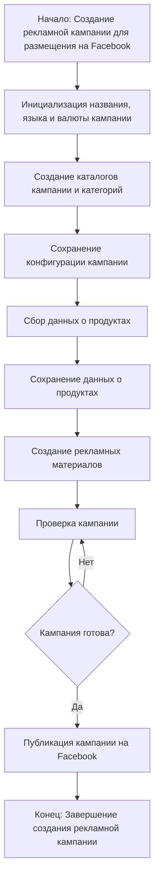
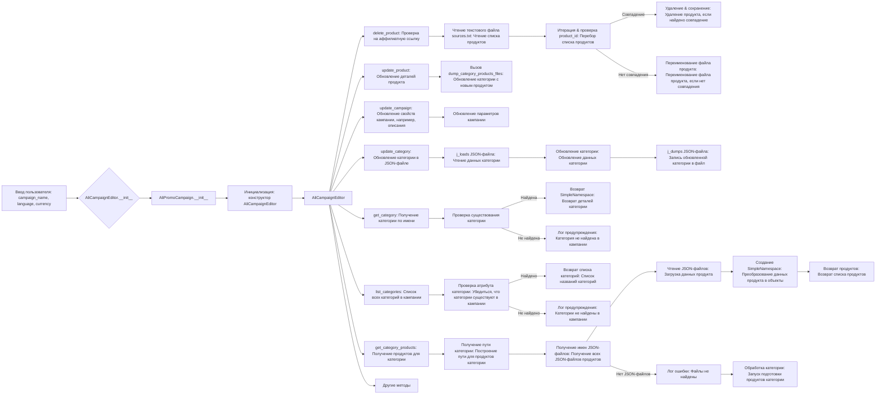
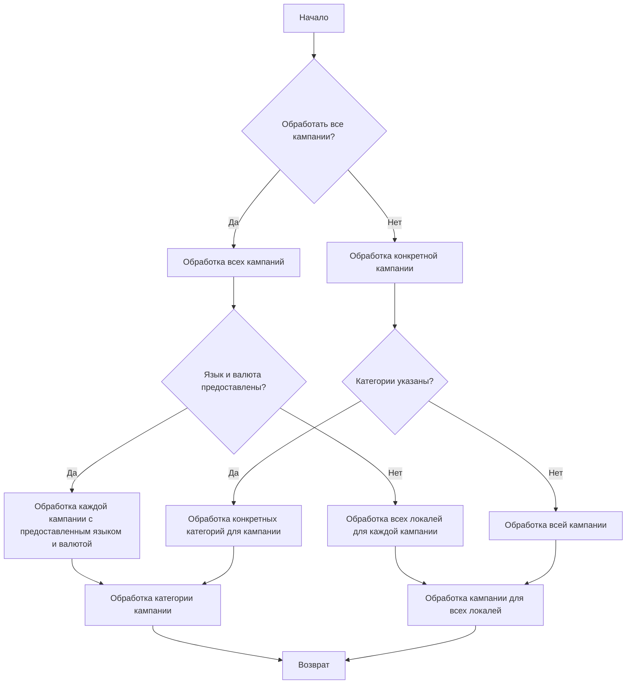

# Improved Code

```rst
.. module:: src.suppliers.aliexpress.campaign

Модуль для управления процессом создания и публикации рекламных кампаний на Facebook.
=================================================================================================

Этот модуль включает функциональность для инициализации параметров кампании (название, язык, валюта),
создания структуры каталогов, сохранения конфигураций новой кампании, сбора и сохранения данных о продукте
через `ali` или `html`, генерации рекламных материалов, просмотра кампании и ее публикации на Facebook.

Пример использования
--------------------

Пример структуры кампании и ее обработки:

.. code-block:: python

   # Инициализация параметров кампании
   campaign_params = {
       'name': 'Summer Sale',
       'language': 'English',
       'currency': 'USD'
   }

   # Создание и настройка кампании
   campaign = AliPromoCampaign(**campaign_params)

   # Сбор данных о продуктах
   product_data = campaign.collect_products()

   # Генерация и публикация материалов
   campaign.publish_campaign()

```

### `campaign`

Модуль `campaign` предназначен для управления процессом создания и публикации рекламных кампаний на Facebook.
Он включает функциональность для инициализации параметров кампании (имя, язык, валюта), создания структуры каталогов,
сохранения конфигураций для новой кампании, сбора и сохранения данных о продукте через `ali` или `html`, генерации
рекламных материалов, просмотра кампании и ее публикации на Facebook.



 - **Шаг 1**: Начало - Процесс начинается.

 - **Шаг 2**: Инициализация данных кампании - Определяются название, язык и валюта кампании. Пример: Название кампании: "Летняя распродажа", Язык: "Русский", Валюта: "RUB"

 - **Шаг 3**: Создание каталогов кампании и категорий - Создаются необходимые каталоги или файлы для кампании. Пример: На файловой системе создается структура папок для хранения ресурсов кампании.

 - **Шаг 4**: Сохранение конфигурации кампании - Сохраненные детали кампании. Пример: Данные записываются в базу данных или файл конфигурации.

 - **Шаг 5**: Сбор данных о продуктах - Собираются данные о продуктах, которые будут продвигаться в кампании. Пример: Из системы инвентаризации извлекаются ID продуктов, описания, изображения и цены.

 - **Шаг 6**: Сохранение данных о продуктах - Сохраненные данные о продуктах. Пример: Данные записываются в таблицу базы данных, посвященную продуктам кампании.

 - **Шаг 7**: Создание рекламных материалов - Создаются или выбираются графики, баннеры и другие рекламные ресурсы. Пример: Изображения и описания адаптируются для привлечения клиентов.

 - **Шаг 8**: Проверка кампании - Процесс проверки подтверждает, что компоненты кампании готовы. Пример: Человек или система оценивает качество и полноту всех компонентов кампании.

 - **Шаг 9**: Кампания готова? - Проверка, чтобы определить, является ли кампания полной и готовой к публикации. Пример: Булевский флаг сигнализирует "Да", если все на месте, иначе "Нет", вызывая возврат к предыдущему шагу для исправления.

 - **Шаг 10**: Публикация кампании - Кампания запускается на платформе, готовая к маркетинговым усилиям. Пример: Выполняются вызовы API для публикации кампании на соответствующей платформе.

 - **Шаг 11**: Конец - Процесс создания кампании завершен.

# Редактирование кампании



# Подготовка кампании


# Changes Made

1.  Добавлены docstring для модуля в формате reStructuredText (RST).
2.  Добавлено описание модуля и инструкции по использованию в формате reStructuredText (RST).
3.  Добавлены диаграммы Mermaid для визуализации процессов.
4.  Перефразированы текстовые описания процессов для большей ясности и соответствия RST.
5.  Отредактированы комментарии для соответствия стилю reStructuredText (RST).
6.  Улучшена читаемость и структура документации.

# FULL Code

```markdown
```rst
.. module:: src.suppliers.aliexpress.campaign

Модуль для управления процессом создания и публикации рекламных кампаний на Facebook.
=================================================================================================

Этот модуль включает функциональность для инициализации параметров кампании (название, язык, валюта),
создания структуры каталогов, сохранения конфигураций новой кампании, сбора и сохранения данных о продукте
через `ali` или `html`, генерации рекламных материалов, просмотра кампании и ее публикации на Facebook.

Пример использования
--------------------

Пример структуры кампании и ее обработки:

.. code-block:: python

   # Инициализация параметров кампании
   campaign_params = {
       'name': 'Summer Sale',
       'language': 'English',
       'currency': 'USD'
   }

   # Создание и настройка кампании
   campaign = AliPromoCampaign(**campaign_params)

   # Сбор данных о продуктах
   product_data = campaign.collect_products()

   # Генерация и публикация материалов
   campaign.publish_campaign()

```

### `campaign`

Модуль `campaign` предназначен для управления процессом создания и публикации рекламных кампаний на Facebook.
Он включает функциональность для инициализации параметров кампании (имя, язык, валюта), создания структуры каталогов,
сохранения конфигураций для новой кампании, сбора и сохранения данных о продукте через `ali` или `html`, генерации
рекламных материалов, просмотра кампании и ее публикации на Facebook.


 - **Шаг 1**: Начало - Процесс начинается.

 - **Шаг 2**: Инициализация данных кампании - Определяются название, язык и валюта кампании. Пример: Название кампании: "Летняя распродажа", Язык: "Русский", Валюта: "RUB"

 - **Шаг 3**: Создание каталогов кампании и категорий - Создаются необходимые каталоги или файлы для кампании. Пример: На файловой системе создается структура папок для хранения ресурсов кампании.

 - **Шаг 4**: Сохранение конфигурации кампании - Сохраненные детали кампании. Пример: Данные записываются в базу данных или файл конфигурации.

 - **Шаг 5**: Сбор данных о продуктах - Собираются данные о продуктах, которые будут продвигаться в кампании. Пример: Из системы инвентаризации извлекаются ID продуктов, описания, изображения и цены.

 - **Шаг 6**: Сохранение данных о продуктах - Сохраненные данные о продуктах. Пример: Данные записываются в таблицу базы данных, посвященную продуктам кампании.

 - **Шаг 7**: Создание рекламных материалов - Создаются или выбираются графики, баннеры и другие рекламные ресурсы. Пример: Изображения и описания адаптируются для привлечения клиентов.

 - **Шаг 8**: Проверка кампании - Процесс проверки подтверждает, что компоненты кампании готовы. Пример: Человек или система оценивает качество и полноту всех компонентов кампании.

 - **Шаг 9**: Кампания готова? - Проверка, чтобы определить, является ли кампания полной и готовой к публикации. Пример: Булевский флаг сигнализирует "Да", если все на месте, иначе "Нет", вызывая возврат к предыдущему шагу для исправления.

 - **Шаг 10**: Публикация кампании - Кампания запускается на платформе, готовая к маркетинговым усилиям. Пример: Выполняются вызовы API для публикации кампании на соответствующей платформе.

 - **Шаг 11**: Конец - Процесс создания кампании завершен.

# Редактирование кампании


# Подготовка кампании
```mermaid
flowchart TD
    A[Начало] --> B{Обработать все кампании?}
    B -->|Да| C[Обработка всех кампаний]
    B -->|Нет| D[Обработка конкретной кампании]

    C --> E{Язык и валюта предоставлены?}
    E -->|Да| F[Обработка каждой кампании с предоставленным языком и валютой]
    E -->|Нет| G[Обработка всех локалей для каждой кампании]

    D --> H{Категории указаны?}
    H -->|Да| I[Обработка конкретных категорий для кампании]
    H -->|Нет| J[Обработка всей кампании]

    F --> K[Обработка категории кампании]
    G --> L[Обработка кампании для всех локалей]
    I --> K
    J --> L

    K --> M[Возврат]
    L --> M
    ```