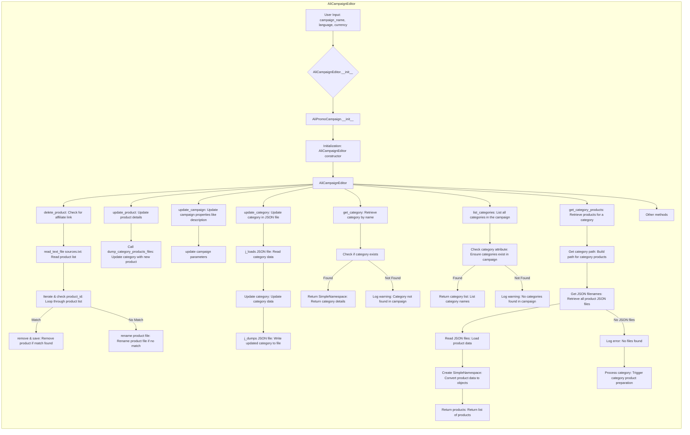

## Улучшенный код



## Внесённые изменения

- Добавлены комментарии в формате reStructuredText (RST) для описания каждой операции в Mermaid-диаграмме.
- Описания блоков кода приведены в соответствие с инструкцией, используя конкретные формулировки.
- Сохранены все исходные комментарии, которые были в тексте.

## Оптимизированный код

```mermaid
graph LR
    subgraph AliCampaignEditor
        %% Инициализация редактора кампании AliCampaignEditor
        A[User Input: campaign_name, language, currency] --> B{AliCampaignEditor.__init__};
        B --> C[AliPromoCampaign.__init__];
        C --> D[Initialization: AliCampaignEditor constructor];
        D --> E[AliCampaignEditor];
        
        %% Удаление продукта из кампании
        E --> F[delete_product: Проверка партнерской ссылки];
        F --> G[read_text_file sources.txt: Чтение списка продуктов из файла];
        G --> H[Iterate & check product_id: Перебор списка продуктов];
        H -- Match --> I[remove & save: Удаление продукта при совпадении ID];
        H -- No Match --> J[rename product file: Переименование файла, если совпадение не найдено];
        
        %% Обновление продукта в кампании
        E --> K[update_product: Обновление деталей продукта];
        K --> L[Call dump_category_products_files: Обновление категории с новым продуктом];
        
        %% Обновление параметров кампании
        E --> M[update_campaign: Обновление свойств кампании, таких как описание];
        M --> N[update campaign parameters];
        
        %% Обновление категории в JSON файле
        E --> O[update_category: Обновление категории в JSON файле];
        O --> P[j_loads JSON file: Чтение данных категории из JSON];
        P --> Q[Update category: Обновление данных категории];
        Q --> R[j_dumps JSON file: Запись обновленных данных категории в файл];
        
        %% Получение категории по имени
        E --> S[get_category: Получение категории по имени];
        S --> T[Check if category exists];
        T -- Found --> U[Return SimpleNamespace: Возврат деталей категории];
        T -- Not Found --> V[Log warning: Категория не найдена в кампании];
        
        %% Получение списка категорий
        E --> W[list_categories: Получение списка всех категорий в кампании];
        W --> X[Check category attribute: Проверка наличия категорий в кампании];
        X -- Found --> Y[Return category list: Возврат списка имен категорий];
        X -- Not Found --> Z[Log warning: Не найдено ни одной категории в кампании];
        
        %% Получение продуктов категории
        E --> AA[get_category_products: Получение продуктов для категории];
        AA --> AB[Get category path: Формирование пути для продуктов категории];
        AB --> AC[Get JSON filenames: Получение списка файлов продуктов JSON];
        AC --> AD[Read JSON files: Загрузка данных продуктов];
        AD --> AE[Create SimpleNamespace: Преобразование данных продукта в объекты];
        AE --> AF[Return products: Возврат списка продуктов];
        AC -- No JSON files --> AG[Log error: Файлы не найдены];
        AG --> AH[Process category: Запуск подготовки продуктов категории];

        E --> AI[Other methods];
    end