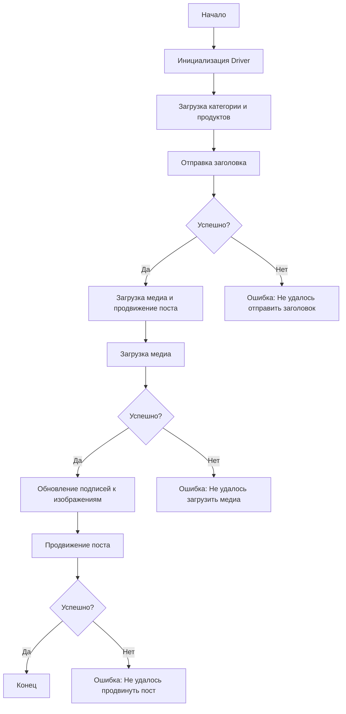

# Сценарий асинхронной публикации сообщения на Facebook

## Обзор

Этот сценарий предназначен для автоматизации процесса публикации сообщений на Facebook. Он взаимодействует со страницей Facebook, используя локаторы, чтобы выполнить различные действия, такие как отправка сообщений, загрузка медиафайлов и обновление подписей. Сценарий находится в директории `hypotez/src/endpoints/advertisement/facebook/scenarios`. Он использует асинхронное программирование (asyncio) для повышения производительности.

## Оглавление

* [Сценарий асинхронной публикации сообщения на Facebook](#сценарий-асинхронной-публикации-сообщения-на-facebook)
* [Обзор](#обзор)
* [Основные возможности](#основные-возможности)
* [Структура модуля](#структура-модуля)
* [Функции](#функции)
    * [`post_title`](#post_title)
    * [`upload_media`](#upload_media)
    * [`update_images_captions`](#update_images_captions)
    * [`promote_post`](#promote_post)
* [Использование](#использование)
* [Пример](#пример)
* [Зависимости](#зависимости)
* [Обработка ошибок](#обработка-ошибок)
* [Вклад](#вклад)
* [Лицензия](#лицензия)

## Основные возможности

1. **Отправка заголовка и описания:** Отправляет заголовок и описание кампании в поле сообщения на Facebook.
2. **Загрузка медиафайлов:** Загружает медиафайлы (изображения и видео) на пост Facebook и обновляет их подписи.
3. **Продвижение поста:** Управляет всем процессом продвижения поста с заголовком, описанием и медиафайлами.

## Структура модуля

## Легенда

(Описание легенды - то же, что в исходном коде)

## Функции

### `post_title`

**Описание**: Отправляет заголовок и описание кампании в поле сообщения на Facebook.

**Параметры**:
- `d: Driver`: Экземпляр `Driver` для взаимодействия с веб-страницей.
- `category: SimpleNamespace`: Категория, содержащая заголовок и описание для отправки.

**Возвращает**:
- `bool`: `True`, если заголовок и описание были успешно отправлены, иначе `None`.

**Возможные исключения**:
- `Exception`: Общие исключения при взаимодействии с веб-страницей.

### `upload_media`

**Описание**: Загружает медиафайлы на пост Facebook и обновляет их подписи.

**Параметры**:
- `d: Driver`: Экземпляр `Driver` для взаимодействия с веб-страницей.
- `products: List[SimpleNamespace]`: Список продуктов, содержащих пути к медиафайлам.
- `no_video: bool = False`: Флаг, указывающий, следует ли пропустить загрузку видео.

**Возвращает**:
- `bool`: `True`, если медиафайлы были успешно загружены, иначе `None`.

**Возможные исключения**:
- `Exception`: Общие исключения при взаимодействии с веб-страницей.

### `update_images_captions`

**Описание**: Асинхронно добавляет описания к загруженным медиафайлам.

**Параметры**:
- `d: Driver`: Экземпляр `Driver` для взаимодействия с веб-страницей.
- `products: List[SimpleNamespace]`: Список продуктов с деталями для обновления.
- `textarea_list: List[WebElement]`: Список текстовых полей, куда добавляются подписи.

**Возвращает**:
- `None`

**Возможные исключения**:
- `Exception`: Общие исключения при взаимодействии с веб-страницей.

### `promote_post`

**Описание**: Управляет процессом продвижения поста с заголовком, описанием и медиафайлами.

**Параметры**:
- `d: Driver`: Экземпляр `Driver` для взаимодействия с веб-страницей.
- `category: SimpleNamespace`: Детали категории, используемые для заголовка и описания поста.
- `products: List[SimpleNamespace]`: Список продуктов, содержащих медиа и детали для публикации.
- `no_video: bool = False`: Флаг, указывающий, следует ли пропустить загрузку видео.

**Возвращает**:
- `bool`: `True`, если пост был успешно продвинут, иначе `None`.

**Возможные исключения**:
- `Exception`: Общие исключения при взаимодействии с веб-страницей.

## Использование

(Описание использования - то же, что в исходном коде)

## Пример

(Пример - то же, что в исходном коде)

## Зависимости

(Список зависимостей - то же, что в исходном коде)

## Обработка ошибок

(Описание обработки ошибок - то же, что в исходном коде)

## Вклад

(Информация о вкладе - то же, что в исходном коде)

## Лицензия

(Информация о лицензии - то же, что в исходном коде)