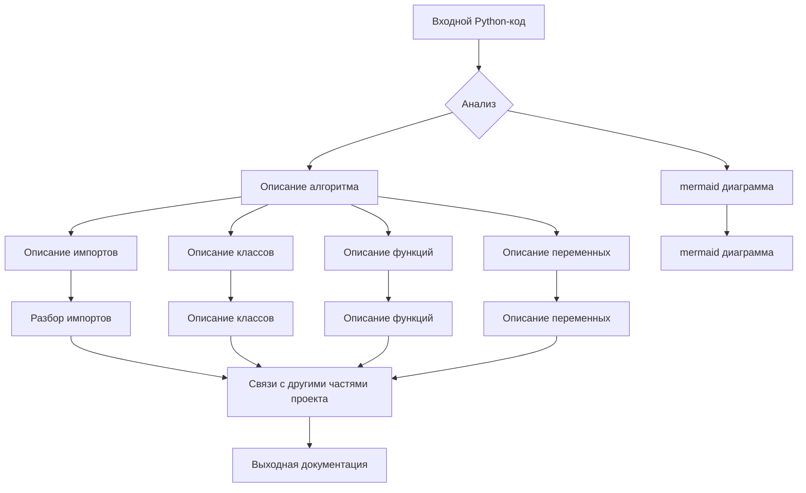

# Документация для instruction_code_explainer_md_en.py

## Обзор

Этот файл содержит инструкцию для анализа Python-кода и генерации документации для разработчика в формате Markdown. Инструкция задаёт формат документации, включая заголовки, структуру оглавления, и формат комментариев для функций и классов.  Она также включает требования к описанию алгоритма, диаграмме в формате mermaid, пояснению импортов, классов, функций, переменных, возможных ошибок и связям с другими частями проекта.

## Алгоритм

**Шаг 1**: Анализ входного Python-кода.
* **Вход:** Строка кода в формате Python.
* **Пример:** `def add(a, b): return a + b`
* **Выход:** Данные о синтаксисе, функциях, классах и переменных.

**Шаг 2**: Создание описания алгоритма.
* **Вход:** Данные о коде.
* **Пример:** Данные о функциях `add`, аргументах `a` и `b`, возвращаемом значении `a + b`.
* **Выход:** Описание алгоритма с пошаговыми блоками в блок-схеме.

**Шаг 3**: Создание диаграммы в формате mermaid.
* **Вход:** Описание алгоритма, переменные и функции.
* **Пример:** Диаграмма, показывающая вызов функции `add` и передачу ей значений `a` и `b`.
* **Выход:** Диаграмма в формате mermaid.

**Шаг 4**: Описание импортов, классов, функций, переменных.
* **Вход:** Python-код, алгоритм и диаграмма.
* **Выход:**  Подробное описание импортов, классов, функций, переменных, включая их назначение, аргументы, возвращаемые значения, примеры использования, и связи с другими частями проекта.

**Шаг 5**: Выявление возможных ошибок и областей для улучшения.
* **Вход:** Анализ кода, диаграммы, и документации.
* **Выход:**  Список потенциальных ошибок, рекомендации по улучшению, и варианты решения.

## mermaid

**Описание зависимостей (импортов):**  В текущем примере нет импортов, поэтому анализ зависимостей не требуется.  Если присутствуют импорты из других пакетов (например, `src.utils`, `src.models`), то в этом разделе необходимо подробно описать их роль и взаимосвязь с текущим файлом и другими частями проекта.

## Объяснение

**Импорты:**  В этом файле нет импортируемых пакетов, поэтому нет импорта, нуждающегося в описании.

**Классы:** В данном файле нет определений классов.

**Функции:** В этом файле нет конкретных функций, только описание того, как анализировать код.

**Переменные:**  Здесь также нет переменных.  В описании должны быть детали, если переменные существуют в предоставленном коде.

**Возможные ошибки и улучшения:**  Инструкция предполагает полный анализ кода. Возможная ошибка - отсутствие анализа или некорректное описание входного Python-кода.  Инструкция нуждается в дальнейшем анализе на примере конкретного Python-кода.

## Связи с другими частями проекта

Связи с другими частями проекта определяются импортами и вызовами функций из других модулей.  В этом примере таких связей нет.  При анализе реального кода необходимо обозначить эти связи.